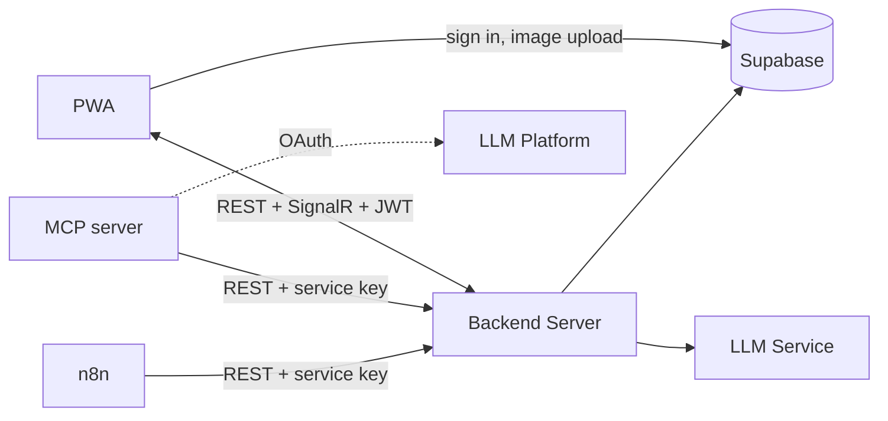

# Jetomax Assignment
Realtime chat PWA: sign in with Google, message 1:1 or in groups, send AI-captioned images, and request an AI summary of a conversation. Includes an MCP server so ChatGPT/Claude can operate on conversations, and an n8n workflow that publishes a scheduled daily digest.



## Repository layout

| Folder | What it is | Setup |
|---|---|---|
| [`backend/`](backend/) | ASP.NET Core (.NET 10) REST + SignalR API — Clean Architecture, EF Core, Semantic Kernel | [`backend/README.md`](backend/README.md) |
| [`frontend/`](frontend/) | PWA | [`frontend/README.md`](frontend/README.md) |
| [`mcp/`](mcp/) | MCP server | [`mcp/README.md`](mcp/README.md) |
| [`n8n/`](n8n/) | n8n workflow | [`n8n/README.md`](n8n/README.md) |
| [`docs/`](docs/) | Product requirements (SRS) | see [Documentation](#documentation) below |

Backend architecture, database design, and the schema live in [`backend/docs/`](backend/docs/) since they're backend-specific; MCP/n8n design details are folded into their own project READMEs.

Each of `backend/`, `frontend/`, `mcp/`, `n8n/` is an independently runnable project with its own `.env.local` and `start-dev.ps1` — see [Quick start](#quick-start).

## Quick start

**Prerequisites:** [.NET SDK 10.x](https://dotnet.microsoft.com/download), [Node.js 20+](https://nodejs.org), a [Supabase](https://supabase.com/) project with `backend/docs/schema.sql` applied, a [Google AI Studio](https://aistudio.google.com/apikey) key. First time on a fresh machine, follow [backend/README.md](backend/README.md#first-time-setup) end-to-end (Supabase project, Google OAuth, database schema) — it covers everything needed before the servers can run. The steps below assume that's already done and you just want the servers running.

1. In each project folder you plan to run, copy its example env file and fill in real values:

   ```powershell
   Copy-Item backend/.env.local.example backend/.env.local
   Copy-Item frontend/.env.example      frontend/.env.local     # already present with working demo values
   Copy-Item mcp/.env.local.example     mcp/.env.local           # only needed if you're running the MCP server
   Copy-Item n8n/.env.example           n8n/.env.local           # only needed if you're running n8n
   ```

2. From the repo root, run:

   ```powershell
   ./start-dev.ps1
   ```

   It prompts for which service(s) to start (`backend`, `frontend`, `mcp`, `n8n`, or `all`) and launches each in its own window, delegating to that project's own `start-dev.ps1` (each one restores/installs dependencies, wires up secrets from `.env.local`, and starts the dev server). Pass `-Service backend,frontend` (or `-Service all`) to skip the prompt.

   For the minimal loop — chatting in the browser — you only need `backend` + `frontend`. `mcp` and `n8n` are optional external clients (see their own READMEs).

### LAN access (testing from a phone or another PC)

```powershell
./start-dev.ps1 -Service backend,frontend -Lan
```

This detects the machine's LAN IPv4, binds the backend to every network interface (not just `localhost`), and adds that address to the backend's allowed CORS origins for the duration of the session. The frontend already resolves its API/SignalR URL from whichever hostname the page was loaded through, so no frontend config change is needed. One caveat: **service workers only register on `https://` or `localhost`** — a device on the LAN gets a fully working page, just not the installable/offline PWA shell.

## Documentation

| Document | Covers |
|---|---|
| [docs/software-requirements-specification.md](docs/software-requirements-specification.md) | Product requirements, use cases, acceptance criteria — the *what* |
| [backend/README.md](backend/README.md) | Backend prerequisites, first-time Supabase/schema setup, running & configuring the API |
| [backend/docs/backend-system-design-and-architecture.md](backend/docs/backend-system-design-and-architecture.md) | Backend architecture, request flow, auth, realtime, AI layer, API reference — the *how* |
| [backend/docs/database-design.md](backend/docs/database-design.md) | Schema, RLS policies, triggers — maps 1:1 to [backend/docs/schema.sql](backend/docs/schema.sql) |
| [mcp/README.md](mcp/README.md) | MCP server design, auth model, and setup for both ChatGPT and Claude |
| [n8n/README.md](n8n/README.md) | Daily digest workflow design and setup |
| [frontend/docs/architecture.md](frontend/docs/architecture.md) | Frontend folder structure, state management, auth/realtime/image flows |
| [frontend/docs/decisions.md](frontend/docs/decisions.md) | Why the frontend made the non-obvious choices it made |

Start with the SRS for *what* the app does, the backend architecture doc for *how* the backend is built, and the per-project READMEs for *how to run* each piece.
