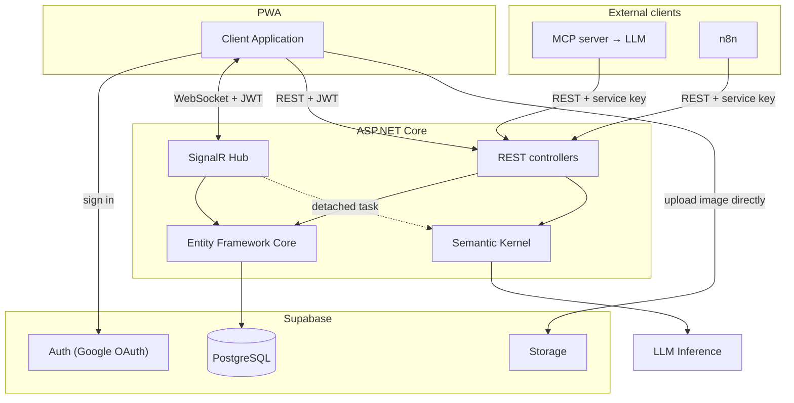
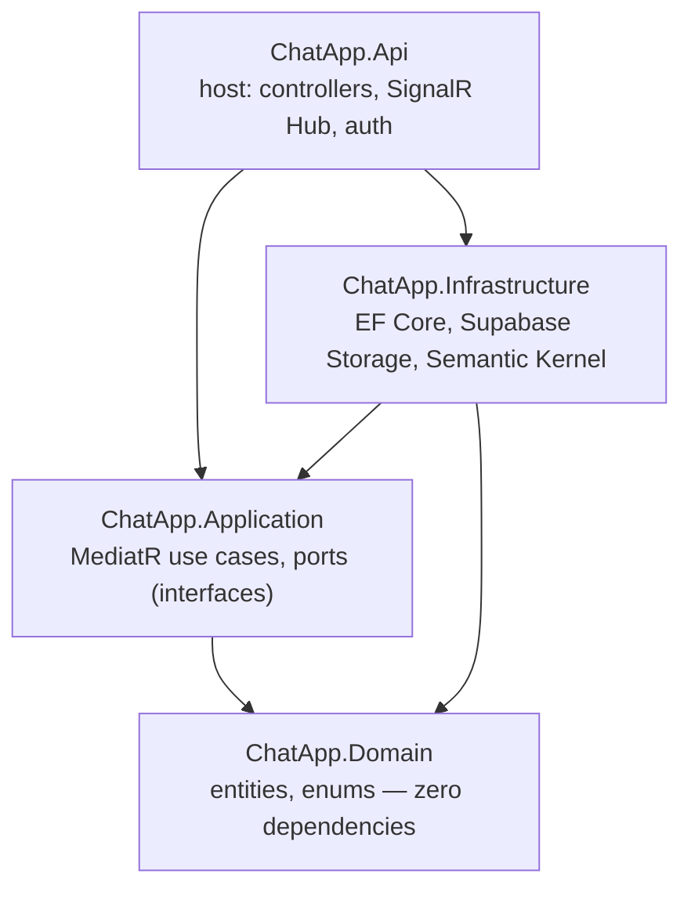
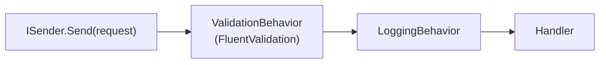
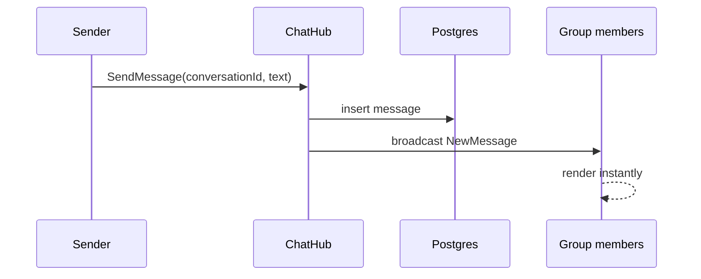
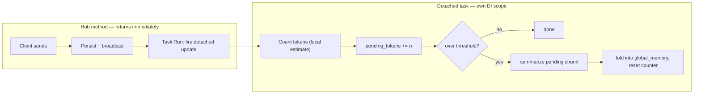

# Backend System Design & Architecture

1. [Guiding principles](#1-guiding-principles)
2. [Technology stack](#2-technology-stack)
3. [System context](#3-system-context)
4. [Codebase architecture](#4-codebase-architecture)
5. [Request handling with MediatR](#5-request-handling-with-mediatr)
6. [Authentication & authorization](#6-authentication--authorization)
7. [Real-time design](#7-real-time-design)
8. [Conversation memory pipeline](#8-conversation-memory-pipeline)
9. [AI layer](#9-ai-layer)
10. [API reference](#10-api-reference)
11. [Security notes](#11-security-notes)
12. [Known limitations](#12-known-limitations)
13. [References](#13-references)

---

## 1. Guiding principles

| # | Principle | Why it matters |
|---|---|---|
| 1 | Supabase issues the JWT; the backend only **validates** it | No auth to build or maintain |
| 2 | Images upload **directly** to Storage from the client; the backend stores only the URL | Backend never handles file bytes on the hot path |
| 3 | AI calls are **pull-based and cached**, never fan-out | Cost scales with usage, not group size |
| 4 | AI failure or latency **never blocks** core chat | AI is an overlay, not a dependency |
| 5 | **Postgres is the source of truth**; SignalR only notifies | A reconnecting client can always recover state via REST |
| 6 | The **backend owns shared counters** (e.g. token counts) | Avoids every client computing and racing on the same value |

---

## 2. Technology stack

| Layer | Choice | Why |
|---|---|---|
| Backend | ASP.NET Core (.NET 10), MVC controllers + SignalR | Native realtime support; controllers carry the authorization attribute cleanly |
| Request dispatch | [MediatR](https://github.com/jbogard/MediatR) | One handler per use case, reused across REST and SignalR |
| Validation | [FluentValidation](https://docs.fluentvalidation.net/) | Input validation as a MediatR pipeline step |
| Data plane | [Supabase](https://supabase.com/docs) (Postgres + Auth + Storage) | Auth (Google OAuth only), storage, and database in one managed service |
| ORM | [EF Core](https://learn.microsoft.com/ef/core/) + [Npgsql](https://www.npgsql.org/efcore/) | Type-safe Postgres access |
| AI orchestration | [Semantic Kernel](https://learn.microsoft.com/semantic-kernel/overview/) | Thin, swappable AI client layer |
| AI model | Google Gemini via `Microsoft.SemanticKernel.Connectors.Google` | One multimodal model for captioning and summarization; model id is config-driven since Gemini model availability changes over time |
| External clients | MCP server, n8n workflow | ChatGPT connector and scheduled digest — both call this API over REST, nothing more |

---

## 3. System context



The client authenticates with Supabase and reuses the same JWT for both REST and the SignalR connection. Images go straight from the browser to Storage; the backend only ever sees the resulting URL. MCP and n8n are external clients of the same REST API, refer to [mcp/README.md](../../mcp/README.md) and [n8n/README.md](../../n8n/README.md) for further details.

---

## 4. Codebase architecture

Four projects, one Web API host, a strict compile-time dependency direction (Clean Architecture):



`Application` never references `Infrastructure` — it declares **ports** (interfaces under `Abstractions/`); `Infrastructure` implements them. `Api` is the composition root that wires everything together in `Program.cs`.

| Project | Owns | Touch it when… |
|---|---|---|
| **Domain** | Entities (`User`, `Conversation`, `Message`, …), enums, invariants — no validation logic, no framework references | a field or business invariant changes |
| **Application** | Vertical-slice use cases (`Features/<Area>/<UseCase>`) and ports (`IAppDbContext`, `IConversationNotifier`, `IStorageClient`, `IGenerativeAiService`, `IConversationAccess`) | you add a use case or change a business rule |
| **Infrastructure** | Adapters: EF Core/Npgsql, Supabase Storage client, Semantic Kernel + Gemini | you swap the database, storage, or AI provider |
| **Api** | Host: controllers, SignalR Hub, JWT/service-key auth, `[AllowedRoles]`, DI wiring | you add a route, change realtime behavior, or change authorization |

### Folder layout

```
backend/src/
├── ChatApp.Domain/
│   ├── Entities/      User, Conversation, Participant, Message, TextMessage,
│   │                  ImageMessage, ConversationMemory, ChunkMemory
│   └── Enums/         MessageType, UserRole
│
├── ChatApp.Application/
│   ├── Abstractions/  ports (interfaces only)
│   ├── Features/
│   │   ├── Conversations/   Create, Join, Leave, Rename, SetReadonly,
│   │   │                    TransferOwnership, AddParticipants,
│   │   │                    RemoveParticipants, Get
│   │   ├── Messages/        Send, SendImage, Get
│   │   ├── Users/           GetUserByIdOrUsername
│   │   └── Internal/        SummarizeConversation, GetAllConversations,
│   │                         SummarizeConversations, PublishDigest, SetUserRole
│   ├── Memory/        ConversationMemoryService — chunk + fold logic
│   ├── Common/         Behaviors/ (Validation, Logging), Results/ (Result<T>, Error)
│   └── DependencyInjection.cs
│
├── ChatApp.Infrastructure/
│   ├── Persistence/    AppDbContext, EF Core entity configurations
│   ├── Storage/        SupabaseStorageClient
│   ├── Ai/             GenerativeAiService (Semantic Kernel + Gemini)
│   ├── Extensions/     PromptSettingsFactory (per-model execution settings)
│   └── DependencyInjection.cs
│
└── ChatApp.Api/
    ├── Program.cs       composition root
    ├── Controllers/     thin — HTTP → ISender.Send
    ├── Realtime/        ChatHub, SignalRConversationNotifier
    ├── Auth/            JWT + service-key authentication, [AllowedRoles]
    └── DTOs/            request/response shapes
```

Each vertical slice under `Features/` is self-contained (its own `Command`/`Query`, `Handler`, `Validator`), so a new use case means adding one folder, not touching a shared file.

---

## 5. Request handling with MediatR

Every use case is a MediatR **command** (write) or **query** (read) with exactly one handler, invoked from whichever transport needs it:

| Use case | Kind | Invoked by |
|---|---|---|
| `Messages.Send`, `Messages.SendImage` | command | SignalR Hub |
| `Conversations.Create`, `Join`, `Rename`, `SetReadonly`, `TransferOwnership`, `AddParticipants`, `RemoveParticipants`, `Leave` | command | REST |
| `Conversations.Get` (optional search term) | query | REST |
| `Messages.Get` (paginated history) | query | REST |
| `Internal.SummarizeConversation` (single thread) | query | REST |
| `Internal.GetAllConversations`, `SummarizeConversations`, `PublishDigest`, `SetUserRole` | query/command | REST (admin/n8n) |

Two pipeline behaviors wrap every request:



**Two rules keep this simple, on purpose:**
- **A handler never injects `IMediator`.** Logic shared between slices is a plain class called directly (see [`ConversationMemoryService`](#8-conversation-memory-pipeline)) — not one handler dispatching another.
- **Anything fired detached opens its own DI scope.** A request-scoped `IAppDbContext` is disposed when the request ends, and `DbContext` is not thread-safe, so background work never reuses the caller's scope.

---

## 6. Authentication & authorization

**Authentication** (who is calling) differs by channel; **authorization** (what they may do) is the same for everyone, decided purely by role.

| Channel | Credential | Resolves to |
|---|---|---|
| App | Supabase JWT (`Authorization: Bearer <token>`), Google OAuth-issued, validated against Supabase's JWKS endpoint | that user's id + role |
| MCP | `X-Client-Key` (service key) + `X-On-Behalf-Of: <username>` | the named user's id + role |
| n8n | `X-Client-Key` (service key) + `X-On-Behalf-Of: <username>` | the named user's id + role |

A service key without a resolvable on-behalf-of user is rejected (401) — there is no "no identity" case.

**`UserRole`** (`Administrator | Moderator | User`, defined in Domain since it's plain user data, not infrastructure) gates every endpoint via an `[AllowedRoles]` attribute, applicable at the controller level (default for every action) or overridden per action:

```csharp
public enum UserRole { Administrator, Moderator, User }

[AllowedRoles(UserRole.Administrator, UserRole.Moderator)]
[HttpPost("summaries")]
public async Task<IActionResult> SummarizeConversations(...) { /* ... */ }
```

No `[AllowedRoles]` anywhere on an action means *any authenticated role* — `[Authorize]` alone already guarantees a resolved identity.

> **Why the role claim isn't named `"role"`.** Supabase's own JWT already carries a claim literally named `role` (the caller's Postgres role, always `"authenticated"`). The app's role claim uses a distinct name (`chatapp_role`) so `ClaimsPrincipal.FindFirst` can't silently pick up Supabase's claim instead of the app's.

**Access matrix:**

| Endpoint group | User | Moderator | Administrator |
|---|:---:|:---:|:---:|
| Send message/image, create/join/leave a conversation | ✓ | ✓ | ✓ |
| Owner-only actions (rename, readonly, transfer, add/remove participants) | ✓ | ✓ | ✓ |
| List own conversations, request a summary | ✓ | ✓ | ✓ |
| List **every** conversation, cross-conversation roll-up, publish digest | | ✓ | ✓ |
| Set a user's role | | | ✓ |

Owner-only actions are additionally gated by an ownership check inside the handler — the role matrix alone doesn't express "must be this conversation's owner". Listing every conversation system-wide is a privileged, audit-style capability, so it needs at least `Moderator`; changing a user's role is the one operation reserved for `Administrator` alone.

---

## 7. Real-time design

SignalR (`/hub/chat`) is the transport for anything clients must see live. A message send is one round trip that persists and fans out:



SignalR **Groups** map 1:1 to conversations, entirely server-managed — there is no client "join group" call. On connect, the Hub adds the connection to a group per conversation the caller currently participates in; when membership changes mid-session, the same broadcast that notifies participants also updates the affected connections' group membership.

| Event | Payload | Meaning |
|---|---|---|
| `NewMessage` | message | A new message was sent |
| `MemberChanged` | `conversationId`, `userId`, `action` (`Added` \| `Left`) | A participant joined, left, was removed, or the conversation was deleted (see below) |
| `DigestPublished` | digest content, date | The n8n daily digest was published |

Conversation deletion reuses `MemberChanged(Left)` rather than a dedicated event — an owner deleting a conversation soft-deletes it and broadcasts `Left` to every participant. A client that receives `MemberChanged(Left)` for **itself** must remove that conversation from its list, regardless of whether it left voluntarily or the conversation was deleted.

Clients treat every broadcast as a hint, not a state update — Postgres is authoritative, so a reconnecting client re-fetches via REST rather than trusting anything it missed over the socket.

---

## 8. Conversation memory pipeline

Each conversation keeps a rolling `global_memory` string, an append-only list of per-chunk summaries, and a `pending_tokens` counter. The "how far summarization has reached" pointer is implicit: the newest chunk's `end_message_id`.

### Trigger: fire-and-forget after send

The message-send path never waits on AI. `ChatHub` persists and broadcasts the message, then fires an un-awaited background task in its own DI scope (never the request's — a `DbContext` is not thread-safe and is disposed when the request ends):



If the process restarts mid-update, an in-flight fold can be lost — the next message re-triggers the same check, so at worst a chunk is folded slightly late. There is no persistent queue or hosted worker; this is a plain fire-and-forget task, which is enough because losing one update just delays the next fold, it never loses a message.

### Two ways to read memory

| Path | Behavior |
|---|---|
| **Threshold fold** (write) | Once `pending_tokens` crosses a configured threshold, summarize the pending messages, fold the result into `global_memory`, reset the counter |
| **On-demand summary** (pure read) | Return `global_memory` plus a fresh summary of everything since the last fold — never mutates stored memory. This is what powers the in-app "Summarize" action, the n8n digest, and the MCP `get_conversation_summarization` tool |

Because `global_memory` is always current, an on-demand summary only needs to summarize the *tail* since the last fold, not the whole conversation history — cost stays flat as history grows.

Token counting is a **local, approximate estimate**, not a remote call — it runs on every message send, so it needs to be free and instant rather than exact. An image message counts its caption's tokens, since that's the only text an image contributes to memory.

### Two writing styles, by audience

The chunk summary (`chunk_memories.memory`) is never read by a human — only fed back into the next fold — so it's generated in a compressed, telegraphic style (no articles, no filler, one fact per line) to keep it cheap to carry forward. `global_memory` and every summary returned to a caller are always natural, concise English, since a human (or ChatGPT, or the digest reader) reads them directly.

---

## 9. AI layer

One port, `IGenerativeAiService`, so business code never touches the Gemini SDK directly:

```csharp
public interface IGenerativeAiService
{
    Task<int> CountTokensAsync(string text, CancellationToken cancellationToken = default);
    Task<T> GenerateContentAsync<T>(string prompt, string? systemInstruction = null, double temp = 1.0, CancellationToken cancellationToken = default);
    Task<T> GenerateContentFromImageAsync<T>(string prompt, byte[] imageAsBytes, string? systemInstruction = null, double temp = 1.0, CancellationToken cancellationToken = default);
    Task<T> GenerateContentFromImageAsync<T>(string prompt, string imageUrl, string? systemInstruction = null, double temp = 1.0, CancellationToken cancellationToken = default);
}
```

- **Application composes prompts; Infrastructure only executes them.** The caller passes both a `prompt` and a `systemInstruction`, and owns the contract that makes the generic return type `T` valid (usually `string`, sometimes a structured type for JSON output).
- **Infrastructure** implements the port over Google Gemini via `Microsoft.SemanticKernel.Connectors.Google`. The model id is read from config, not hardcoded, since Gemini model availability changes over time — see [Gemini API models](https://ai.google.dev/gemini-api/docs/models) if the configured model starts 404ing.
- **Image captioning** (on send) and **conversation memory** (chunk folds, summaries, the n8n digest) are the only two features that call this port.

---

## 10. API reference

Auth: the app carries a Supabase JWT; MCP and n8n carry a service key plus `X-On-Behalf-Of: <username>` (see [§6](#6-authentication--authorization)). All identifiers are UUIDs unless noted.

### 10.1 SignalR Hub (`/hub/chat`)

| Method (client → server) | Params | Description |
|---|---|---|
| `SendMessage` | `conversationId`, `text` | Send a text message |
| `SendImage` | `conversationId`, `imageUrl` | Send an already-uploaded image |

### 10.2 REST

| Method | Path | Min role | Description |
|---|---|---|---|
| `GET` | `/api/users/{idOrUsername}` | User | Resolve a user by id or username, whichever the caller has, to `{ id, username }` |
| `GET` | `/api/conversations?q=<term>` | User | List the caller's conversations; empty `q` returns all, otherwise filters by name |
| `POST` | `/api/conversations` | User | Create a conversation with ≥1 other participant, by `username` |
| `POST` | `/api/conversations/join` | User | Join by `publicId` |
| `PATCH` | `/api/conversations/{id}/name` | User (owner) | Rename |
| `PATCH` | `/api/conversations/{id}/readonly` | User (owner) | Set readonly |
| `POST` | `/api/conversations/{id}/transfer` | User (owner) | Transfer ownership, by `username` |
| `GET` | `/api/conversations/{id}/messages?before=&limit=` | User | Paginated history, newest-first unless `before` is set |
| `POST` / `DELETE` | `/api/conversations/{id}/participants` | User (owner) | Add/remove a batch of participants, by `username`, all-or-nothing |
| `POST` | `/api/conversations/{id}/leave` | User | Leave; owner must pass `mode: "delete" \| "freeze"` |
| `POST` | `/api/conversations/{id}/summary` | Administrator, Moderator | On-demand summary |
| `GET` | `/api/internal/conversations` | Administrator, Moderator | Every non-deleted conversation, regardless of membership |
| `POST` | `/api/internal/summaries?hoursAgo=24` | Administrator, Moderator | One overall summary of activity in the given window |
| `POST` | `/api/internal/digest` | Administrator, Moderator | Broadcast a digest (`DigestPublished`) — broadcast only, not persisted |
| `POST` | `/api/internal/roles` | Administrator | Set one or more existing users' role, by `username` |

```jsonc
// POST /api/conversations
{ "participantUsernames": ["bob", "carol"] }

// POST/DELETE /api/conversations/{id}/participants
{ "usernames": ["dave"] }

// POST /api/conversations/{id}/transfer
{ "newOwnerUsername": "bob" }

// POST /api/conversations/join
{ "publicId": "Ab3Xy9" }

// POST /api/internal/roles
{ "usernames": ["bob"], "role": "Moderator" }
```

A username that doesn't resolve to a real user in any of the bodies above returns `404`, and the whole request fails together — there is no partial effect. Field limits: `displayName` ≤ 100 characters; `limit` ∈ [1, 100], default 50.

### 10.3 External clients

MCP and n8n are not part of this solution — they're separate deployables that call the REST API above like any other authenticated client. See [mcp/README.md](../../mcp/README.md) and [n8n/README.md](../../n8n/README.md).

---

## 11. Security notes

- **Two authorization surfaces, not one.** All traffic through this API (app, MCP, n8n) is gated by `[AllowedRoles]` plus handler-level membership/ownership checks — that's the only check that matters for this API. Separately, Supabase also exposes PostgREST directly to the internet with a public anon key, so **Row-Level Security** is what keeps *that* surface safe. See [database-design.md](database-design.md#row-level-security) for the RLS policies.
- **The backend connects to Postgres with a role that bypasses RLS.** This is intentional — RLS is not a second check on backend queries. If the connection is ever pointed at a role RLS *does* apply to, `auth.uid()` becomes `NULL` for that session and every RLS policy evaluates false, so every query **silently returns zero rows** rather than erroring. Check the connection role first if data seems to vanish.
- **Cost control.** AI calls are pull-based, cached in `global_memory`, and never triggered by anything other than a user action or the scheduled digest — no user or group size can trigger runaway spend.

---

## 12. Known limitations

| Limitation | Why it's accepted, and the fix path |
|---|---|
| Single backend instance assumed | The fire-and-forget memory task and the in-memory connection-to-user tracker don't survive a restart or scale-out. Fix: a durable queue for the former, a SignalR backplane (e.g. Redis) for the latter. |
| No automated test suite yet | Fix: add a test project per Application slice, starting with memory-fold logic and ownership rules — the highest-value, least-obvious behavior. |
| Freeze has no recovery path other than transfer | A frozen conversation (`owner_id = null`) stays frozen until a participant with the ability to do so transfers ownership back — this is intentional, not a bug. |
| Manual readonly can be cleared by a join | `is_readonly` is a single flag auto-managed at the 1↔2 participant boundary; a manually-set readonly is cleared if membership crosses back through that boundary. Accepted simplification. |
| Summaries can lose nuance over many folds | Each fold is prompted to preserve names, numbers, decisions, and negations, but repeated summarization is inherently lossy over a very long history. |

---

## 13. References

- [ASP.NET Core](https://learn.microsoft.com/aspnet/core/) · [SignalR](https://learn.microsoft.com/aspnet/core/signalr/introduction)
- [EF Core](https://learn.microsoft.com/ef/core/) · [Npgsql](https://www.npgsql.org/efcore/)
- [MediatR](https://github.com/jbogard/MediatR) · [FluentValidation](https://docs.fluentvalidation.net/)
- [Semantic Kernel](https://learn.microsoft.com/semantic-kernel/overview/) · [Gemini API models](https://ai.google.dev/gemini-api/docs/models)
- [Supabase Auth](https://supabase.com/docs/guides/auth) · [Storage](https://supabase.com/docs/guides/storage) · [Row-Level Security](https://supabase.com/docs/guides/database/postgres/row-level-security) · [Validating Supabase JWTs](https://supabase.com/docs/guides/auth/jwts)

**Related documents:** [SRS](../../docs/software-requirements-specification.md) · [database-design.md](database-design.md) · [backend/README.md — prerequisites & setup](../README.md#prerequisites) · [mcp/README.md](../../mcp/README.md) · [n8n/README.md](../../n8n/README.md)
