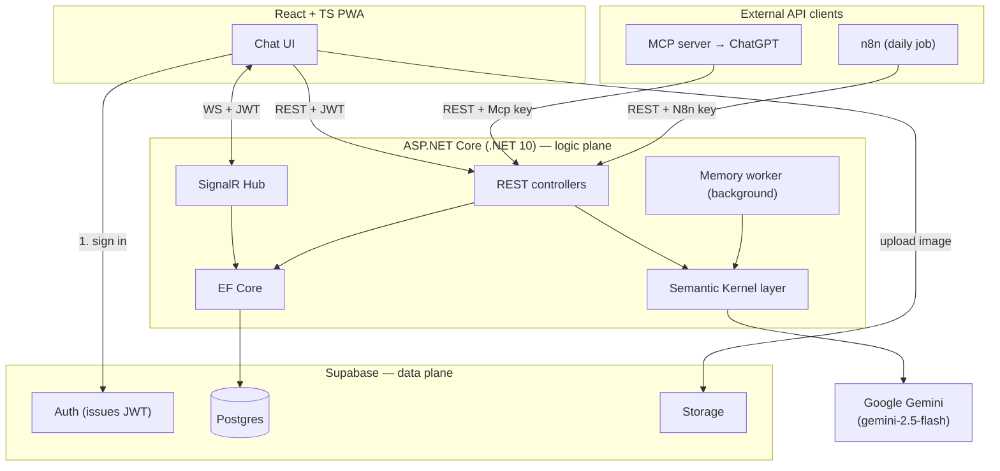
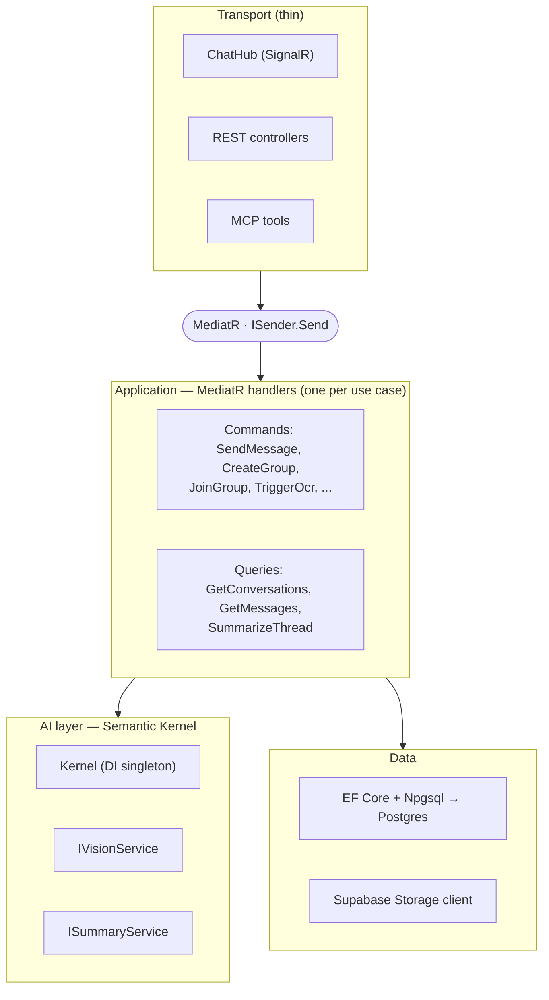
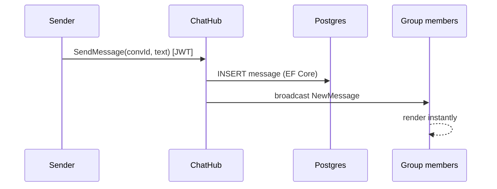
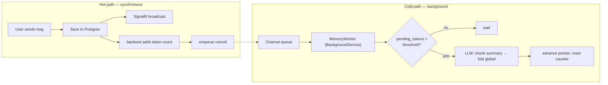
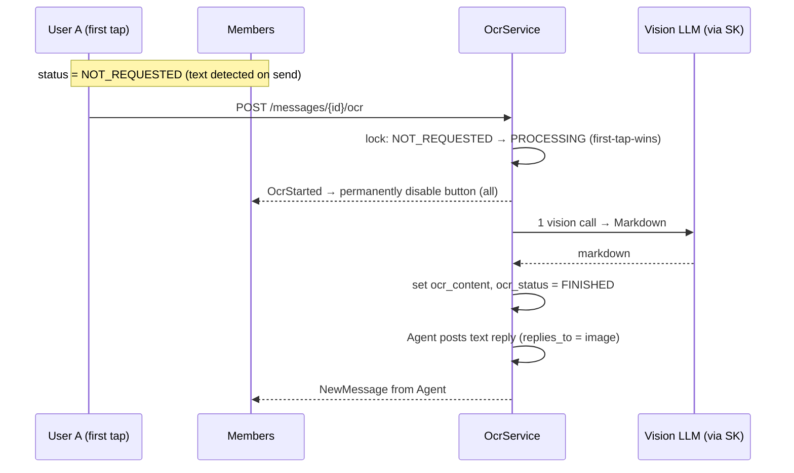
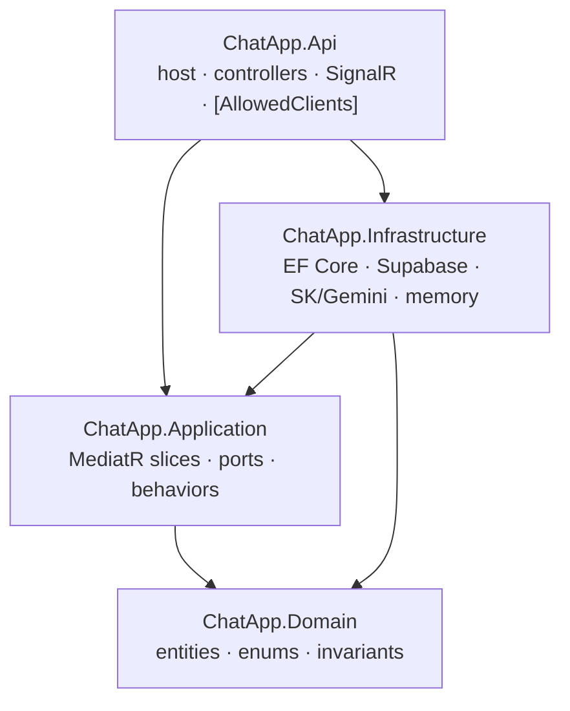

# Backend System Design & Architecture

How the backend is built. Functional requirements are in `chat-app-features-breakdowns.md`; the data model is in `database-design.md`.

> **Design philosophy.** The backend is a thin **logic plane**. It does not own identity (Supabase Auth does), it does not own files (Supabase Storage does), and it never calls AI on its own initiative (only on user action or a scheduled job). All state lives in Postgres.

---

## Contents

1. [Guiding principles](#1-guiding-principles)
2. [Technology stack](#2-technology-stack)
3. [System context](#3-system-context)
4. [Internal architecture](#4-internal-architecture)
5. [Real-time design](#5-real-time-design)
6. [Conversation memory pipeline](#6-conversation-memory-pipeline)
7. [Collaborative OCR](#7-collaborative-ocr)
8. [AI layer (Semantic Kernel)](#8-ai-layer-semantic-kernel)
9. [API reference](#9-api-reference)
10. [Codebase architecture](#10-codebase-architecture)
11. [Security](#11-security)
12. [Concurrency patterns](#12-concurrency-patterns)
13. [Known limitations](#13-known-limitations)
14. [References](#14-references)

---

## 1. Guiding principles

Seven rules enforced everywhere; they explain most decisions below.

| # | Principle | Why |
|---|---|---|
| 1 | JWT is issued by Supabase; the backend only **validates** it | Never re-implement auth |
| 2 | Images upload **directly** to Storage; backend stores only the URL | Backend stays light |
| 3 | AI is **pull-based + cached**, never fan-out | Cost scales with usage, not group size |
| 4 | Collaborative actions use a **first-click-wins idempotent lock** | One trigger → one AI call |
| 5 | AI failure/latency **never blocks** the core chat | AI is an overlay, not a critical path |
| 6 | **Postgres is the source of truth**; SignalR only notifies | Reconnecting clients recover state |
| 7 | The **backend owns counters** (e.g. tokens), not clients | Avoids N-client fan-out |

---

## 2. Technology stack

| Layer | Choice | Rationale |
|---|---|---|
| Client | React + TypeScript PWA (Vite) | One codebase → PC / iOS / Android |
| Backend | ASP.NET Core (.NET 10) + SignalR, controllers | Native realtime for .NET; controllers enable the access-control attribute (§4.2) |
| App mediator | MediatR | One handler per use case, shared across REST / SignalR / MCP transports (§4.1) |
| Data plane | Supabase (Postgres + Auth + Storage) | Auth, storage, DB batteries-included |
| ORM | EF Core + Npgsql | Type-safe Postgres access |
| AI orchestration | Semantic Kernel | Thin, swappable AI service layer |
| AI model | **Google Gemini `gemini-2.5-flash`** via SK's `Microsoft.SemanticKernel.Connectors.Google` | One cheap multimodal model for OCR (vision) + summaries |
| Integration | MCP server (C#) + n8n | ChatGPT connector + scheduled digests |

> **Semantic Kernel vs Agent Framework.** As of April 2026, Microsoft Agent Framework (MAF) is the GA successor and SK is in maintenance mode (supported ≥1 year). SK is chosen intentionally: the AI needs here are single, stateless calls — no agents or multi-agent workflows — so SK's service layer is right-sized. MAF would be over-engineering for this scope.

---

## 3. System context



The client authenticates with Supabase and reuses the **same JWT** to talk to the .NET backend. Images go straight to Storage; the backend only handles the URL. **MCP and n8n are external clients** of the same REST API — see `mcp-integration.md` and `n8n-workflow.md`.

---

## 4. Internal architecture

Four logical layers inside a single Web API project (folders, not separate assemblies — appropriate for this scope). All three transports funnel through **MediatR** into one set of handlers, so business logic is written once and reused.



**Channel-separation rule:** request/response → REST controllers; realtime broadcast → SignalR Hub. Both — plus MCP — dispatch the same MediatR requests.

### 4.1 MediatR — applied thinly

Every use case is a MediatR **command** (write) or **query** (read) with exactly one handler. The value here is concrete: the *same* operation is invoked from up to three transports, and MediatR means it is implemented **once**.

| Use case (request) | Kind | Invoked by |
|---|---|---|
| `SendMessageCommand`, `SendImageCommand` | command | SignalR Hub |
| `CreateConversationCommand`, `JoinConversationCommand` (by `public_id`) | command | REST |
| `AddParticipantCommand`, `RemoveParticipantCommand`, `LeaveConversationCommand` (`delete`\|`freeze`) | command | REST |
| `RenameConversationCommand`, `SetReadonlyCommand`, `TransferOwnershipCommand` | command | REST |
| `TriggerOcrCommand` | command | REST |
| `GetConversationsQuery` (optional search term) | query | REST, MCP |
| `GetMessagesQuery` | query | REST |
| `SummarizeThreadQuery` | query | REST, MCP, n8n |

To avoid over-engineering, only **one** pipeline behavior is added — `ValidationBehavior` ([FluentValidation](https://docs.fluentvalidation.net/)) — plus a lightweight logging behavior. No planners, no CQRS read/write DB split, no event sourcing; commands and queries share the same Postgres. MediatR here is a dispatcher, not a framework.

> **Licensing note (read before adding the NuGet package).** [MediatR](https://github.com/jbogard/MediatR) **v13.0+ is commercial** (dual-license under [Lucky Penny](https://mediatr.io/)); a **free Community edition** covers non-production use and companies under $5M revenue — a home-test project qualifies. Versions **≤ v12 remain MIT**. If you prefer to avoid the license entirely, use a free drop-in such as the source-generated [`Mediator`](https://github.com/martinothamar/Mediator) or [`FreeMediator`](https://www.nuget.org/packages/FreeMediator). The design below is package-agnostic; any of these works with the same slice structure.

### 4.2 Client access control

Three client types call the backend; not every client may call every endpoint. Client identity is resolved from the authentication scheme and expressed as a claim, then checked by a single attribute.

```csharp
public enum Client { App, Mcp, N8n }

// Usage on a controller or action:
[AllowedClients(Client.App, Client.Mcp)]
public class ConversationsController : ControllerBase { /* ... */ }
```

**How the client is identified.**

| Client | Credential | Resolves to |
|---|---|---|
| `App` | User's Supabase JWT (Bearer) | `Client.App` + user identity |
| `Mcp` | Service key header + on-behalf-of user id | `Client.Mcp` + user identity |
| `N8n` | Service key header | `Client.N8n` (no user) |

An authentication step sets a `client` claim; `AllowedClientsAttribute` (an `IAuthorizationFilter`) reads it and returns 403 if the caller's client is not in the allowed set. Because it runs in the authorization pipeline, it composes with the normal user/ownership checks.

```csharp
public sealed class AllowedClientsAttribute(params Client[] allowed) : Attribute, IAuthorizationFilter
{
    public void OnAuthorization(AuthorizationFilterContext ctx)
    {
        var claim = ctx.HttpContext.User.FindFirst("client")?.Value;
        if (!Enum.TryParse<Client>(claim, out var c) || !allowed.Contains(c))
            ctx.Result = new ForbidResult();
    }
}
```

**Access matrix** (which client may call each endpoint):

| Endpoint group | App | Mcp | N8n |
|---|---|---|---|
| Send message / image, create / leave / delete group, add / remove member, trigger OCR | ✓ | | |
| Get conversations (+ search), join group | ✓ | ✓ | |
| Summarize thread | ✓ | ✓ | ✓ |
| Bulk "all threads" + publish digest (n8n only) | | | ✓ |

This satisfies the rule that a User cannot reach n8n-only endpoints and n8n cannot reach user-only endpoints.

### 4.3 Validation & integrity

**Two layers, not three.** Format validation is owned by **FluentValidation** in the Application layer (one validator per command, next to its slice); the **database** is the integrity backstop (CHECK, UNIQUE, FK, RLS). The **Domain layer performs no validation** — no attributes, no throwing — it is a pure model.

| Rule kind | Primary | Backstop |
|---|---|---|
| Field format (length, charset, required, enum) | FluentValidation | DB CHECK for the integrity-critical ones (`username`, `public_id`, `type`, `ocr_status`) |
| Uniqueness (`username`, `public_id`) | — | **DB UNIQUE** (only the DB avoids the check-then-insert race) |
| Referential integrity | — | DB FK |
| Stateful business rules (owner-only, frozen, readonly, ≥2 participants) | Application handler | RLS where it is a security boundary |

The validator runs first in the MediatR pipeline (§4.1) and rejects bad input before it reaches the database; the DB catches anything that slips through or arrives via another client/service-role path. On a DB violation the API maps Postgres `23505` (unique) → 409 and `23514` (check) → 400 rather than surfacing a raw error. Cosmetic text (e.g. `conversation.DisplayName`, allowed charset letters/digits/comma/space) is validated only in Application — it is not an integrity concern, so it gets no DB CHECK.

---

## 5. Real-time design

SignalR is the transport for anything that must reach clients live. A message send is a single round-trip that both persists and fans out:



SignalR **Groups** map to conversations. Membership changes and OCR state changes are broadcast the same way. Clients treat broadcasts as *notifications*; on reconnect they re-fetch from REST, since Postgres — not the socket — is authoritative.

---

## 6. Conversation memory pipeline

**Pattern:** hierarchical rolling summarization. Each conversation keeps a `global_memory`, a list of per-chunk memories (each with a start/end message id), and a running token counter (`pending_tokens`). The pointer to the last summarized message is implicit: the newest chunk's `end_message_id`. (Table shapes: `database-design.md`.)

### Hot path vs cold path

The chat flow never waits for the LLM; it only enqueues a conversation id. A background worker does the summarizing.



### Chunk boundary (snapshot + pointer)

Messages keep arriving while the worker runs, so a snapshot fixes the boundary. The **pointer** is implicit — it is the newest chunk's `end_message_id`:

```
pointer         = newest chunk_memories.end_message_id (or first message)
chunk           = messages[pointer .. snapshot]
chunk.memory    = LLM(current global_memory, chunk)       # token-frugal
global_memory   = LLM(old global_memory, chunk.memory)    # rolling fold, size-bounded
# persist: new chunk_memories row (start/end) + updated global_memory; reset pending_tokens
```

### Two triggers

| Trigger | Behavior |
|---|---|
| **Threshold** | `pending_tokens` crosses the configured threshold → summarize the pending chunk in the background |
| **On-demand** | A summary is requested → return `global_memory` + a fresh summary from the pointer to now, regardless of threshold |

**Why it matters.** Because `global_memory` is always current, every summary reads **O(1)** rather than scanning full history. The MCP `summarize_thread` tool and the n8n digest both read the same `global_memory`.

> Token counting is a cheap **local** operation (`Microsoft.ML.Tokenizers`), not an LLM call — only summarization spends money. For an **image message** the token count is taken from its `caption`. The chunk summary is kept token-frugal, but the prompt must preserve core facts (names, decisions, numbers, negations) because the memory is re-fed to the model.

---

## 7. Collaborative OCR

The "AI-assisted image messaging" feature, in two stages.

**On send (automatic, one vision pass).** When an image is uploaded, the backend makes a single vision call that both **captions** the image and **detects whether it contains text**. The result sets `image_messages.ocr_status`:
- no text → `TEXT_NOT_FOUND` (terminal; the button never appears)
- text present → `NOT_REQUESTED` (the "Extract text" button is enabled)

The `caption` is stored regardless (it feeds conversation memory).

**On demand (collaborative).** When status is `NOT_REQUESTED`, any participant may tap "Extract text". The **first** tap wins a lock (`NOT_REQUESTED → PROCESSING`) and the button is **permanently disabled for everyone** via SignalR. One vision call transcribes to **Markdown**; the text is saved to `ocr_content`, status becomes `FINISHED`, and the hidden **Agent** posts a `text` reply whose `replies_to_message_id` is the image.



- **Markdown, not HTML** → output is data; rendered with raw HTML disabled → no XSS surface, no sanitizer or sandboxed iframe needed.
- **First-tap-wins lock on `ocr_status`** → exactly one transcription call per image regardless of how many tap.
- **Result stored twice, on purpose** → `ocr_content` on the image (queryable) **and** an Agent reply message (shows in the thread; latecomers see it).

**Prompt contract.** *"Transcribe the image into clean GitHub-Flavored Markdown, preserving structure (headings, tables, lists, code blocks). Output ONLY markdown. Do not embed raw HTML."*

**OCR status lifecycle:** `TEXT_NOT_FOUND` (terminal) — or — `NOT_REQUESTED → PROCESSING → FINISHED`.

---

## 8. AI layer (Semantic Kernel)

A thin, swappable layer. Business code calls `IVisionService` / `ISummaryService` — never the model SDK directly. The model is **Google Gemini** via SK's Google connector; because it is exposed through the standard `IChatCompletionService`, swapping providers is a one-line DI change and the service classes are untouched. Gemini is multimodal, so the same model handles both vision (OCR) and summaries. No agents, plugins, planners, or memory constructs are used — the needs are single stateless calls.

```csharp
// NuGet: Microsoft.SemanticKernel.Connectors.Google  (experimental → SKEXP0070)
#pragma warning disable SKEXP0070

// Build the Kernel once
builder.Services.AddSingleton(_ =>
    Kernel.CreateBuilder()
        .AddGoogleAIGeminiChatCompletion("gemini-2.5-flash", geminiApiKey)  // vision + summarize
        .Build());

builder.Services.AddScoped<IVisionService, SkVisionService>();
builder.Services.AddScoped<ISummaryService, SkSummaryService>();
```

Both services resolve `kernel.GetRequiredService<IChatCompletionService>()`; OCR attaches the image via `ImageContent`, summarization sends text only.

---

## 9. API reference

Auth: the **App** carries the Supabase JWT (`Authorization: Bearer <token>` / SignalR `accessTokenFactory`); **MCP** and **n8n** carry their service keys, which resolve to the `Mcp` / `N8n` client types (§4.2). Identifiers are UUIDs.

### 9.1 SignalR Hub (`/hub/chat`)

**Client → server**

| Method | Params | Description |
|---|---|---|
| `SendMessage` | `conversationId`, `text` | Send a text message |
| `SendImage` | `conversationId`, `imageUrl` | Send an image (already uploaded) |

**Server → client (broadcast)**

| Event | Payload | Meaning |
|---|---|---|
| `NewMessage` | message | New message (user or Agent) |
| `OcrStarted` | `messageId` | Disable "Extract text" for all |
| `OcrDone` | `messageId` | OCR finished (reply already broadcast) |
| `MemberChanged` | `conversationId`, `userId`, `action` | Member added/removed/left |

### 9.2 REST

Auth: the App uses the Supabase JWT; MCP and n8n use service keys (§4.2). The **Clients** column lists which client types the `[AllowedClients]` attribute permits.

| Method | Path | Role | Clients | Description |
|---|---|---|---|---|
| `GET` | `/api/conversations?q=<term>` | member | App, Mcp | List the caller's conversations; **`q` empty → all**, otherwise filtered (search merged in) |
| `POST` | `/api/conversations` | any | App | Create a conversation with ≥1 other participant (caller becomes owner; `public_id` + `display_name` auto-generated) |
| `POST` | `/api/conversations/join` | any | App, Mcp | Join by **`public_id`** in the body (rejected if frozen/deleted) |
| `PATCH` | `/api/conversations/{id}` | **owner** | App | Rename `display_name` and/or set `is_readonly` |
| `POST` | `/api/conversations/{id}/transfer` | **owner** | App | Transfer ownership to another participant |
| `GET` | `/api/conversations/{id}/messages?before=&limit=` | member | App | Paginated history |
| `POST` | `/api/conversations/{id}/members` | **owner** | App | Add a participant |
| `DELETE` | `/api/conversations/{id}/members/{userId}` | **owner** | App | Remove a participant |
| `POST` | `/api/conversations/{id}/leave` | member | App | Leave; owner passes `mode = delete \| freeze` |
| `POST` | `/api/messages/{id}/ocr` | member | App | Trigger collaborative OCR (first-tap-wins) |
| `POST` | `/api/conversations/{id}/summary` | member | App, Mcp, N8n | On-demand summary (global + tail) |
| `GET` | `/api/internal/threads` | — | **N8n** | Bulk: all threads for the daily digest |
| `POST` | `/api/internal/digest` | — | **N8n** | Publish the 24h digest to the web page |

```jsonc
// GET /api/conversations           → all conversations
// GET /api/conversations?q=holiday → conversations matching "holiday"

// POST /api/conversations/join
{ "publicId": "Ab3Xy9" }

// POST /api/messages/{id}/ocr → 202; result arrives via SignalR (Agent reply)
{ "status": "PROCESSING" }
```

The user-facing endpoints reject `Mcp`/`N8n`, and the `/api/internal/*` endpoints reject `App`/`Mcp` — enforcing that a User cannot reach n8n-only endpoints and n8n cannot reach user endpoints.

### 9.3 External clients (MCP, n8n)

MCP and n8n are **not part of the backend** — they are external clients that call the REST API above with the `Mcp` / `N8n` client credentials (§4.2). The backend has no MCP- or n8n-specific logic. Their designs live in their own documents:

- **ChatGPT via MCP** → `mcp-integration.md` (tools map to `GetConversationsQuery`, `SummarizeThreadQuery`, join).
- **Scheduled summaries via n8n** → `n8n-workflow.md` (daily job hitting `/api/internal/*` and the summary endpoint).

## 10. Codebase architecture

The backend is a .NET solution of **four projects** with a compiler-enforced dependency direction, plus tests. The MCP server and n8n are **not** in this solution — they are external clients (`mcp-integration.md`, `n8n-workflow.md`).

### Dependency direction



Arrows are compile-time references. **`Application` never references `Infrastructure`** — it defines *ports* (interfaces); `Infrastructure` implements them (Dependency Inversion). `Api` is the composition root that wires both together.

| Project | Role | Change it when… |
|---|---|---|
| **Domain** | Entities, enums, invariant guards; zero dependencies | a field/entity or business invariant changes |
| **Application** | Vertical-slice use cases (MediatR) + **ports** (`IAppDbContext`, `IChatNotifier`, `IStorageClient`, `IVisionService`, `ISummaryService`, `IOcrService`, `IMemoryQueue`, `ITokenCounter`, `ICurrentUser`) | you add a use case or change business flow |
| **Infrastructure** | **Adapters**: EF Core/Npgsql, Supabase Storage, SK+Gemini, tokenizer, memory worker plumbing | you swap DB / storage / AI provider |
| **Api** | Host: controllers, SignalR Hub, `[AllowedClients]`, DI, background service | you change routes, realtime, or client auth |

### Folder tree

```
backend/
├── ChatApp.sln
├── src/
│   ├── ChatApp.Domain/                 # deps: (none)
│   │   ├── Entities/                    # Profile, Conversation, Participant,
│   │   │                                #   Message, TextMessage, ImageMessage,
│   │   │                                #   ConversationMemory, ChunkMemory
│   │   ├── Enums/                        # MessageType, OcrStatus
│   │   └── Errors/                       # domain errors + invariant guards
│   │
│   ├── ChatApp.Application/             # deps: Domain, mediator, FluentValidation
│   │   ├── Abstractions/                 # PORTS (interfaces)
│   │   ├── Features/                     # VERTICAL SLICES (Command+Handler+Validator)
│   │   │   ├── Conversations/            #   Create, Join, Leave, Rename,
│   │   │   │                             #   SetReadonly, TransferOwnership,
│   │   │   │                             #   AddParticipant, RemoveParticipant,
│   │   │   │                             #   GetConversations (q empty => all)
│   │   │   ├── Messages/                 #   SendMessage, SendImage, GetMessages
│   │   │   ├── Ocr/                      #   TriggerOcr (first-tap-wins)
│   │   │   ├── Summaries/                #   SummarizeThread (global + tail)
│   │   │   └── Internal/                 #   GetAllThreads, PublishDigest (n8n)
│   │   ├── Memory/                        # MemoryService (snapshot + fold, via ports)
│   │   └── Common/
│   │       ├── Behaviors/                 # ValidationBehavior, LoggingBehavior (only 2)
│   │       ├── Client.cs                  # enum { App, Mcp, N8n }
│   │       └── Results/                   # Result<T>, Error
│   │
│   ├── ChatApp.Infrastructure/         # deps: Application, Domain, EF Core, SK
│   │   ├── Persistence/                  # AppDbContext : IAppDbContext, Configurations/
│   │   ├── Storage/                      # SupabaseStorageClient : IStorageClient
│   │   ├── Ai/                           # KernelFactory (Gemini), SkVisionService,
│   │   │                                 #   SkSummaryService, SkOcrService, Prompts/
│   │   ├── Memory/                       # TokenCounter, MemoryQueue (Channel<Guid>)
│   │   └── DependencyInjection.cs        # AddInfrastructure(...)
│   │
│   └── ChatApp.Api/                     # deps: Application, Infrastructure
│       ├── Program.cs                    # composition root: DI, JWT, SignalR, mediator
│       ├── Controllers/                  # thin: HTTP -> ISender.Send
│       ├── Realtime/                     # ChatHub, SignalRChatNotifier : IChatNotifier
│       ├── Auth/                         # AllowedClientsAttribute, ClientAuthHandler
│       └── Hosted/                       # MemoryWorker : BackgroundService
│
└── tests/
    ├── ChatApp.UnitTests/               # Domain, handlers, validators, memory-fold
    └── ChatApp.IntegrationTests/        # API + RLS + SignalR
```

Each vertical slice is self-contained, so `tests/` maps almost 1:1 to `Features/`.

### Mediator via NuGet

Install a mediator package and register it by scanning the Application assembly (see the licensing note in §4.1 for which package). With MediatR the wiring is:

```csharp
// ChatApp.Application/DependencyInjection.cs
services.AddMediatR(cfg =>
{
    cfg.RegisterServicesFromAssembly(typeof(AssemblyMarker).Assembly);
    cfg.AddOpenBehavior(typeof(ValidationBehavior<,>));
    cfg.AddOpenBehavior(typeof(LoggingBehavior<,>));
});
services.AddValidatorsFromAssembly(typeof(AssemblyMarker).Assembly); // FluentValidation
```

Controllers and the Hub depend only on `ISender`:

```csharp
[HttpPost("join")]
[AllowedClients(Client.App, Client.Mcp)]
public async Task<IActionResult> Join(JoinConversationCommand cmd)
    => Ok(await _sender.Send(cmd));
```

**Golden rule (enforced by the compiler):** `Application` has no `using` of `Infrastructure`; anything it needs (DB, storage, Gemini, realtime) is reached through a port in `Abstractions/`. That is what turns "maintainable" from a promise into a constraint.

---

## 11. Security

- **Authentication** — the App is authenticated via Supabase Auth (JWT Bearer, validated against Supabase's issuer/signing key; passed to SignalR via `accessTokenFactory`). MCP and n8n authenticate with service keys that resolve to a `client` claim.
- **Authorization — three layers, defense in depth.** (1) **Client type** — `[AllowedClients(...)]` restricts each endpoint to App / Mcp / N8n (§4.2). (2) **User & ownership** — membership and owner-only rules in the handlers. (3) **Row-Level Security** in Postgres. Hiding a button is not security; all three run server-side. (RLS design, including how membership checks avoid recursion, is in `database-design.md`.)
- **XSS** — OCR output is Markdown rendered with raw HTML disabled; the prompt forbids embedded HTML.
- **Cost abuse** — all AI is pull-based and locked/cached (principles 3–4), so no user or large group can trigger runaway spend.

---

## 12. Concurrency patterns

| Situation | Pattern |
|---|---|
| Many users tap OCR on one image | First-click-wins lock on `ocr_status`; one call, result broadcast |
| Memory worker vs incoming messages | Snapshot + pointer fixes the chunk boundary |
| Duplicate summary triggers for one thread | Per-thread idempotent lock in the worker |
| Multi-instance (future) | Replace in-memory locks with Redis/Postgres atomics (`SETNX`, conditional `UPDATE`) |

---

## 13. Known limitations

| Limitation | Rationale / mitigation |
|---|---|
| Single backend instance assumed | In-memory locks and the `Channel` queue don't survive restart or scale-out. Path: Redis/Postgres locks, Hangfire queue. |
| Frozen conversation is unmanaged | Freeze sets `owner_id = null`; no one can add/remove members or rename until... it stays frozen (by design — the owner chose freeze over transfer). New joins are blocked; existing members chat or leave. |
| Manual readonly can be cleared by a join | `is_readonly` is a single flag auto-managed at the 1↔2 boundary; an owner's manual readonly is cleared if participants cross back through that boundary. Accepted simplification. |
| Summaries can lose nuance | Prompt preserves core facts; the global fold adds redundancy. |
| Memory worker loss on restart | Enqueued ids are in memory; the next message re-enqueues, so at worst a chunk is summarized slightly late. |
| OCR quality depends on the vision model | Text presence is detected on send; if none, status is `TEXT_NOT_FOUND` and no button appears. |

---

## 14. References

**Framework & runtime**
- [ASP.NET Core](https://learn.microsoft.com/aspnet/core/) · [SignalR](https://learn.microsoft.com/aspnet/core/signalr/introduction) · [Background services (`BackgroundService`)](https://learn.microsoft.com/aspnet/core/fundamentals/host/hosted-services) · [System.Threading.Channels](https://learn.microsoft.com/dotnet/core/extensions/channels)

**Data**
- [EF Core](https://learn.microsoft.com/ef/core/) · [Npgsql EF Core provider](https://www.npgsql.org/efcore/) · [PostgreSQL](https://www.postgresql.org/docs/)

**Mediator & validation**
- [MediatR (GitHub)](https://github.com/jbogard/MediatR) · [MediatR licensing / commercial](https://mediatr.io/) · free drop-ins: [`Mediator` (source-gen)](https://github.com/martinothamar/Mediator), [`FreeMediator`](https://www.nuget.org/packages/FreeMediator) · [FluentValidation](https://docs.fluentvalidation.net/)

**AI**
- [Semantic Kernel](https://learn.microsoft.com/semantic-kernel/overview/) · [SK Google Gemini connector (`AddGoogleAIGeminiChatCompletion`)](https://learn.microsoft.com/dotnet/api/microsoft.semantickernel.googleaikernelbuilderextensions.addgoogleaigeminichatcompletion) · [Gemini API models](https://ai.google.dev/gemini-api/docs/models) · [Microsoft.ML.Tokenizers](https://learn.microsoft.com/dotnet/api/microsoft.ml.tokenizers)

**Supabase**
- [Auth](https://supabase.com/docs/guides/auth) · [Storage](https://supabase.com/docs/guides/storage) · [Row-Level Security](https://supabase.com/docs/guides/database/postgres/row-level-security) · [Validating Supabase JWTs in a backend](https://supabase.com/docs/guides/auth/jwts)

**Sibling documents**
- `software-requirements-specification.md` · `database-design.md` · `prerequisite-setups.md` · `mcp-integration.md` · `n8n-workflow.md`