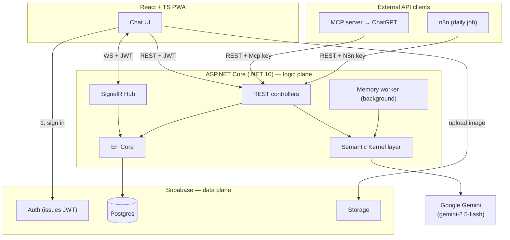
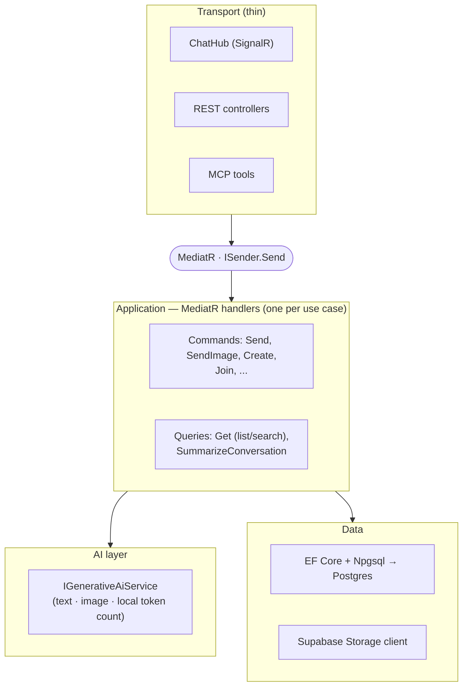
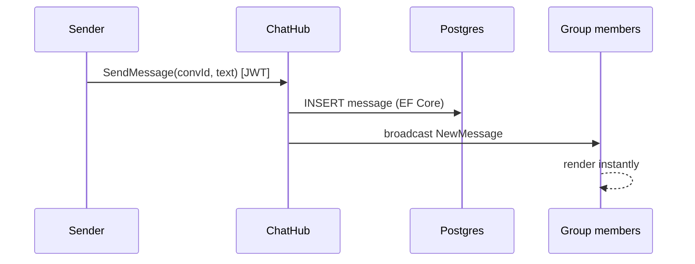
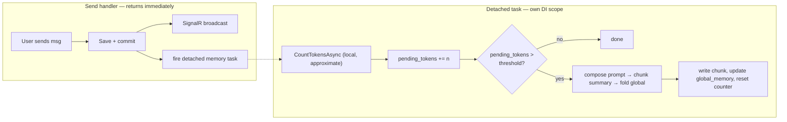
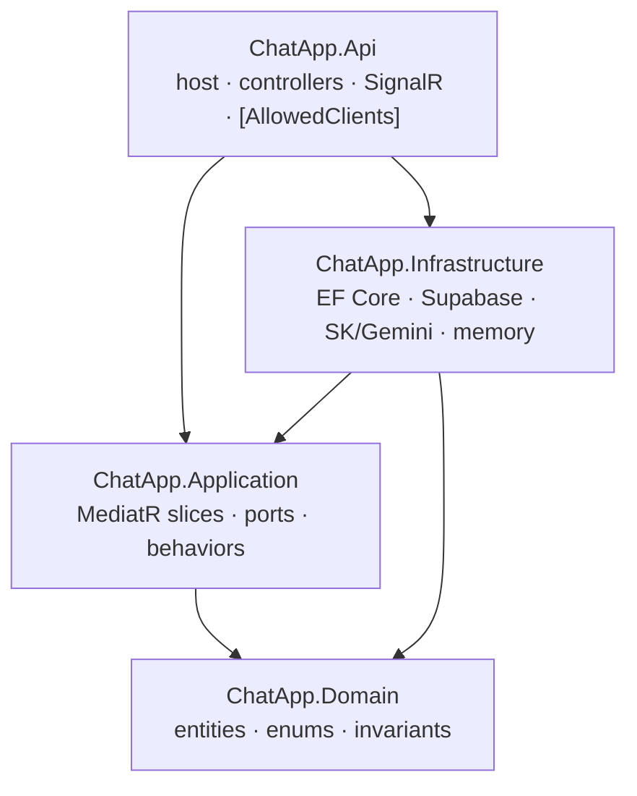

# Backend System Design & Architecture

How the backend is built. Functional requirements are in `chat-app-features-breakdowns.md`; the data model is in `database-design.md`.

> **Design philosophy.** The backend is a thin **logic plane**. It does not own identity (Supabase Auth does), it does not own files (Supabase Storage does), and it never calls AI on its own initiative (only on user action or a scheduled job). All state lives in Postgres.

---

## Contents

1. [Guiding principles](#1-guiding-principles)
2. [Technology stack](#2-technology-stack)
3. [System context](#3-system-context)
4. [Internal architecture](#4-internal-architecture)
5. [Real-time design](#5-real-time-design)
6. [Conversation memory pipeline](#6-conversation-memory-pipeline)
7. [Image captioning (OCR descoped)](#7-image-captioning-ocr-descoped)
8. [AI layer (Semantic Kernel)](#8-ai-layer-semantic-kernel)
9. [API reference](#9-api-reference)
10. [Codebase architecture](#10-codebase-architecture)
11. [Security](#11-security)
12. [Concurrency patterns](#12-concurrency-patterns)
13. [Known limitations](#13-known-limitations)
14. [References](#14-references)

---

## 1. Guiding principles

Seven rules enforced everywhere; they explain most decisions below.

| # | Principle | Why |
|---|---|---|
| 1 | JWT is issued by Supabase; the backend only **validates** it | Never re-implement auth |
| 2 | Images upload **directly** to Storage; backend stores only the URL | Backend stays light |
| 3 | AI is **pull-based + cached**, never fan-out | Cost scales with usage, not group size |
| 4 | Collaborative actions use a **first-click-wins idempotent lock** | One trigger → one AI call |
| 5 | AI failure/latency **never blocks** the core chat | AI is an overlay, not a critical path |
| 6 | **Postgres is the source of truth**; SignalR only notifies | Reconnecting clients recover state |
| 7 | The **backend owns counters** (e.g. tokens), not clients | Avoids N-client fan-out |

---

## 2. Technology stack

| Layer | Choice | Rationale |
|---|---|---|
| Client | React + TypeScript PWA (Vite) | One codebase → PC / iOS / Android |
| Backend | ASP.NET Core (.NET 10) + SignalR, controllers | Native realtime for .NET; controllers enable the access-control attribute (§4.2) |
| App mediator | MediatR | One handler per use case, shared across REST / SignalR / MCP transports (§4.1) |
| Data plane | Supabase (Postgres + Auth + Storage) | Auth, storage, DB batteries-included |
| ORM | EF Core + Npgsql | Type-safe Postgres access |
| AI orchestration | Semantic Kernel | Thin, swappable AI service layer |
| AI model | **Google Gemini `gemini-2.5-flash`** via SK's `Microsoft.SemanticKernel.Connectors.Google` | One cheap multimodal model for image captioning (vision) + summaries |
| Integration | MCP server (C#) + n8n | ChatGPT connector + scheduled digests |

> **Semantic Kernel vs Agent Framework.** As of April 2026, Microsoft Agent Framework (MAF) is the GA successor and SK is in maintenance mode (supported ≥1 year). SK is chosen intentionally: the AI needs here are single, stateless calls — no agents or multi-agent workflows — so SK's service layer is right-sized. MAF would be over-engineering for this scope.

---

## 3. System context



The client authenticates with Supabase and reuses the **same JWT** to talk to the .NET backend. Images go straight to Storage; the backend only handles the URL. **MCP and n8n are external clients** of the same REST API — see `mcp-integration.md` and `n8n-workflow.md`.

---

## 4. Internal architecture

Four logical layers inside a single Web API project (folders, not separate assemblies — appropriate for this scope). All three transports funnel through **MediatR** into one set of handlers, so business logic is written once and reused.



**Channel-separation rule:** request/response → REST controllers; realtime broadcast → SignalR Hub. Both — plus MCP — dispatch the same MediatR requests.

### 4.1 MediatR — applied thinly

Every use case is a MediatR **command** (write) or **query** (read) with exactly one handler. The value here is concrete: the *same* operation is invoked from up to three transports, and MediatR means it is implemented **once**.

| Use case (request) | Kind | Invoked by |
|---|---|---|
| `Messages.Send`, `Messages.SendImage` | command | SignalR Hub |
| `Conversations.Create`, `Conversations.Join` (by `public_id`) | command | REST |
| `Conversations.AddParticipants`, `Conversations.RemoveParticipants` (**batch**, all-or-nothing), `Conversations.Leave` (`delete`\|`freeze`) | command | REST |
| `Conversations.Rename`, `Conversations.SetReadonly`, `Conversations.TransferOwnership` | command | REST |
| `Conversations.Get` (optional search term; empty ⇒ all) | query | REST, MCP |
| `Messages.Get` (paginated) | query | REST |
| `Internal.SummarizeConversation` (single thread) | query | REST, MCP, n8n |
| `Internal.GetAllConversations`, `Internal.SummarizeConversations` (24 h roll-up), `Internal.PublishDigest` | query/command | n8n |

> **`Internal` is a code namespace, not an access boundary** (decision B-1): `SummarizeConversation` lives there but is reachable by App / Mcp / N8n; only `GetAllConversations`, `SummarizeConversations` and `PublishDigest` are n8n-only. Access is decided per-endpoint by `[AllowedClients]` (§4.2), not by the folder name.

Slices are named by namespace (`Features/<Area>/<UseCase>/{Command|Query, Handler, Validator}`), so the type names are short and repeated across folders. Api controllers disambiguate with `using` aliases — record this as a team convention.

Registration lives in `Application/DependencyInjection.cs` as `AddApplication()`, which calls `AddMediatR(RegisterServicesFromAssembly + AddOpenBehavior × 2)` and `AddValidatorsFromAssembly`. Without it nothing in this layer is resolvable from Api.

> **Two rules that keep the dispatcher from becoming a framework.**
> - **A handler must not inject `IMediator`.** Logic shared between slices belongs in a plain service called directly (this is how the memory-update logic must be shared instead of one summary handler dispatching another). Nested dispatch re-runs the whole pipeline per inner call, couples slices to each other's request contracts, and invites the scope bug below.
> - **Anything fired detached must open its own DI scope.** A request-scoped `IAppDbContext` is disposed when the request ends, and `DbContext` is not thread-safe — so fire-and-forget work and any parallel fan-out must resolve their own scope per unit of work, never reuse the caller's.

To avoid over-engineering, only **one** pipeline behavior is added — `ValidationBehavior` ([FluentValidation](https://docs.fluentvalidation.net/)) — plus a lightweight logging behavior. No planners, no CQRS read/write DB split, no event sourcing; commands and queries share the same Postgres. MediatR here is a dispatcher, not a framework.

> **Licensing note (read before adding the NuGet package).** [MediatR](https://github.com/LuckyPennySoftware/MediatR) **v13.0+ is commercial** (dual-license under [Lucky Penny](https://mediatr.io/)); a **free Community edition** covers non-production use and companies under $5M revenue — a home-test project qualifies. Versions **≤ v12 remain MIT**. Free drop-ins: source-generated [`Mediator`](https://github.com/martinothamar/Mediator) or [`FreeMediator`](https://www.nuget.org/packages/FreeMediator). The design is package-agnostic.
>
> Two practical consequences of choosing MediatR v14, both worth handling explicitly:
> - **Without a license key it still runs** (no runtime limits), but it **logs a licensing warning on every startup**. Register a free Community key (`cfg.LicenseKey`, or the `MEDIATR_LICENSE_KEY` environment variable), or silence it with `builder.Logging.AddFilter("LuckyPennySoftware.MediatR.License", LogLevel.None)`.
> - It pulls the `Microsoft.IdentityModel.*` JWT stack into Application transitively, purely to validate that key. Nothing in the business logic uses it. `LoggingBehavior` also gets `ILogger<T>` only transitively through MediatR — add an **explicit** `PackageReference` for `Microsoft.Extensions.Logging.Abstractions` so the logging behavior does not depend on the mediator choice.

### 4.2 Client access control

Three client types call the backend; not every client may call every endpoint. Client identity is resolved from the authentication scheme and expressed as a claim, then checked by a single attribute.

> **Layer ownership.** The `Client` enum and this whole check live in **`ChatApp.Api`**. The Application layer is deliberately unaware of which client called it — `IConversationAccess` exposes the caller's user identity as a synchronous `Guid? UserId` (plus the owner/readonly access guards, and a `GetCurrentUserAsync()` used only by `Create`, which needs the owner's `Username` for display-name generation). Consequence to respect: an Application handler must **never infer a client type**, in particular not by treating a failed identity lookup as "this must be n8n". `[AllowedClients]` is the single gate; handlers that need no user simply do not ask for one.

```csharp
public enum Client { App, Mcp, N8n }   // declared in ChatApp.Api — Application is unaware of it

// Usage on a controller or action:
[AllowedClients(Client.App, Client.Mcp)]
public class ConversationsController : ControllerBase { /* ... */ }
```

**How the client is identified.**

| Client | Credential | Resolves to |
|---|---|---|
| `App` | User's Supabase JWT (Bearer) | `Client.App` + user identity |
| `Mcp` | Service key header + on-behalf-of user id | `Client.Mcp` + user identity |
| `N8n` | Service key header | `Client.N8n` (no user) |

An authentication step sets a `client` claim; `AllowedClientsAttribute` (an `IAuthorizationFilter`) reads it and returns 403 if the caller's client is not in the allowed set. Because it runs in the authorization pipeline, it composes with the normal user/ownership checks.

```csharp
public sealed class AllowedClientsAttribute(params Client[] allowed) : Attribute, IAuthorizationFilter
{
    public void OnAuthorization(AuthorizationFilterContext ctx)
    {
        var claim = ctx.HttpContext.User.FindFirst("client")?.Value;
        if (!Enum.TryParse<Client>(claim, out var c) || !allowed.Contains(c))
            ctx.Result = new ForbidResult();
    }
}
```

**Access matrix** (which client may call each endpoint):

| Endpoint group | App | Mcp | N8n |
|---|---|---|---|
| Send message / image, create / leave / delete group, add / remove member | ✓ | | |
| Get conversations (+ search), join group | ✓ | ✓ | |
| Summarize thread | ✓ | ✓ | ✓ |
| Bulk "all threads" + publish digest (n8n only) | | | ✓ |

This satisfies the rule that a User cannot reach n8n-only endpoints and n8n cannot reach user-only endpoints.

### 4.3 Validation & integrity

**Two layers, not three.** Format validation is owned by **FluentValidation** in the Application layer (one validator per command, next to its slice); the **database** is the integrity backstop (CHECK, UNIQUE, FK, RLS). The **Domain layer performs no validation** — no attributes, no throwing — it is a pure model.

| Rule kind | Primary | Backstop |
|---|---|---|
| Field format (length, charset, required, enum) | FluentValidation | DB CHECK for the integrity-critical ones (`username`, `public_id`, `type`) |
| Uniqueness (`username`, `public_id`) | — | **DB UNIQUE** (only the DB avoids the check-then-insert race) |
| Referential integrity | — | DB FK |
| Stateful business rules (owner-only, frozen, readonly, ≥2 participants) | Application handler | RLS where it is a security boundary |

The validator runs first in the MediatR pipeline (§4.1) and rejects bad input before it reaches the database; the DB catches anything that slips through or arrives via another client/service-role path. On a DB violation the API maps Postgres `23505` (unique) → 409 and `23514` (check) → 400 rather than surfacing a raw error. Cosmetic text (e.g. `conversation.DisplayName`, allowed charset letters/digits/comma/space) is validated only in Application — it is not an integrity concern, so it gets no DB CHECK.

---

## 5. Real-time design

SignalR is the transport for anything that must reach clients live. A message send is a single round-trip that both persists and fans out:



SignalR **Groups** map to conversations. Membership changes are broadcast the same way. Clients treat broadcasts as *notifications*; on reconnect they re-fetch from REST, since Postgres — not the socket — is authoritative.

---

## 6. Conversation memory pipeline

**Pattern:** hierarchical rolling summarization. Each conversation keeps a `global_memory`, a list of per-chunk memories (each with a start/end message id), and a running token counter (`pending_tokens`). The pointer to the last summarized message is implicit: the newest chunk's `end_message_id`. (Table shapes: `database-design.md`.)

### Trigger model — detached-per-send (decisions A-1, B-2, B-7, Q-B)

The message-send path never waits for the AI. After it commits the message and broadcasts it, it **kicks off a detached memory-update task that opens its own DI scope** (a fresh `IAppDbContext`, never the request's). There is **no shared queue and no long-running worker** — the send handler fires the work and returns. Summarization runs inside that detached scope; token counting (a cheap local operation, see below) can run either on the send path or in the detached task.



The chunk + fold logic is a **plain service** called directly by the detached task — never one handler dispatching another through `IMediator` (§4.1). Because a bare detached task is not drained on host shutdown, an in-flight update can be lost on restart; the next message re-fires it, so at worst a chunk is summarized slightly late (see §13).

### Chunk boundary (snapshot + pointer)

Messages keep arriving while the worker runs, so a snapshot fixes the boundary. The **pointer** is implicit — it is the newest chunk's `end_message_id`:

```
pointer         = newest chunk_memories.end_message_id (or first message)
chunk           = messages[pointer .. snapshot]
chunk.memory    = LLM(current global_memory, chunk)       # token-frugal
global_memory   = LLM(old global_memory, chunk.memory)    # rolling fold, size-bounded
# persist: new chunk_memories row (start/end) + updated global_memory; reset pending_tokens
```

### Two triggers

| Trigger | Behavior |
|---|---|
| **Threshold** | The detached task finds `pending_tokens` over the configured threshold → it summarizes the pending chunk and folds it into `global_memory` in that same scope |
| **On-demand** | A summary is requested → **pure read** (decision C-3): return `global_memory` + a freshly-computed summary from the pointer to now, without mutating stored memory or resetting the counter |

**Why it matters.** Because `global_memory` is always current, every summary reads **O(1)** rather than scanning full history. The MCP `summarize_thread` tool and the n8n digest both read the same `global_memory`.

> **Token counting is a local approximation, not a remote call** (decision B-7, final — this supersedes any earlier expectation of a remote Gemini `countTokens` call). `IGenerativeAiService.CountTokensAsync` returns a cheap local estimate (e.g. character count); it costs no network round-trip and no Gemini quota, at the price of being approximate rather than exact for the model's tokenizer — acceptable since `pending_tokens` only needs to trigger a fold *near* the right size, not exactly. For an **image message** the count is taken from its `caption`. The chunk summary must preserve core facts (names, decisions, numbers, negations) because the memory is re-fed to the model.

---

## 7. Image captioning (OCR descoped)

The "AI-assisted image messaging" feature is now **just an on-send caption**: when an image is uploaded, the backend makes a single vision call that generates a `caption`, stored on `image_messages` and folded into conversation memory. There is no text-extraction/transcription step, no "Extract text" action, no `ocr_status`/`ocr_content`, and no collaborative locking — that whole sub-feature (originally documented here as collaborative OCR) was **descoped**. If it returns later, it needs its own port (`IOcrService` was removed from Application), its own DB columns (removed from `schema.sql`), and a first-tap-wins locking design like the one that used to live in this section.

---

## 8. AI layer (Semantic Kernel)

A thin, swappable layer with **one AI port**: `IGenerativeAiService` (decision Q-A). It handles text generation, image generation, and token counting, so business code never touches the model SDK and there is no overlap between competing AI abstractions.

```csharp
public interface IGenerativeAiService
{
    Task<int> CountTokensAsync(string text, CancellationToken cancellationToken = default);
    Task<T> GenerateContentAsync<T>(string prompt, double temp = 1.0, CancellationToken cancellationToken = default);
    Task<T> GenerateContentFromImageAsync<T>(string prompt, byte[] imageAsBytes, double temp = 1.0, CancellationToken cancellationToken = default);
    Task<T> GenerateContentFromImageAsync<T>(string prompt, string imageUrl, double temp = 1.0, CancellationToken cancellationToken = default);
}
```

- **Prompts live in the Application layer** (decision A-2b): the caller composes the prompt string and calls this port; Infrastructure only executes it. The `Internal/*` handlers and the on-send caption path all go through this one port.
- **Implementation (Infrastructure)** wraps **Google Gemini `gemini-2.5-flash`** via `Microsoft.SemanticKernel.Connectors.Google` (`AddGoogleAIGeminiChatCompletion`, experimental `SKEXP0070`). Gemini is multimodal, so the same model backs both the text and image overloads. Swapping providers is confined to this one adapter.
- **`CountTokensAsync` is a local, approximate count** (decision B-7, final) — not a call to Gemini's `countTokens` API. It trades tokenizer-exactness for zero network cost and zero API quota usage, which matters because it runs on every message send. This replaces the removed local `ITokenCounter` port — the same responsibility, now folded into the single AI port rather than a separate one.
- `GenerateContentAsync<T>` returns `T` (typically `string`, or a JSON-shaped record when the prompt asks for structured output); the caller owns the prompt contract that makes `T` valid.

---

## 9. API reference

Auth: the **App** carries the Supabase JWT (`Authorization: Bearer <token>` / SignalR `accessTokenFactory`); **MCP** and **n8n** carry their service keys, which resolve to the `Mcp` / `N8n` client types (§4.2). Identifiers are UUIDs.

### 9.1 SignalR Hub (`/hub/chat`)

**Client → server**

| Method | Params | Description |
|---|---|---|
| `SendMessage` | `conversationId`, `text` | Send a text message |
| `SendImage` | `conversationId`, `imageUrl` | Send an image (already uploaded) |

**Server → client (broadcast)**

| Event | Payload | Meaning |
|---|---|---|
| `NewMessage` | message | New message (user or Agent) |
| `MemberChanged` | `conversationId`, `userId`, `action` (`Added` \| `Left`) | A participant joined, or left / was removed |
| `DigestPublished` | digest content, date | The n8n daily digest was published (not conversation-scoped) |

The Application-side port for these broadcasts is **`IConversationNotifier`**.

**Conversation delete is signalled through `MemberChanged(Left)`, not a dedicated event** (decision, ship-oriented). When an owner deletes a conversation, the backend soft-deletes it (`is_deleted = true`) and broadcasts `MemberChanged(action = Left)` to **every** participant. There is deliberately no `ConversationDeleted`/`ConversationClosed` event — reusing the existing vocabulary keeps the notifier port surface unchanged.

Client contract that this relies on: a client treats **`MemberChanged(Left)` where `userId` is its own** as "this conversation is gone from my list" and removes it from the sidebar — the same reaction it needs for being individually removed. It must not assume `Left` only means "someone else left." (Only the owner's own `participants` row is physically removed on delete; other rows are retained under soft-delete, so the signal, not the row's presence, is the source of truth for the UI.)

### 9.2 REST

Auth: the App uses the Supabase JWT; MCP and n8n use service keys (§4.2). The **Clients** column lists which client types the `[AllowedClients]` attribute permits.

| Method | Path | Role | Clients | Description |
|---|---|---|---|---|
| `GET` | `/api/conversations?q=<term>` | member | App, Mcp | List the caller's conversations; **`q` empty → all**, otherwise filtered (search merged in). Excludes deleted. |
| `POST` | `/api/conversations` | any | App | Create a conversation with ≥1 other participant (caller becomes owner; `public_id` + `display_name` auto-generated) |
| `POST` | `/api/conversations/join` | any | App, Mcp | Join by **`public_id`** in the body (rejected if frozen/deleted) |
| `PATCH` | `/api/conversations/{id}/name` | **owner** | App | Rename `display_name` (≤ 100 chars; letters, digits, comma, space) |
| `PATCH` | `/api/conversations/{id}/readonly` | **owner** | App | Set `is_readonly` |
| `POST` | `/api/conversations/{id}/transfer` | **owner** | App | Transfer ownership to another participant |
| `GET` | `/api/conversations/{id}/messages?before=&limit=` | member | App | Paginated history. `before` = message id (omitted ⇒ newest); `limit` default 50, max 100. **Filter and order on the `(sent_at, id)` tuple** — comparing `sent_at` alone loses the tie-stability that a message-id cursor exists to provide |
| `POST` | `/api/conversations/{id}/participants` | **owner** | App | **Add a batch** of participants (all-or-nothing) |
| `DELETE` | `/api/conversations/{id}/participants` | **owner** | App | **Remove a batch** of participants (all-or-nothing); cannot remove the owner |
| `POST` | `/api/conversations/{id}/leave` | member | App | Leave; owner passes `mode = delete \| freeze` |
| `POST` | `/api/conversations/{id}/summary` | member | App, Mcp, N8n | On-demand summary (global + tail) |
| `GET` | `/api/internal/conversations` | — | **N8n** | Bulk: all non-deleted conversations |
| `POST` | `/api/internal/summaries?hoursAgo=24` | — | **N8n** | Backend-produced roll-up across conversations active in the window |
| `POST` | `/api/internal/digest` | — | **N8n** | Publish the digest (broadcast to listeners) |

```jsonc
// GET /api/conversations           → all conversations
// GET /api/conversations?q=holiday → conversations matching "holiday"

// POST /api/conversations/join
{ "publicId": "Ab3Xy9" }

// POST /api/conversations/{id}/participants
{ "userIds": ["…", "…"] }        // batch, all-or-nothing

// POST /api/messages/{id}/ocr → 202; result arrives via SignalR (Agent reply)
{ "status": "PROCESSING" }
```

Two field limits are product decisions, recorded here as the contract: `display_name` ≤ **100** characters, and `limit` ∈ **[1, 100]** with default **50**.

The user-facing endpoints reject `Mcp`/`N8n`, and the `/api/internal/*` endpoints reject `App`/`Mcp` — enforcing that a User cannot reach n8n-only endpoints and n8n cannot reach user endpoints. **Client-type authorization is owned entirely by the Api layer** (`[AllowedClients]`); the Application layer is deliberately unaware of which client called it, so handlers must never infer a client type (for example, from a failed identity lookup).

### 9.3 External clients (MCP, n8n)

MCP and n8n are **not part of the backend** — they are external clients that call the REST API above with the `Mcp` / `N8n` client credentials (§4.2). The backend has no MCP- or n8n-specific logic. Their designs live in their own documents:

- **ChatGPT via MCP** → `mcp-integration.md` (tools map to `Conversations.Get`, `SummarizeConversation`, join).
- **Scheduled summaries via n8n** → `n8n-workflow.md` (daily job hitting `/api/internal/*` and the summary endpoint).

## 10. Codebase architecture

The backend is a .NET solution of **four projects** with a compiler-enforced dependency direction, plus tests. The MCP server and n8n are **not** in this solution — they are external clients (`mcp-integration.md`, `n8n-workflow.md`).

### Dependency direction



Arrows are compile-time references. **`Application` never references `Infrastructure`** — it defines *ports* (interfaces); `Infrastructure` implements them (Dependency Inversion). `Api` is the composition root that wires both together.

| Project | Role | Change it when… |
|---|---|---|
| **Domain** | Entities, enums, invariant guards; zero dependencies | a field/entity or business invariant changes |
| **Application** | Vertical-slice use cases (MediatR) + **ports** (`IAppDbContext`, `IConversationNotifier`, `IStorageClient`, `IGenerativeAiService`, `IConversationAccess`) | you add a use case or change business flow |
| **Infrastructure** | **Adapters**: EF Core/Npgsql, Supabase Storage, SK+Gemini, tokenizer, memory worker plumbing | you swap DB / storage / AI provider |
| **Api** | Host: controllers, SignalR Hub, `[AllowedClients]`, DI, background service | you change routes, realtime, or client auth |

### Folder tree

```
backend/
├── ChatApp.sln
├── src/
│   ├── ChatApp.Domain/                 # deps: (none)
│   │   ├── Entities/                    # Profile, Conversation, Participant,
│   │   │                                #   Message, TextMessage, ImageMessage,
│   │   │                                #   ConversationMemory, ChunkMemory
│   │   └── Enums/                        # MessageType   (no validation, no throwing)
│   │
│   ├── ChatApp.Application/             # deps: Domain, mediator, FluentValidation,
│   │   │                                #       Logging.Abstractions (explicit)
│   │   ├── DependencyInjection.cs        # AddApplication(): mediator + behaviors + validators
│   │   ├── Abstractions/                 # PORTS (interfaces only)
│   │   ├── Features/                     # VERTICAL SLICES (Command|Query + Handler + Validator)
│   │   │   ├── Conversations/            #   Create, Join, Leave, Rename, SetReadonly,
│   │   │   │                             #   TransferOwnership, AddParticipants,
│   │   │   │                             #   RemoveParticipants (batch),
│   │   │   │                             #   Get (list/search; q empty => all)
│   │   │   ├── Messages/                 #   Send, SendImage, Get,
│   │   │   └── Internal/                 #   SummarizeConversation (App+Mcp+n8n),
│   │   │                                 #   GetAllConversations, SummarizeConversations
│   │   │                                 #   (24h roll-up), PublishDigest   [n8n only]
│   │   ├── Memory/                        # plain conversation-memory service: chunk + fold
│   │   │                                 #   logic, called directly by the detached
│   │   │                                 #   send-triggered task (NOT via IMediator)
│   │   └── Common/
│   │       ├── Behaviors/                 # ValidationBehavior, LoggingBehavior (only 2)
│   │       └── Results/                   # Result, Result<T>, Error, ErrorType, IResult<TSelf>
│   │                                      # (no Client enum — client auth is an Api concern, §4.2)
│   │
│   ├── ChatApp.Infrastructure/         # deps: Application, Domain, EF Core, SK
│   │   ├── Persistence/                  # AppDbContext : IAppDbContext, Configurations/
│   │   ├── Storage/                      # SupabaseStorageClient : IStorageClient
│   │   ├── Ai/                           # GeminiGenerativeAiService : IGenerativeAiService
│   │   │                                 #   (SK Google connector). Prompts are passed in
│   │   │                                 #   by Application, not stored here
│   │   ├── Memory/                       # TokenCounter, MemoryQueue (Channel<Guid>)
│   │   └── DependencyInjection.cs        # AddInfrastructure(...)
│   │
│   └── ChatApp.Api/                     # deps: Application, Infrastructure
│       ├── Program.cs                    # composition root: DI, JWT, SignalR, mediator
│       ├── Controllers/                  # thin: HTTP -> ISender.Send
│       ├── Realtime/                     # ChatHub, SignalRNotifier : IConversationNotifier
│       ├── Auth/                         # AllowedClientsAttribute, ClientAuthHandler
│       └── Hosted/                       # MemoryWorker : BackgroundService
│
└── tests/
    ├── ChatApp.UnitTests/               # Domain, handlers, validators, memory-fold
    └── ChatApp.IntegrationTests/        # API + RLS + SignalR
```

Each vertical slice is self-contained, so `tests/` maps almost 1:1 to `Features/`.

### Mediator via NuGet

Install a mediator package and register it by scanning the Application assembly (see the licensing note in §4.1 for which package). With MediatR the wiring is:

```csharp
// ChatApp.Application/DependencyInjection.cs
services.AddMediatR(cfg =>
{
    cfg.RegisterServicesFromAssembly(typeof(AssemblyMarker).Assembly);
    cfg.AddOpenBehavior(typeof(ValidationBehavior<,>));
    cfg.AddOpenBehavior(typeof(LoggingBehavior<,>));
});
services.AddValidatorsFromAssembly(typeof(AssemblyMarker).Assembly); // FluentValidation
```

Controllers and the Hub depend only on `ISender`:

```csharp
[HttpPost("join")]
[AllowedClients(Client.App, Client.Mcp)]
public async Task<IActionResult> Join(JoinConversationCommand cmd)
    => Ok(await _sender.Send(cmd));
```

**Golden rule (enforced by the compiler):** `Application` has no `using` of `Infrastructure`; anything it needs (DB, storage, Gemini, realtime) is reached through a port in `Abstractions/`. That is what turns "maintainable" from a promise into a constraint.

---

## 11. Security

- **Authentication** — the App is authenticated via Supabase Auth (JWT Bearer, validated against Supabase's issuer/signing key; passed to SignalR via `accessTokenFactory`). MCP and n8n authenticate with service keys that resolve to a `client` claim.
- **Authorization — two layers guarding *different* surfaces, not the same one twice.**
  1. **Backend traffic** (App via REST/SignalR, plus MCP and n8n) — enforced by `[AllowedClients(...)]` at the edge (§4.2) and by membership/owner rules inside the handlers. This is the **only** authorization for any request that goes through the .NET API.
  2. **Direct Supabase traffic** — a Supabase project also exposes PostgREST publicly, and the **anon key ships in the frontend**. **Row-Level Security is what makes that surface safe**: without it, anyone holding the anon key could read every table directly. (RLS design, including how membership checks avoid recursion, is in `database-design.md`.)

  > **Consequence to design for, not around.** The backend connects to Postgres with a **service role, which bypasses RLS** — so RLS is *not* a second check on backend queries, and handler-level checks are load-bearing on their own. Conversely, if Infrastructure ever configures the connection with a role that RLS *does* apply to, `auth.uid()` is `NULL` in that session, every policy evaluates false, and **every query silently returns zero rows** rather than failing loudly. Verify the connection role first when debugging "the query returns nothing".
- **Cost abuse** — all AI is pull-based and locked/cached (principles 3–4), so no user or large group can trigger runaway spend.

---

## 12. Concurrency patterns

| Situation | Pattern |
|---|---|
| Memory worker vs incoming messages | Snapshot + pointer fixes the chunk boundary |
| Duplicate summary triggers for one thread | Per-thread idempotent lock in the worker |
| Multi-instance (future) | Replace in-memory locks with Redis/Postgres atomics (`SETNX`, conditional `UPDATE`) |

---

## 13. Known limitations

> **Delivery bar: ship-oriented.** This is a single-developer, deadline-bound take-home whose grading criteria are a running repo, a clear README, and commit history — not a production hardening pass. The limitations below are **knowingly accepted for this deliverable**; the fix path is noted for each but is out of scope now. Concretely, work is prioritised as:
> - **Must fix (a broken or visibly-flawed demo):** anything that fails at runtime on the happy path, anything the reviewer sees on `dotnet build`/startup, and the F-7 summarization feature (it also powers the MCP `summarize_thread` tool and the n8n digest — both graded).
> - **Cheap polish worth doing:** user-facing error-message typos, missing XML docs, a non-crypto `PublicId` generator.
> - **Deferred:** double identity resolution, transactional message+token writes, per-field validation errors, and a full unit-test suite for all 19 slices. A few high-value tests (a "every `IRequest<T>` has a registered handler" smoke test; memory-fold and ownership-rule tests) are kept; exhaustive coverage is not.
>
> **Sequencing consequence:** the critical path to unblock the `ChatApp.Api` task is small (fix the two blocking defects + add `AddApplication()`), so Api scaffolding should start **in parallel** rather than waiting for the Application layer to be fully polished — otherwise the largest remaining piece (F-7) gates having anything demonstrable.

| Limitation | Rationale / mitigation |
|---|---|
| Single backend instance assumed | Detached memory tasks don't survive restart or scale-out. Path: a durable queue + hosted worker if the fire-and-forget guarantee needs strengthening. |
| Frozen conversation is unmanaged | Freeze sets `owner_id = null`; no one can add/remove members or rename until... it stays frozen (by design — the owner chose freeze over transfer). New joins are blocked; existing members chat or leave. |
| Manual readonly can be cleared by a join | `is_readonly` is a single flag auto-managed at the 1↔2 boundary; an owner's manual readonly is cleared if participants cross back through that boundary. Accepted simplification. |
| Summaries can lose nuance | Prompt preserves core facts; the global fold adds redundancy. |
| Detached memory task loss on restart | The send-triggered memory task is not drained on host shutdown, so an in-flight update can be lost; the next message re-fires it, so at worst a chunk is summarized slightly late. |

---

## 14. References

**Framework & runtime**
- [ASP.NET Core](https://learn.microsoft.com/aspnet/core/) · [SignalR](https://learn.microsoft.com/aspnet/core/signalr/introduction) · [Background services (`BackgroundService`)](https://learn.microsoft.com/aspnet/core/fundamentals/host/hosted-services) · [System.Threading.Channels](https://learn.microsoft.com/dotnet/core/extensions/channels)

**Data**
- [EF Core](https://learn.microsoft.com/ef/core/) · [Npgsql EF Core provider](https://www.npgsql.org/efcore/) · [PostgreSQL](https://www.postgresql.org/docs/)

**Mediator & validation**
- [MediatR (GitHub)](https://github.com/jbogard/MediatR) · [MediatR licensing / commercial](https://mediatr.io/) · free drop-ins: [`Mediator` (source-gen)](https://github.com/martinothamar/Mediator), [`FreeMediator`](https://www.nuget.org/packages/FreeMediator) · [FluentValidation](https://docs.fluentvalidation.net/)

**AI**
- [Semantic Kernel](https://learn.microsoft.com/semantic-kernel/overview/) · [SK Google Gemini connector (`AddGoogleAIGeminiChatCompletion`)](https://learn.microsoft.com/dotnet/api/microsoft.semantickernel.googleaikernelbuilderextensions.addgoogleaigeminichatcompletion) · [Gemini API models](https://ai.google.dev/gemini-api/docs/models)

**Supabase**
- [Auth](https://supabase.com/docs/guides/auth) · [Storage](https://supabase.com/docs/guides/storage) · [Row-Level Security](https://supabase.com/docs/guides/database/postgres/row-level-security) · [Validating Supabase JWTs in a backend](https://supabase.com/docs/guides/auth/jwts)

**Sibling documents**
- `software-requirements-specification.md` · `database-design.md` · `prerequisite-setups.md` · `mcp-integration.md` · `n8n-workflow.md`
