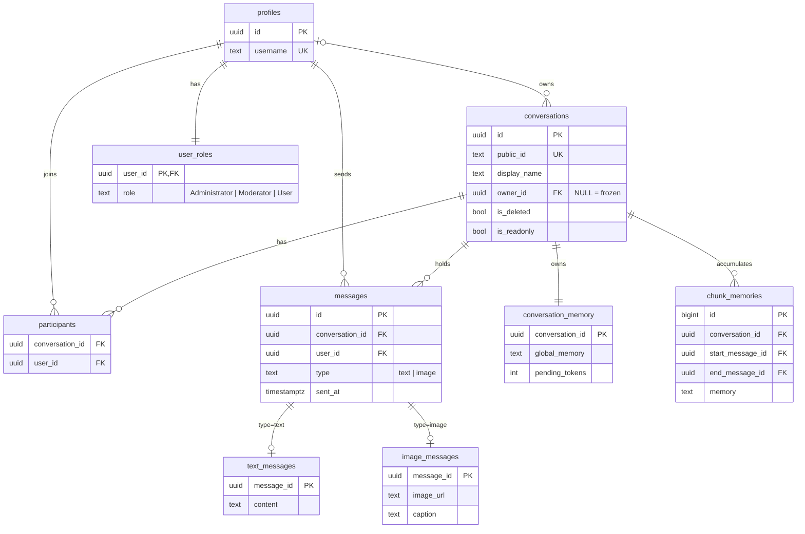

# Database Design

The data model, mapping 1:1 to [`schema.sql`](schema.sql). Technical usage is in [backend-system-design-and-architecture.md](backend-system-design-and-architecture.md); product requirements in [software-requirements-specification.md](software-requirements-specification.md).

> **Principle.** Postgres is the single source of truth; realtime only notifies. Conversations are **soft-deleted**, never dropped. Messages and users are never deleted at all.

Engine: PostgreSQL via Supabase. UUID keys, `timestamptz` timestamps, enums modeled as `CHECK` constraints. Columns are snake_case.

---

## Entity–relationship overview



---

## Tables

### profiles

| Column | Type | Constraints | Notes |
|---|---|---|---|
| `id` | uuid | PK | equals the Supabase auth user id |
| `username` | text | unique | auto-derived from the Google email's local-part at sign-up |
| `created_time` | timestamptz | not null, default `now()` | |

### user_roles

| Column | Type | Constraints | Notes |
|---|---|---|---|
| `user_id` | uuid | PK, FK → `profiles`, cascade delete | one row per user |
| `role` | text | not null, default `'User'`, check in (`Administrator`, `Moderator`, `User`) | gates API authorization only — Postgres RLS stays membership-based, not role-based |
| `assigned_at` | timestamptz | not null, default `now()` | |

Every new user gets `User` by default via the `handle_new_user` trigger. Promoting an account to `Moderator`/`Administrator` is a manual database operation.

### conversations

| Column | Type | Constraints | Notes |
|---|---|---|---|
| `id` | uuid | PK | |
| `public_id` | text | unique, `~ '^[A-Za-z0-9]{6}$'` | 6 characters, case-sensitive, generated with a cryptographically-random source since it's an access grant, not just a display id |
| `display_name` | text | not null | auto-generated at creation, owner-editable |
| `owner_id` | uuid | FK → `profiles`, set null on delete | nullable and transferable; `NULL` = **frozen** |
| `is_deleted` | boolean | not null, default `false` | soft delete |
| `is_readonly` | boolean | not null, default `false` | true ⇒ only the owner may send |
| `last_message_time` | timestamptz | not null, default `now()` | trigger-maintained |

### participants

| Column | Type | Constraints |
|---|---|---|
| `conversation_id` | uuid | FK → `conversations`, cascade delete |
| `user_id` | uuid | FK → `profiles`, cascade delete |
| `joined_time` | timestamptz | not null, default `now()` |
| — | — | PK (`conversation_id`, `user_id`) |

### messages (base table, one row per message)

| Column | Type | Constraints | Notes |
|---|---|---|---|
| `id` | uuid | PK | |
| `conversation_id` | uuid | FK → `conversations`, cascade delete | |
| `user_id` | uuid | FK → `profiles`, cascade delete | sender |
| `type` | text | check in (`text`, `image`) | discriminator for the child table |
| `sent_at` | timestamptz | not null, default `now()` | |

### text_messages / image_messages (one child row per message)

| Table | Column | Type | Notes |
|---|---|---|---|
| `text_messages` | `message_id` | uuid, PK, FK → `messages` | |
| | `content` | text, not null | |
| `image_messages` | `message_id` | uuid, PK, FK → `messages` | |
| | `image_url` | text, not null | |
| | `caption` | text | AI-generated on send; the only AI output an image carries |

### conversation_memory (1:1 with conversations)

| Column | Type | Constraints | Notes |
|---|---|---|---|
| `conversation_id` | uuid | PK, FK → `conversations`, cascade delete | |
| `global_memory` | text | not null, default `''` | the rolling summary |
| `pending_tokens` | integer | not null, default `0`, check ≥ 0 | threshold counter, backend-maintained |
| `last_updated_time` | timestamptz | not null, default `now()` | |

### chunk_memories (append-only)

| Column | Type | Constraints | Notes |
|---|---|---|---|
| `id` | bigint | PK, identity | also the chunk order |
| `conversation_id` | uuid | FK → `conversations`, cascade delete | |
| `start_message_id` / `end_message_id` | uuid | FK → `messages`, **restrict** delete | bounds the chunk's message range |
| `memory` | text | not null | the chunk's summary |

The rolling read pointer is implicit — it's the newest chunk's `end_message_id`, marking where summarization last reached. See [architecture §8](backend-system-design-and-architecture.md#8-conversation-memory-pipeline) for how it's used.

---

## Ownership & lifecycle

| Rule | Enforced by |
|---|---|
| `owner_id` is the creator, but transferable and nullable | plain update, no immutability trigger |
| `owner_id IS NULL` ⟺ frozen (no new joins; existing members may chat or leave) | `can_join()` requires a non-null owner |
| Owner leaving → soft-delete or freeze | application command |
| `is_readonly` auto-set at 1 participant, auto-cleared at 2 | participant triggers, below |

A brand-new conversation always starts with ≥ 2 participants, so it's never persistently readonly at creation — the only way to reach 1 participant is by someone leaving.

---

## Deletion policy

**No row is ever hard-deleted for messages, conversations, or users.** Conversations use `is_deleted`; messages and users are never removed at all. The chunk-boundary foreign keys use `on delete restrict` so the database itself enforces "never delete a message a chunk points at", keeping `ChunkMemory.StartMessageId`/`EndMessageId` safely non-nullable.

**Participants are the one exception** — leaving or being removed deletes that `participants` row outright, since nothing else references it and the readonly-boundary triggers need a real `DELETE` to fire on.

---

## Indexes

| Index | Columns | Serves |
|---|---|---|
| `idx_messages_conv_sent` | (`conversation_id`, `sent_at desc`) | history pagination |
| `idx_participants_user` | (`user_id`) | "which conversations am I in?" |
| `idx_conversations_last` | (`last_message_time desc`) | conversation list, most-recent-first |
| `idx_chunks_conv` | (`conversation_id`, `id`) | chunk ordering |

---

## Triggers

| Trigger | Fires | Guarantees |
|---|---|---|
| `participants_after_insert` | after insert on `participants` | clears `is_readonly` at 2 participants |
| `participants_after_delete` | after delete on `participants` | sets `is_readonly` at ≤ 1 participant |
| `messages_after_insert` | after insert on `messages` | updates `last_message_time` |
| `on_auth_user_created` | after insert on `auth.users` | provisions a `profiles` + `user_roles` row (Supabase-managed table) |

Conversation-creation bookkeeping (owner-as-participant, the 1:1 `conversation_memory` row) is done by the application layer, not a trigger — keeps it testable without a live database.

---

## Row-Level Security

RLS is enabled on every table. Membership/ownership checks run through `SECURITY DEFINER` helpers so policies on `participants` never recurse:

```sql
is_participant(conv)  -- caller is in participants(conv)
is_owner(conv)        -- conversations(conv).owner_id = auth.uid()
is_readonly(conv)     -- conversations(conv).is_readonly
can_join(conv)        -- owner_id IS NOT NULL AND is_deleted = false
```

| Table | Select | Insert | Update | Delete |
|---|---|---|---|---|
| `profiles` | own row only; other users' `id`/`username` are read via the `profiles_public` view | own row | own row | — |
| `user_roles` | own row only | trigger/service role only | — (no policy — cannot self-escalate) | — |
| `conversations` | `is_participant` & not deleted | `owner_id = auth.uid()` | `is_owner` | — (soft delete via update) |
| `participants` | `is_participant` | `is_owner` or self-join via `can_join` | — | `is_owner` or self-leave |
| `messages` | `is_participant` | sender is self, a participant, and not blocked by readonly | — | — |
| `text_messages` / `image_messages` | participant of the parent conversation | caller owns the parent message | service role (caption write) | — |
| `conversation_memory` / `chunk_memories` | `is_participant` | service role | service role | service role |

`profiles_public` is a plain view (`select id, username from profiles`) granted to `authenticated`/`anon` — this is what a username-to-id lookup (creating a conversation, adding participants) queries.

### Storage — the `images` bucket

`storage.objects` (Supabase-managed, outside the tables above) also has RLS enabled, with no policy by default — meaning every client upload is rejected until one exists. Any `authenticated` user may `insert`/`select` objects in the `images` bucket; per-conversation authorization is already handled at the application layer, so the bucket only needs to gate signed-in vs. anonymous. See `schema.sql`'s "Storage RLS" section.

---

## Verification

`schema.sql` is idempotent — safe to run against the same database twice. See [prerequisite-setups.md](prerequisite-setups.md#3-apply-the-database-schema) to apply it.
