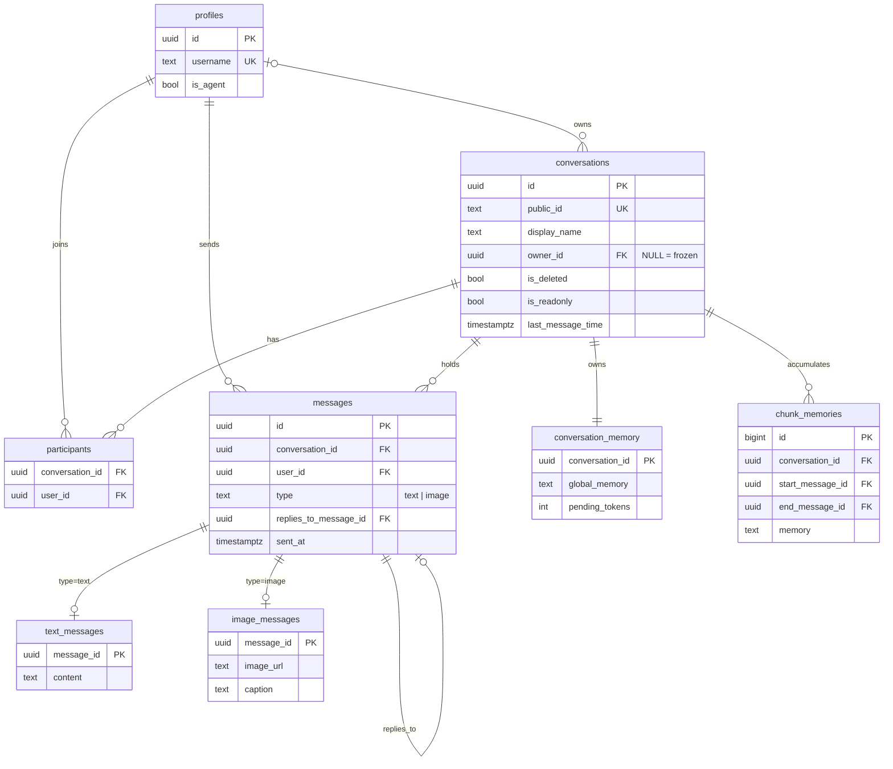

# Database Design

The data model. It is the concrete counterpart to `schema.sql`; every table, constraint, and trigger here maps 1:1 to that script. Technical usage is in `backend-system-design-and-architecture.md`; requirements in `software-requirements-specification.md`.

> **Principle.** Postgres is the single source of truth. Realtime only *notifies*. Conversations are **soft-deleted** (`is_deleted`), never dropped. The AI-generated image caption reuses the message tables — the schema does not grow to add AI.

Engine: **PostgreSQL** (via **Supabase**). UUID keys, `timestamptz` timestamps, enums modeled as `CHECK` constraints. SQL columns are snake_case; the spec's PascalCase names map directly (e.g. `OwnerId → owner_id`, `Timestamp → sent_at`).

---

## Entity–relationship overview



Eight tables: users, conversations, participants, a table-per-type message trio, and two memory tables.

---

## Tables

### profiles (users)
| Column | Type | Constraints | Notes |
|---|---|---|---|
| `id` | uuid | PK | = Supabase auth id |
| `username` | text | **unique**, `~ '^[A-Za-z0-9]{1,30}$'` | letters + digits, ≤30; the user's public handle |
| `is_agent` | boolean | not null, default false | hidden system user reserved for AI-posted messages — **not currently used by any feature** (see note) |
| `created_time` | timestamptz | not null, default now() | |

### conversations
| Column | Type | Constraints | Notes |
|---|---|---|---|
| `id` | uuid | PK | |
| `public_id` | text | **unique**, `~ '^[A-Za-z0-9]{6}$'` | 6 chars, case-sensitive; used to join. Generated with a **CSPRNG** (`RandomNumberGenerator`), retrying on the rare `23505` unique collision — not a predictable PRNG, since the code is an access grant |
| `display_name` | text | not null | auto-generated at creation, owner-editable |
| `owner_id` | uuid | FK → profiles, on delete set null | **nullable & transferable**; `NULL` = **frozen** |
| `is_deleted` | boolean | not null, default false | soft delete |
| `is_readonly` | boolean | not null, default false | when true, only the owner may send |
| `created_time` | timestamptz | not null, default now() | |
| `last_message_time` | timestamptz | not null, default now() | trigger-maintained |

### participants
The Agent is **not** a participant, so participant counts are always human.

| Column | Type | Constraints |
|---|---|---|
| `conversation_id` | uuid | FK → conversations, on delete cascade |
| `user_id` | uuid | FK → profiles, on delete cascade |
| `joined_time` | timestamptz | not null, default now() |
| — | — | PK (`conversation_id`, `user_id`) |

### messages (base, table-per-type)
| Column | Type | Constraints | Notes |
|---|---|---|---|
| `id` | uuid | PK | |
| `conversation_id` | uuid | FK → conversations, on delete cascade | |
| `user_id` | uuid | FK → profiles, on delete cascade | sender (user or Agent) |
| `type` | text | check in (`text`,`image`) | **discriminator** |
| `replies_to_message_id` | uuid | FK → messages, on delete set null | generic reply-to; not currently used by any feature (kept for the reply-threading shape) |
| `sent_at` | timestamptz | not null, default now() | spec's `Timestamp` |

### text_messages
| Column | Type | Constraints |
|---|---|---|
| `message_id` | uuid | PK, FK → messages, on delete cascade |
| `content` | text | not null |

### image_messages
| Column | Type | Constraints | Notes |
|---|---|---|---|
| `message_id` | uuid | PK, FK → messages, on delete cascade | |
| `image_url` | text | not null | |
| `caption` | text | | AI caption generated on send (feeds memory) — the only AI output an image carries |

### conversation_memory (1:1)
| Column | Type | Constraints | Notes |
|---|---|---|---|
| `conversation_id` | uuid | PK, FK → conversations, on delete cascade | |
| `global_memory` | text | not null, default '' | rolling fold |
| `pending_tokens` | integer | not null, default 0, check ≥ 0 | threshold counter (backend-maintained) |
| `last_updated_time` | timestamptz | not null, default now() | |

### chunk_memories
| Column | Type | Constraints | Notes |
|---|---|---|---|
| `id` | bigint | PK, generated always as identity | also the chunk order |
| `conversation_id` | uuid | FK → conversations, on delete cascade | |
| `start_message_id` / `end_message_id` | uuid | FK → messages, on delete **restrict** | chunk's message range; restrict + no-hard-delete keeps these non-null Domain properties safe |
| `memory` | text | not null | chunk summary |
| `created_time` | timestamptz | not null, default now() | |

The rolling **pointer** is implicit: the newest chunk's `end_message_id` marks where summarization last reached.

---

## Ownership & lifecycle rules

| Rule | Enforced by |
|---|---|
| `owner_id` = creator, but **transferable** and **nullable** | update allowed by owner (no immutability trigger) |
| `owner_id IS NULL` ⟺ **frozen** (no new joins; existing members may chat/leave) | `can_join()` requires `owner_id IS NOT NULL` |
| Owner leaving → **soft-delete** (`is_deleted = true`) or **freeze** (`owner_id = null`) | app command |
| Delete is **soft**; rows are retained | `is_deleted` flag |
| `is_readonly` auto-set when participants drop to 1, auto-cleared when a join brings it back to 2; owner may also set it manually | participant triggers (§ below) |

> **Readonly is a single flag** managed at the 1↔2 participant boundary. A brand-new conversation is created with ≥2 participants, so it is never persistently readonly at creation; the only way to reach 1 participant is by leaving, which the delete trigger handles.

---

## Relationships & cascade

**No table is ever hard-deleted for messages, conversations, or users** (decision C-2). Conversations are soft-deleted via `is_deleted`; messages and users are never removed. The chunk-boundary FKs therefore use **`on delete restrict`** — the DB refuses to remove a message that a `chunk_memories` row points at, turning the "no hard delete" promise into an enforced invariant while letting `ChunkMemory.Start/EndMessageId` stay non-nullable in the Domain.

**Scope of the rule (decision Q-C):** "no hard delete" covers **messages, conversations, users**. **Participants are the exception** — leaving or being removed **deletes the `participants` row**, and the readonly-boundary triggers fire on that `DELETE`. This is safe because nothing references a participant row (in particular, `chunk_memories` references messages, never participants). The remaining `on delete cascade` actions from `conversations`/`profiles` never fire under soft-delete; they stay only as a defensive guarantee.

---

## Indexes

| Index | Columns | Serves |
|---|---|---|
| `idx_messages_conv_sent` | (`conversation_id`, `sent_at desc`) | history pagination |
| `idx_participants_user` | (`user_id`) | "which conversations am I in?" |
| `idx_conversations_last` | (`last_message_time desc`) | conversation list by recency |
| `idx_chunks_conv` | (`conversation_id`, `id`) | chunk ordering |

---

## Triggers

| Trigger | Fires | Guarantees |
|---|---|---|
| `participants_after_insert` | after insert on participants | clears `is_readonly` when count reaches 2 |
| `participants_after_delete` | after delete on participants | sets `is_readonly` when count drops to ≤1 |
| `messages_after_insert` | after insert on messages | updates `last_message_time` |
| `on_auth_user_created` | after insert on auth.users | provisions a profile (Supabase only) |

Create-time bookkeeping (owner-as-participant + the 1:1 `conversation_memory` row) is done by the **Application layer**, not a trigger (decision A-3) — testable without a DB and visible in code. The Agent is seeded once (`username = aiagent`, `is_agent = true`). **Note:** the previous immutable-`owner_id` trigger was removed — ownership is now transferable.

---

## Memory tables — deep dive

Hierarchical rolling summarization (mechanics in the architecture doc §6). Field mapping to the spec: `GlobalMemory → global_memory`, `PendingTokens → pending_tokens`, chunk `Memory → memory` with `StartMessageId`/`EndMessageId`.

- **`conversation_memory`** holds the live state: `global_memory` (evolving overall recap) and `pending_tokens` (accrued since the last chunk; a **detached, send-triggered task** increments this per message via `IGenerativeAiService.CountTokensAsync` — a cheap **local, approximate** count, not a remote call — an image message counts the tokens of its `caption`). See architecture §6/§8 for why an approximate local count was chosen over an exact remote one.
- **`chunk_memories`** is the append-only, `id`-ordered history; each row's `start_message_id`/`end_message_id` bound its message range.

When `pending_tokens` crosses the configured threshold, the backend forms a new chunk over the pending messages, writes its `memory`, folds it into `global_memory`, and resets `pending_tokens`. An **on-demand summary is a pure read** (decision C-3): it returns `global_memory` plus a freshly-computed summary of messages after the newest chunk's `end_message_id`, and **never mutates stored memory or incurs a write** — never a full-history scan.

---

## Validation & integrity ownership

The database is the **integrity backstop**, not the primary validator. Field-format UX validation lives in the Application layer (FluentValidation); the DB guarantees that bad data can never land regardless of the write path (user, MCP, n8n, or service role).

| Concern | Owned by the DB via |
|---|---|
| `username` format (`^[A-Za-z0-9]{1,30}$`) and uniqueness | CHECK + UNIQUE |
| `public_id` format (6 alphanumeric) and uniqueness | CHECK + UNIQUE |
| `type` domain | CHECK |
| `pending_tokens ≥ 0` | CHECK |
| referential integrity | FK (+ cascade) |
| per-row authorization | RLS (below) |

Cosmetic text such as `conversations.display_name` (charset "letters, digits, comma, space") is validated only in Application — it is a display concern, not an integrity one, so no DB CHECK is added for it. The **Domain layer carries no validation** (no attributes, no throwing) — it is a pure model.

---

## Row-Level Security

RLS is enabled on all tables. Membership/ownership checks are delegated to **`SECURITY DEFINER`** helpers so policies on `participants` don't recurse:

```sql
is_participant(conv)  -- caller is in participants(conv)
is_owner(conv)        -- conversations(conv).owner_id = auth.uid()
is_readonly(conv)     -- conversations(conv).is_readonly (missing => true)
can_join(conv)        -- owner_id IS NOT NULL AND is_deleted = false  (i.e. not frozen/deleted)
```

Policy summary (`auth.uid()` = current user):

| Table | Select | Insert | Update | Delete |
|---|---|---|---|---|
| profiles | everyone | own row | own row | — |
| conversations | `is_participant(id)` & not deleted | `owner_id = auth.uid()` | `is_owner(id)` (rename / readonly / transfer / soft-delete / freeze) | — (soft delete via update) |
| participants | `is_participant(conversation_id)` | `is_owner(...)` **or** self-join (`user_id=auth.uid()` & `can_join`) | — | `is_owner(...)` **or** self-leave |
| messages | `is_participant(conversation_id)` | sender is self, participant, and not blocked by readonly (unless owner) | — | — |
| text_messages / image_messages | participant of parent's conversation | caller owns the parent message | service role (caption) | — |
| conversation_memory / chunk_memories | `is_participant(conversation_id)` | service role | service role | service role |

Background writes (memory worker) and the caption write on image send run with the **service role**, which bypasses RLS by design.

> **What RLS actually protects here.** All table access from the app goes through the .NET backend, and that backend connects with a **service role that bypasses RLS** — so these policies are *not* a second check on backend queries. They exist because a Supabase project also exposes **PostgREST publicly**, and the **anon key ships in the frontend**: without RLS, anyone holding that key could read every table directly. Two practical rules follow:
>
> - Authorization for backend traffic is enforced **entirely** in the Application handlers (membership, owner-only, readonly). Do not treat RLS as a safety net for it.
> - If the backend is ever pointed at Postgres with a role that RLS *does* apply to, `auth.uid()` is `NULL` for that session, every policy evaluates false, and **queries return zero rows silently** instead of erroring. Check the connection role first when data "disappears".

---

## Data lifecycle

- **Create conversation** (≥2 participants) → row with generated `public_id`; owner auto-membered; empty memory row.
- **Join** → user submits `public_id`; if the conversation is joinable (`can_join`), a `participants` row is added; if this makes count = 2, readonly auto-clears.
- **Send message** → base `messages` row + `text_messages`/`image_messages` child; `last_message_time` updated; backend adds token count. Image sends also set `caption` via one vision pass (this is the only AI step an image goes through — there is no OCR/text-extraction feature).
- **Transfer ownership** → `owner_id` updated to another participant.
- **Owner leaves** → soft-delete (`is_deleted = true`) or **freeze** (`owner_id = null`).
- **Participant leaves** → row removed; if count drops to 1, readonly auto-set.

---

## Mapping & verification

This design maps 1:1 to `schema.sql`. That script is **idempotent** and was verified on PostgreSQL 16: it runs twice cleanly, and functional tests confirm the username/`public_id` format checks, ownership **transfer** and **freeze** (`owner_id = null`), the readonly auto-toggle at the 1↔2 boundary, the message `type` discriminator, and the `last_message_time` trigger.
