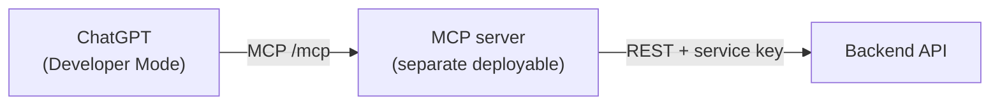

# MCP Integration (ChatGPT)

The MCP server is a **separate deployable** that exposes tools to ChatGPT and fulfils them by calling this backend's REST API — never talking to the database directly. All business logic stays in the backend; the MCP server is just a protocol adapter.



## Connecting to ChatGPT

The server is added as a remote connector at its `https://…/mcp` route via ChatGPT **Developer Mode** (Plus/Pro/Team/Enterprise). ChatGPT's default connector mode only calls the standard `search`/`fetch` tools — custom tools require Developer Mode — so the server ships both the standard pair and the custom tools, working in either mode.

Reference: [Building MCP servers for ChatGPT](https://platform.openai.com/docs/mcp) · [Model Context Protocol](https://modelcontextprotocol.io/) · [MCP C# SDK](https://github.com/modelcontextprotocol/csharp-sdk)

## Tools → backend endpoints

| Tool | Input | Backend call |
|---|---|---|
| `search` | `query` | `GET /api/conversations?q=<query>` |
| `fetch` | `id` | `GET /api/conversations/{id}/messages` |
| `list_conversations` | — | `GET /api/conversations` (empty query) |
| `summarize_thread` | `conversationId` | `POST /api/conversations/{id}/summary` |
| `join_group` | `publicId` | `POST /api/conversations/join` |

`search` and `list_conversations` hit the same backend operation — an empty query returns everything, a non-empty one filters.

## Auth model

The MCP server authenticates each ChatGPT user itself, then calls the backend with the `Mcp` service key plus that user's backend **username** — the backend resolves a real user and applies the exact same membership, ownership, and role-based rules ([architecture §6](backend-system-design-and-architecture.md#6-authentication--authorization)) it would for that user calling directly.

```
X-Client-Key: <Clients:McpKey value>
X-On-Behalf-Of: <username>
```

`X-Client-Key` authenticates the MCP server as a trusted service; `X-On-Behalf-Of` carries the username the request acts as. A username that doesn't resolve, or is missing, is rejected with `401`.

The MCP server owns its own mapping of "which ChatGPT/OAuth user maps to which backend username" — that mapping is entirely the MCP server's concern, not the backend's.

## Open items

- MCP server project skeleton and hosting.
- Exact `fetch` item shape for ChatGPT deep-research compatibility.
