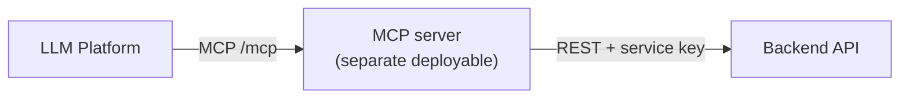

# MCP Integration

The MCP server is a **separate deployable** that exposes tools to LLM platforms and fulfils them by calling this backend's REST API — never talking to the database directly. All business logic stays in the backend; the MCP server is just a protocol adapter.



## Example: Connecting to ChatGPT

The server is added as a remote connector at its `https://…/mcp` route via ChatGPT **Developer Mode** (Plus/Pro/Team/Enterprise). ChatGPT's default connector mode only calls the standard `search`/`fetch` tools — custom tools require Developer Mode — so the server ships both the standard pair and the custom tools, working in either mode.

Reference: [Building MCP servers for ChatGPT](https://platform.openai.com/docs/mcp) · [Model Context Protocol](https://modelcontextprotocol.io/) · [MCP C# SDK](https://github.com/modelcontextprotocol/csharp-sdk)

## Tools → backend endpoints

| Tool | Input | Backend call |
|---|---|---|
| `list_joined_conversations` | `query` | `GET /api/conversations?q=<query>` |
| `fetch_conversation_messages` | `conversationId`, `beforeMessageId?`, `limit?` | `GET /api/conversations/{id}/messages` |
| `get_conversation_summarization` | `conversationId` | `POST /api/conversations/{id}/summary` |
| `join_conversation` | `publicId` | `POST /api/conversations/join` |

There is no standard `search`/`fetch` pair — see [mcp/README.md](../mcp/README.md#tools) for what that trades off against ChatGPT's default (non-Developer-Mode) connector calling convention.

## Auth model

Two separate authentication concerns, not one:

1. **MCP server → backend**: always as **one fixed, configured account** — there is no per-caller mapping. Every tool call sends:
   ```
   X-Client-Key: <Clients:McpKey value>
   X-On-Behalf-Of: <the one configured backend username>
   ```
   The backend resolves that user and applies the exact same membership, ownership, and role-based rules ([architecture §6](backend-system-design-and-architecture.md#6-authentication--authorization)) it would for that user calling directly.

2. **ChatGPT/Claude → MCP server**: real OAuth, since both platforms require it for remote MCP connectors. The MCP server doesn't issue tokens itself — it validates access tokens issued by [Auth0](https://auth0.com/) (a hosted authorization server) against a configured audience, publishing the standard [RFC 9728](https://datatracker.ietf.org/doc/html/rfc9728) discovery document so ChatGPT/Claude can find Auth0 automatically. A valid token only proves "this client completed Auth0 login" — it does not change which backend account gets used, since that's still the one fixed account from step 1.

See [mcp/README.md](../mcp/README.md) for the full Auth0 setup and connector instructions.

## Implementation

The server lives at [`mcp/`](../mcp/) — see [mcp/README.md](../mcp/README.md) for the codebase layout, how to run/deploy it, and step-by-step setup for both ChatGPT and Claude.
