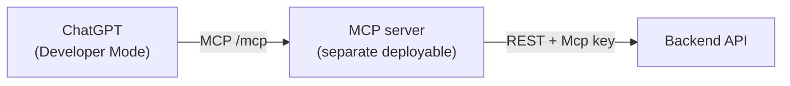

# MCP Integration (ChatGPT)

> **Status: to be detailed later.** This captures the agreed design so it can be built after the backend is in place.

The MCP server is an **external client of the backend API** — a separate deployable that exposes tools to ChatGPT and fulfils them by calling the backend's existing REST endpoints with the **`Mcp` client credential** (see access control in `backend-system-design-and-architecture.md`). The backend has no MCP-specific logic; there is one source of business logic.



## Requirement (from the brief)

Provide an MCP server address connectable to ChatGPT so ChatGPT can: display all conversations, summarize a selected thread, and join a group chat.

## Connecting to ChatGPT

- The server is added as a **remote connector** at its `https://…/mcp` route via ChatGPT **Developer Mode**, available on Plus / Pro / Team / Enterprise (not Free).
- ChatGPT's default connector mode invokes only the standard `search` / `fetch` tools; custom tools require Developer Mode. The server therefore ships **both** the standard pair **and** the custom tools so it works in either mode.

Reference: [Building MCP servers for ChatGPT / connectors](https://platform.openai.com/docs/mcp) · [Model Context Protocol](https://modelcontextprotocol.io/) · [MCP C# SDK](https://github.com/modelcontextprotocol/csharp-sdk)

## Tools → backend endpoints

| Tool | Input | Backend call |
|---|---|---|
| `search` | `query` | `GET /api/conversations?q=<query>` |
| `fetch` | `id` | `GET /api/conversations/{id}/messages` (or item fetch) |
| `list_conversations` | — | `GET /api/conversations` (empty `q`) |
| `summarize_thread` | `conversationId` | `POST /api/conversations/{id}/summary` |
| `join_group` | `publicId` | `POST /api/conversations/join` |

`search` and `list_conversations` are the same backend operation (`GetConversationsQuery`) — an empty query returns everything, a non-empty one filters.

## Auth model

The MCP server authenticates each ChatGPT user, then calls the backend with the **`Mcp` service credential** plus the on-behalf-of user id, so the backend applies the same per-user membership/ownership rules. It may call only endpoints whose `[AllowedClients]` includes `Mcp` (list/search conversations, join, summarize).

**Concrete header shape (as implemented in `ChatApp.Api`):**
```
X-Client-Key: <Clients:McpKey value>
X-On-Behalf-Of: <userId>
```
`X-Client-Key` resolves the caller to the `Mcp` client type; `X-On-Behalf-Of` carries the user id the request acts as (n8n's endpoints are system-wide and never send this header — n8n's `UserId` is `null` by design).

## Open items (later)

- MCP server project skeleton (`ChatApp.Mcp`) and hosting (Vercel / Railway).
- Exact `fetch` item shape for ChatGPT deep-research compatibility.
- On-behalf-of user propagation and token exchange.
