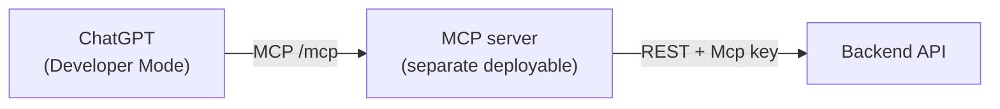

# MCP Integration (ChatGPT)

> **Status: to be detailed later.** This captures the agreed design so it can be built after the backend is in place.

The MCP server is an **external client of the backend API** — a separate deployable that exposes tools to ChatGPT and fulfils them by calling the backend's existing REST endpoints with the **`Mcp` service key, on behalf of a real ChatGPT-linked user** (see `backend-system-design-and-architecture.md` §4.2 — authorization is role-based now, not client-based). The backend has no MCP-specific logic; there is one source of business logic.



## Requirement (from the brief)

Provide an MCP server address connectable to ChatGPT so ChatGPT can: display all conversations, summarize a selected thread, and join a group chat.

## Connecting to ChatGPT

- The server is added as a **remote connector** at its `https://…/mcp` route via ChatGPT **Developer Mode**, available on Plus / Pro / Team / Enterprise (not Free).
- ChatGPT's default connector mode invokes only the standard `search` / `fetch` tools; custom tools require Developer Mode. The server therefore ships **both** the standard pair **and** the custom tools so it works in either mode.

Reference: [Building MCP servers for ChatGPT / connectors](https://platform.openai.com/docs/mcp) · [Model Context Protocol](https://modelcontextprotocol.io/) · [MCP C# SDK](https://github.com/modelcontextprotocol/csharp-sdk)

## Tools → backend endpoints

| Tool | Input | Backend call |
|---|---|---|
| `search` | `query` | `GET /api/conversations?q=<query>` |
| `fetch` | `id` | `GET /api/conversations/{id}/messages` (or item fetch) |
| `list_conversations` | — | `GET /api/conversations` (empty `q`) |
| `summarize_thread` | `conversationId` | `POST /api/conversations/{id}/summary` |
| `join_group` | `publicId` | `POST /api/conversations/join` |

`search` and `list_conversations` are the same backend operation (`GetConversationsQuery`) — an empty query returns everything, a non-empty one filters.

## Auth model

The MCP server authenticates each ChatGPT user, then calls the backend with the **`Mcp` service key** plus the on-behalf-of user's **username**, so the backend resolves a real user and applies the exact same per-user membership/ownership rules **and role-based authorization** (`[AllowedRoles]`, §4.2) it would for that user calling directly. There is no "no identity" mode anymore — every MCP call must resolve to a real user.

**Concrete header shape (as implemented in `ChatApp.Api`):**
```
X-Client-Key: <Clients:McpKey value>
X-On-Behalf-Of: <username>
```
`X-Client-Key` authenticates the MCP server itself as a trusted service; `X-On-Behalf-Of` carries the **username** (not a raw id — resolved server-side via `profiles_public`) the request acts as. A username that doesn't resolve, or is missing, is `401`.

> **Open security question (not decided) — carried over from the architecture doc.** Should the Mcp key be restricted to impersonating only `User`-role accounts, so a leaked key can't be used to act as an Administrator? Recommended default: yes, restrict it. Confirm before implementing.

**Mapping ChatGPT's own user to a backend username.** The MCP server still owns its own "which ChatGPT/OAuth user maps to which backend username" table — this hasn't changed. What changed is only the *shape* of what gets sent once that mapping is known (a username, not a raw UUID) — slightly simpler, since the MCP server no longer needs to have ever seen the backend's internal user id at all, only the username the person signed up with.

## Open items (later)

- MCP server project skeleton (`ChatApp.Mcp`) and hosting (Vercel / Railway).
- Exact `fetch` item shape for ChatGPT deep-research compatibility.
- On-behalf-of user propagation and token exchange.
