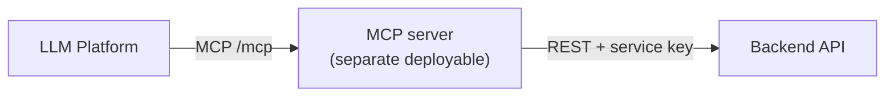

# MCP Integration

The MCP server is a **separate deployable** that exposes tools to LLM platforms and fulfils them by calling this backend's REST API — never talking to the database directly. All business logic stays in the backend; the MCP server is just a protocol adapter.



## Example: Connecting to ChatGPT

The server is added as a remote connector at its `https://…/mcp` route via ChatGPT **Developer Mode** (Plus/Pro/Team/Enterprise). ChatGPT's default connector mode only calls the standard `search`/`fetch` tools — custom tools require Developer Mode — so the server ships both the standard pair and the custom tools, working in either mode.

Reference: [Building MCP servers for ChatGPT](https://platform.openai.com/docs/mcp) · [Model Context Protocol](https://modelcontextprotocol.io/) · [MCP C# SDK](https://github.com/modelcontextprotocol/csharp-sdk)

## Tools → backend endpoints

| Tool | Input | Backend call |
|---|---|---|
| `search` | `query` | `GET /api/conversations?q=<query>` |
| `fetch` | `id` | `GET /api/conversations/{id}/messages` |
| `list_conversations` | — | `GET /api/conversations` (empty query) |
| `summarize_thread` | `conversationId` | `POST /api/conversations/{id}/summary` |
| `join_group` | `publicId` | `POST /api/conversations/join` |

`search` and `list_conversations` hit the same backend operation — an empty query returns everything, a non-empty one filters.

## Auth model

The MCP server always calls the backend as **one fixed, configured account** — there is no per-ChatGPT-user mapping. Every tool call sends:

```
X-Client-Key: <Clients:McpKey value>
X-On-Behalf-Of: <the one configured backend username>
```

`X-Client-Key` authenticates the MCP server as a trusted service; `X-On-Behalf-Of` carries the username every call acts as — the backend resolves that user and applies the exact same membership, ownership, and role-based rules ([architecture §6](backend-system-design-and-architecture.md#6-authentication--authorization)) it would for that user calling directly.

Separately, the MCP server gates *itself*: every incoming request must carry a matching `Authorization: Bearer <key>`, which is how ChatGPT/Claude authenticate to it. This keeps the design to exactly one shared credential per direction instead of a per-user OAuth exchange — the right amount of complexity for a single-account integration; see [mcp/README.md](../mcp/README.md) for the full setup and rationale.

## Implementation

The server lives at [`mcp/`](../mcp/) — see [mcp/README.md](../mcp/README.md) for the codebase layout, how to run/deploy it, and step-by-step setup for both ChatGPT and Claude.
