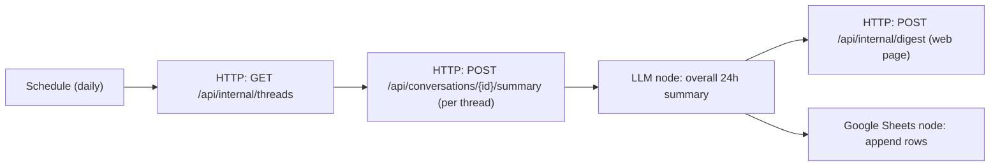

# n8n Workflow (Scheduled Summaries)

> **Status: to be detailed later.** This captures the agreed design so it can be built after the backend is in place.

n8n is an **external client of the backend API** — a scheduled automation that calls backend endpoints with the **`N8n` client credential** (see access control in `backend-system-design-and-architecture.md`). The backend exposes the data; n8n orchestrates the digest.

## Requirement (from the brief)

Create an n8n workflow that retrieves all chat threads, generates a summary for each, produces an overall summary of all conversations from the last 24 hours, publishes these summaries to a web page, and updates a Google Sheet.

## Backend endpoints used (client type `N8n`)

| Step | Backend call |
|---|---|
| Retrieve all threads | `GET /api/internal/threads` |
| Summarize each thread | `POST /api/conversations/{id}/summary` |
| Publish digest to web page | `POST /api/internal/digest` |
| Update spreadsheet | Google Sheets node (n8n built-in) |

Per-thread summaries read the pre-computed `global_memory`, so the daily job stays cheap regardless of history length.

## Hosting & references

- Self-host n8n via Docker, or use n8n Cloud.
- Reference: [n8n docs](https://docs.n8n.io/) · [Schedule Trigger node](https://docs.n8n.io/integrations/builtin/core-nodes/n8n-nodes-base.scheduletrigger/) · [HTTP Request node](https://docs.n8n.io/integrations/builtin/core-nodes/n8n-nodes-base.httprequest/) · [Google Sheets node](https://docs.n8n.io/integrations/builtin/app-nodes/n8n-nodes-base.googlesheets/)

## Open items (later)

- `workflow.json` export.
- Google Sheets OAuth credential + target spreadsheet id.
- The `/api/internal/digest` publish format and the public web page that renders it.
