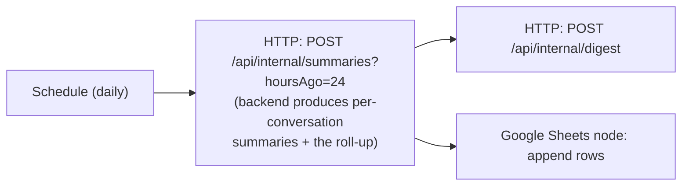

# n8n Workflow (Scheduled Summaries)

> **Status: to be detailed later.** This captures the agreed design so it can be built after the backend is in place.

n8n is an **external client of the backend API** — a scheduled automation that calls backend endpoints with the **`N8n` service key, on behalf of a real user with the `Administrator` role** (§4.2 — authorization is role-based now, not client-based; there is no more "no identity, system-wide" mode). The backend exposes the data; n8n orchestrates the digest.



> **Change vs. the original sketch.** The 24-hour roll-up is now produced **by the backend in one call**, not assembled in an n8n LLM node from N per-thread calls. Fewer nodes, fewer round-trips, one place where prompts live. n8n keeps orchestration (schedule, publish, spreadsheet).

## Requirement (from the brief)

Create an n8n workflow that retrieves all chat threads, generates a summary for each, produces an overall summary of all conversations from the last 24 hours, publishes these summaries to a web page, and updates a Google Sheet.

## Backend endpoints used (service key `N8n`, on behalf of an Administrator)

| Step | Backend call |
|---|---|
| Per-conversation summaries + 24 h roll-up | `POST /api/internal/summaries?hoursAgo=24` |
| Publish the digest | `POST /api/internal/digest` |
| Update spreadsheet | Google Sheets node (n8n built-in) |
| (optional) List conversations | `GET /api/internal/conversations` |

Summaries read the pre-computed `global_memory`, so the daily job stays cheap regardless of history length.

**Every HTTP call to the backend now needs two headers, not one:**
```
X-Client-Key: <Clients:N8nKey value>
X-On-Behalf-Of: <username of an Administrator account>
```
An Administrator-role account must exist (role assigned manually — see `database-design.md`'s `user_roles` note) before this workflow can authenticate. This is a change from the earlier design (n8n previously called these endpoints with no user context at all); **the already-exported `chatapp-n8n-workflow.json` predates this change and needs a follow-up patch** adding the `X-On-Behalf-Of` header (with the admin username as a `Config`-node value) to every HTTP Request node that calls the backend.

> **Digest persistence is still open.** `POST /api/internal/digest` currently **broadcasts only** — nothing is stored server-side, so a browser opening the digest page *after* the broadcast sees nothing. Either n8n owns publishing the page itself (recommended: it already has the content and the Google Sheet), or the backend needs somewhere to keep the latest digest. Decide before building this workflow.

## Hosting & references

- Self-host n8n via Docker, or use n8n Cloud.
- Reference: [n8n docs](https://docs.n8n.io/) · [Schedule Trigger node](https://docs.n8n.io/integrations/builtin/core-nodes/n8n-nodes-base.scheduletrigger/) · [HTTP Request node](https://docs.n8n.io/integrations/builtin/core-nodes/n8n-nodes-base.httprequest/) · [Google Sheets node](https://docs.n8n.io/integrations/builtin/app-nodes/n8n-nodes-base.googlesheets/)

## Open items (later)

- `workflow.json` export.
- Google Sheets OAuth credential + target spreadsheet id.
- The `/api/internal/digest` publish format and the public web page that renders it.
