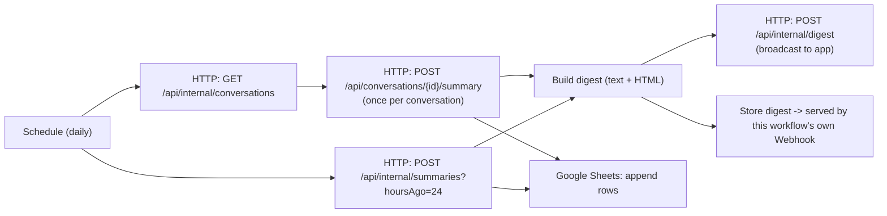

# n8n Workflow — Daily Digest

n8n is an external client of the backend API — a scheduled automation that calls backend endpoints with the `N8n` service key, on behalf of a real Administrator account. The backend exposes the data; n8n owns scheduling, publishing, and the spreadsheet.



## What it does

1. Fetches every conversation (`GET /api/internal/conversations`).
2. Requests an on-demand summary for each one individually.
3. Separately requests one overall summary of everything active in the last 24 hours.
4. Combines both into a single digest (plain text and HTML).
5. Sends the digest to the backend, which broadcasts `DigestPublished` to connected clients — the backend does not store it.
6. Serves the same digest as a web page via this workflow's own **Webhook** node, so it's viewable any time, not only right after a run.
7. Appends one row per conversation, plus one "overall" row, to a Google Sheet.

## Auth

Every backend call carries two headers — the service key plus the real user it acts as:

```
X-Client-Key: <Clients:N8nKey value>
X-On-Behalf-Of: <username of an Administrator account>
```

An Administrator-role account must already exist before this workflow can authenticate — see [database-design.md](database-design.md#user_roles) for how roles are assigned.

## A membership caveat worth knowing

`GET /api/internal/conversations` lists every conversation regardless of membership, but `POST /api/conversations/{id}/summary` only allows a caller who is a **participant** of that conversation. If the on-behalf-of Administrator isn't a participant of some conversation, that conversation's summary call gets `403` — the workflow has "continue on fail" enabled for exactly this reason, so one failed thread doesn't break the whole run; it just falls back to a placeholder line in the digest.

## Resilience

Both AI-backed calls (per-thread summary, 24-hour roll-up) have **continue on fail** enabled — if Gemini times out or rate-limits for one conversation, the digest still completes with a placeholder for that entry instead of the whole run aborting.

## Setup

The workflow, its import instructions, and its own setup checklist live at `n8n/workflow.json` and `n8n/README.md`. Hosting: self-hosted n8n via Docker, or n8n Cloud — see [n8n docs](https://docs.n8n.io/).

Reference: [Schedule Trigger](https://docs.n8n.io/integrations/builtin/core-nodes/n8n-nodes-base.scheduletrigger/) · [HTTP Request node](https://docs.n8n.io/integrations/builtin/core-nodes/n8n-nodes-base.httprequest/) · [Google Sheets node](https://docs.n8n.io/integrations/builtin/app-nodes/n8n-nodes-base.googlesheets/)
