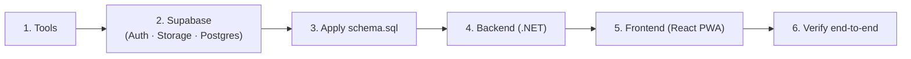

# Prerequisite Setups

A from-scratch guide to run the project locally: tools → Supabase → database → backend → frontend → verify. Design context is in `backend-system-design-and-architecture.md`; the schema is `schema.sql`.

---

## 0. What you will set up



---

## 1. Tools to install

| Tool | Version | Purpose | Link |
|---|---|---|---|
| .NET SDK | **10.x** | Build & run the backend | https://dotnet.microsoft.com/download |
| Node.js + npm | **≥ 20 LTS** | Build & run the frontend PWA | https://nodejs.org |
| Docker Desktop | latest | Local Supabase stack (Postgres/Auth/Storage) | https://www.docker.com/products/docker-desktop |
| Supabase CLI | latest | Run Supabase locally / manage projects | https://supabase.com/docs/guides/cli |
| Git | latest | Version control | https://git-scm.com |

You also need a **Google AI Studio API key** for Gemini: https://aistudio.google.com/apikey

Verify:
```bash
dotnet --version   # 10.x
node --version     # v20+
docker --version
supabase --version
```

---

## 2. Supabase

Two options — **Option A (local)** is recommended for development.

### Option A — Local stack via Supabase CLI (Docker)
Runs Postgres + Auth + Storage + Studio on your machine.
```bash
supabase init            # creates ./supabase in the repo
supabase start           # boots the full stack in Docker
```
`supabase start` prints your local credentials — copy these:
- **API URL** (e.g. `http://127.0.0.1:54321`)
- **anon key** and **service_role key**
- **JWT secret**
- Studio URL (e.g. `http://127.0.0.1:54323`)

Docs: https://supabase.com/docs/guides/local-development

### Option B — Hosted project (for staging / sharing)
1. Create a project at https://supabase.com/dashboard.
2. **Project Settings → API**: copy the **Project URL**, **anon** key, and **service_role** key.
3. **Project Settings → API → JWT Settings**: copy the **JWT secret** (used by the backend to validate tokens).

### Storage bucket (both options)
Create a bucket named **`images`** for chat images (Studio → Storage → New bucket). Keep it private; the backend issues signed URLs. Docs: https://supabase.com/docs/guides/storage

### Auth (both options)
Enable **Email** sign-in (Studio → Authentication → Providers). The user's `username` is passed in sign-up metadata and copied into `profiles` by the `handle_new_user` trigger in `schema.sql`. Docs: https://supabase.com/docs/guides/auth

---

## 3. Apply the database schema

Run `schema.sql` against your Supabase database.

- **Studio:** open the **SQL Editor**, paste `schema.sql`, run. It is idempotent (safe to re-run).
- **CLI (local):**
  ```bash
  supabase db reset            # optional: clean slate
  psql "$DATABASE_URL" -f schema.sql   # DATABASE_URL from `supabase status`
  ```

This creates the 8 tables, triggers, the seeded AI Agent, and the RLS policies. See `database-design.md` for the model.

---

## 4. Backend (.NET)

```bash
git clone <your-repo-url> && cd <repo>/backend
dotnet restore
dotnet build
```

Configure secrets with **user-secrets** (never commit keys):
```bash
cd src/ChatApp.Api
dotnet user-secrets init
dotnet user-secrets set "Supabase:Url"            "<API URL>"
dotnet user-secrets set "Supabase:ServiceRoleKey" "<service_role key>"
dotnet user-secrets set "Supabase:JwtSecret"      "<JWT secret>"
dotnet user-secrets set "Supabase:StorageBucket"  "images"
dotnet user-secrets set "Gemini:ApiKey"           "<google ai studio key>"
dotnet user-secrets set "Gemini:Model"            "gemini-2.5-flash"
dotnet user-secrets set "Clients:McpKey"          "<random secret for MCP client>"
dotnet user-secrets set "Clients:N8nKey"          "<random secret for n8n client>"
dotnet user-secrets set "Memory:TokenThreshold"   "1500"
```

Run:
```bash
dotnet run --project src/ChatApp.Api    # API + SignalR, e.g. https://localhost:5001
```

Notes:
- The schema is applied via `schema.sql` (§3), not EF migrations — EF Core here is read/write mapping only.
- If you added the licensed MediatR (v13+), set its license key per §4.1 of the backend doc; otherwise use a free mediator package.

Reference: [user-secrets](https://learn.microsoft.com/aspnet/core/security/app-secrets) · [.NET config](https://learn.microsoft.com/aspnet/core/fundamentals/configuration/)

---

## 5. Frontend (React PWA)

```bash
cd ../frontend
npm install
```

Create `.env.local`:
```bash
VITE_SUPABASE_URL=<API URL>
VITE_SUPABASE_ANON_KEY=<anon key>
VITE_API_BASE_URL=https://localhost:5001
```

Run:
```bash
npm run dev            # http://localhost:5173
```
On mobile, open the dev URL and choose **Add to Home Screen** to install the PWA.

---

## 6. Verify end-to-end

1. Register two users (unique usernames, letters/digits only).
2. User A creates a conversation adding User B → note the generated `PublicId`.
3. Send text messages both ways — they appear in real time.
4. Send an image → it renders; if it contains text, an **Extract text** button appears.
5. Click **Extract text** → the AI Agent replies with the transcription.
6. (Optional) User C joins with the `PublicId`.

If all six pass, the environment is correctly wired.

---

## 7. Environment variables — quick reference

**Backend** (`src/ChatApp.Api`, via user-secrets or environment):

| Key | Meaning |
|---|---|
| `Supabase:Url` | Supabase API URL |
| `Supabase:ServiceRoleKey` | Service role key (server-only; bypasses RLS for Agent/memory writes) |
| `Supabase:JwtSecret` | Secret to validate user JWTs |
| `Supabase:StorageBucket` | `images` |
| `Gemini:ApiKey` / `Gemini:Model` | Google AI Studio key / `gemini-2.5-flash` |
| `Clients:McpKey` / `Clients:N8nKey` | Service keys mapping callers to `Mcp` / `N8n` client types |
| `Memory:TokenThreshold` | Tokens before a memory chunk is formed |

**Frontend** (`.env.local`): `VITE_SUPABASE_URL`, `VITE_SUPABASE_ANON_KEY`, `VITE_API_BASE_URL`.

> External clients (MCP server, n8n) are set up separately — see `mcp-integration.md` and `n8n-workflow.md`.
