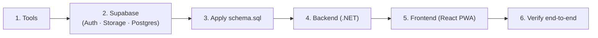

# Prerequisite Setups

A from-scratch guide to run the project locally: tools → Supabase → database → backend → frontend → verify. Design context is in [backend-system-design-and-architecture.md](backend-system-design-and-architecture.md); the schema is [`schema.sql`](schema.sql).



---

## 1. Tools to install

| Tool | Version | Purpose |
|---|---|---|
| [.NET SDK](https://dotnet.microsoft.com/download) | 10.x | Build & run the backend |
| [Node.js + npm](https://nodejs.org) | ≥ 20 LTS | Build & run the frontend PWA |
| [Docker Desktop](https://www.docker.com/products/docker-desktop) | latest | Local Supabase stack |
| [Supabase CLI](https://supabase.com/docs/guides/cli) | latest | Run Supabase locally / manage projects |
| [Git](https://git-scm.com) | latest | Version control |

Also get a **Google AI Studio API key** for Gemini: https://aistudio.google.com/apikey

```bash
dotnet --version   # 10.x
node --version     # v20+
docker --version
supabase --version
```

---

## 2. Supabase

**Option A (local, recommended for development)** runs Postgres + Auth + Storage + Studio in Docker:

```bash
supabase init
supabase start
```

`supabase start` prints your local credentials — copy the **API URL**, **anon key**, and **service_role key**.

**Option B (hosted project)**: create one at [supabase.com/dashboard](https://supabase.com/dashboard), then **Project Settings → API** for the same three values.

Either way, you do not need to copy a JWT secret — see [§4](#4-backend-net) for how the backend validates tokens.

### Storage bucket

Create a private bucket named `images` (Studio → Storage → New bucket). The frontend uploads images directly and generates its own signed URLs; the backend's only storage need is downloading an object's bytes (with the service-role key) so it can hand them to Gemini for captioning.

`storage.objects` has RLS enabled by default with no policy — an upload fails with "new row violates row-level security policy" until one exists. `schema.sql` (next step) creates the two policies this bucket needs (`storage_images_insert`/`storage_images_select`, any authenticated user); nothing extra to do here as long as you run that script after creating the bucket.

### Auth — Google OAuth only

This app has no email/password sign-in. Set it up in two places:

**Google Cloud Console:**
1. Create/select a project at [console.cloud.google.com](https://console.cloud.google.com).
2. **APIs & Services → OAuth consent screen** → External, fill in app name + support email.
3. **APIs & Services → Credentials → Create Credentials → OAuth Client ID** → Web application.
4. **Authorized JavaScript origins**: your frontend URL (e.g. `http://localhost:5173`).
5. **Authorized redirect URIs**: your Supabase callback — hosted: `https://<project-ref>.supabase.co/auth/v1/callback`; local CLI: `http://127.0.0.1:54321/auth/v1/callback`.
6. Copy the **Client ID** and **Client Secret**.

**Supabase:**
- Hosted: Studio → **Authentication → Providers → Google** → paste Client ID + Secret → Save. Then set **Site URL** and your frontend origin(s) under **Authentication → URL Configuration**.
- Local CLI: add to `supabase/config.toml`:
  ```toml
  [auth.external.google]
  enabled = true
  client_id = "<client id>"
  secret = "env(SUPABASE_AUTH_EXTERNAL_GOOGLE_SECRET)"
  ```
  put the real secret in `supabase/.env`, then `supabase stop && supabase start`.

The frontend calls `supabase.auth.signInWithOAuth({ provider: 'google' })` — no custom sign-up form. Username is derived automatically by the `handle_new_user` trigger in `schema.sql`.

Reference: [Login with Google](https://supabase.com/docs/guides/auth/social-login/auth-google)

> **How the backend validates tokens.** Supabase signs JWTs asymmetrically (ES256) by default on new projects, not with a shared secret you copy around. The backend instead validates against Supabase's **JWKS endpoint** (`{Supabase:Url}/auth/v1/.well-known/jwks.json`), which publishes the current signing key(s) — this needs only `Supabase:Url`, no separate secret. Reference: [JWT Signing Keys](https://supabase.com/docs/guides/auth/signing-keys).

---

## 3. Apply the database schema

Run `schema.sql` against your Supabase database — it's idempotent, safe to run more than once.

- **Studio:** SQL Editor → paste `schema.sql` → run.
- **CLI:**
  ```bash
  supabase db reset            # optional: clean slate
  psql "$DATABASE_URL" -f schema.sql   # DATABASE_URL from `supabase status`
  ```

This creates every table, trigger, and RLS policy described in [database-design.md](database-design.md).

---

## 4. Backend (.NET)

```bash
git clone <your-repo-url> && cd <repo>/backend
dotnet restore
dotnet build
```

Configure secrets with **user-secrets** — never commit real keys:

```bash
cd src/ChatApp.Api
dotnet user-secrets init
dotnet user-secrets set "Supabase:Url"              "<API URL>"
dotnet user-secrets set "Supabase:ServiceRoleKey"   "<service_role key>"
dotnet user-secrets set "Supabase:StorageBucket"    "images"
dotnet user-secrets set "ConnectionStrings:Postgres" "<Postgres connection string — see note below>"
dotnet user-secrets set "Gemini:ApiKey"             "<google ai studio key>"
dotnet user-secrets set "Gemini:Model"              "gemini-3.5-flash-lite"
dotnet user-secrets set "Clients:McpKey"            "<random secret for the MCP server>"
dotnet user-secrets set "Clients:N8nKey"            "<random secret for n8n>"
dotnet user-secrets set "ConversationMemoryOptions:TokenThreshold" "1500"
```

> **`ConnectionStrings:Postgres` is a different credential from `Supabase:ServiceRoleKey`.** `ServiceRoleKey` is a JWT used as a Bearer token for Supabase's REST APIs (Storage). EF Core connects to Postgres directly via Npgsql, which needs a real Postgres role and password — get this from **Project Settings → Database → Connection string** (local CLI: `supabase status`). Use a role with `BYPASSRLS` (`postgres` or `service_role`); the JWT will not work as a database password.
>
> **For a hosted project, use the "Session Pooler" connection string, not "Direct connection".** Direct connections are IPv6-only on most hosted projects, and the Transaction Pooler mode conflicts with Npgsql's default prepared-statement caching under EF Core.

Run:

```bash
dotnet run --project src/ChatApp.Api
```

Reference: [user-secrets](https://learn.microsoft.com/aspnet/core/security/app-secrets)

---

## 5. Frontend (React PWA)

```bash
cd ../frontend
npm install
```

Create `.env.local`:

```bash
VITE_SUPABASE_URL=<API URL>
VITE_SUPABASE_ANON_KEY=<anon key>
VITE_API_BASE_URL=https://localhost:5001
```

```bash
npm run dev            # http://localhost:5173
```

On mobile, open the dev URL and choose **Add to Home Screen** to install the PWA.

---

## 6. Verify end-to-end

1. Sign in with two different Google accounts.
2. User A creates a conversation, adding User B by username — note the generated `PublicId`.
3. Send text messages both ways — they appear in real time.
4. Send an image — it renders and gets an AI-generated caption.
5. (Optional) User C joins with the `PublicId`.

If all five pass, the environment is wired correctly.

---

## 7. Environment variables — quick reference

**Backend** (`src/ChatApp.Api`, via user-secrets or environment):

| Key | Meaning |
|---|---|
| `Supabase:Url` | Supabase API URL |
| `Supabase:ServiceRoleKey` | Service role key — must bypass RLS (see [database-design.md](database-design.md#row-level-security)) |
| `ConnectionStrings:Postgres` | The actual Postgres connection string used by EF Core (not the same credential as `ServiceRoleKey`) |
| `Supabase:StorageBucket` | `images` |
| `Gemini:ApiKey` / `Gemini:Model` | Google AI Studio key / model id — Gemini model availability changes over time; if you hit a 404, check [deprecations](https://ai.google.dev/gemini-api/docs/deprecations) and update the config value, no code change needed |
| `Clients:McpKey` / `Clients:N8nKey` | Service keys for the MCP server and n8n |
| `ConversationMemoryOptions:TokenThreshold` | Tokens accumulated before a memory chunk is formed |

**Frontend** (`.env.local`): `VITE_SUPABASE_URL`, `VITE_SUPABASE_ANON_KEY`, `VITE_API_BASE_URL`.

External clients (MCP server, n8n) are set up separately — see [mcp-integration.md](mcp-integration.md) and [n8n-workflow.md](n8n-workflow.md).
