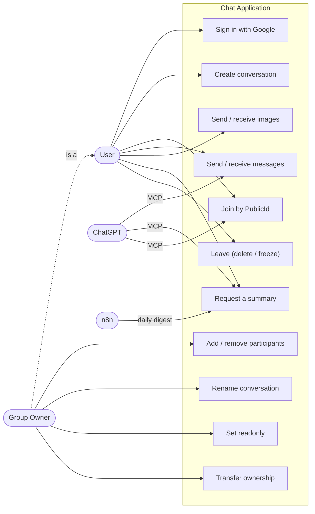
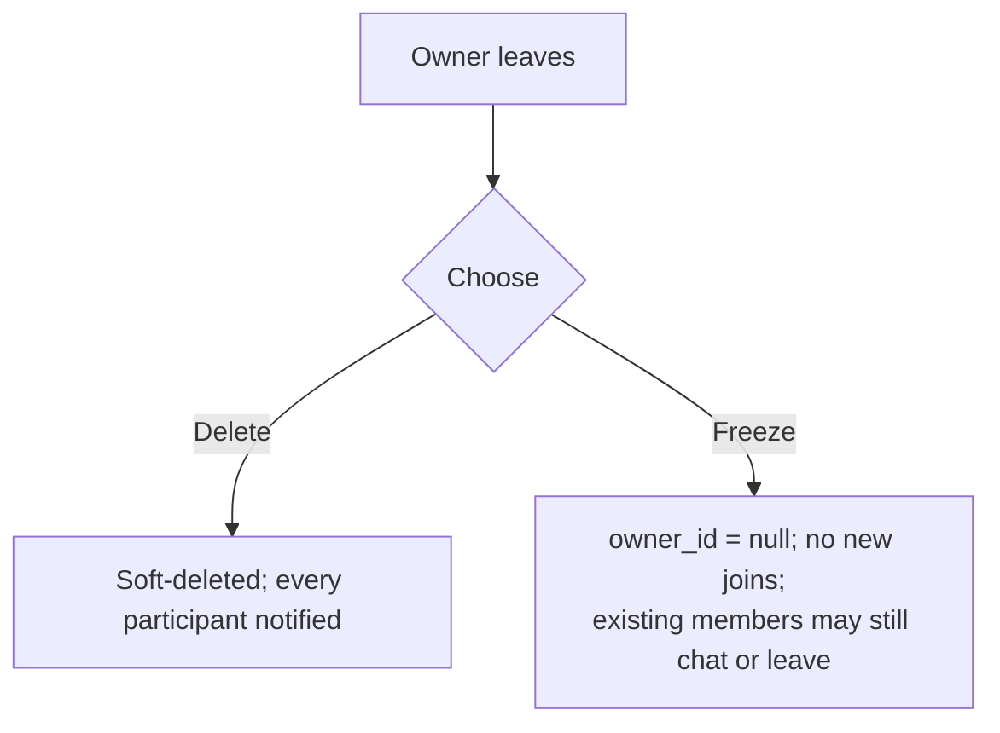
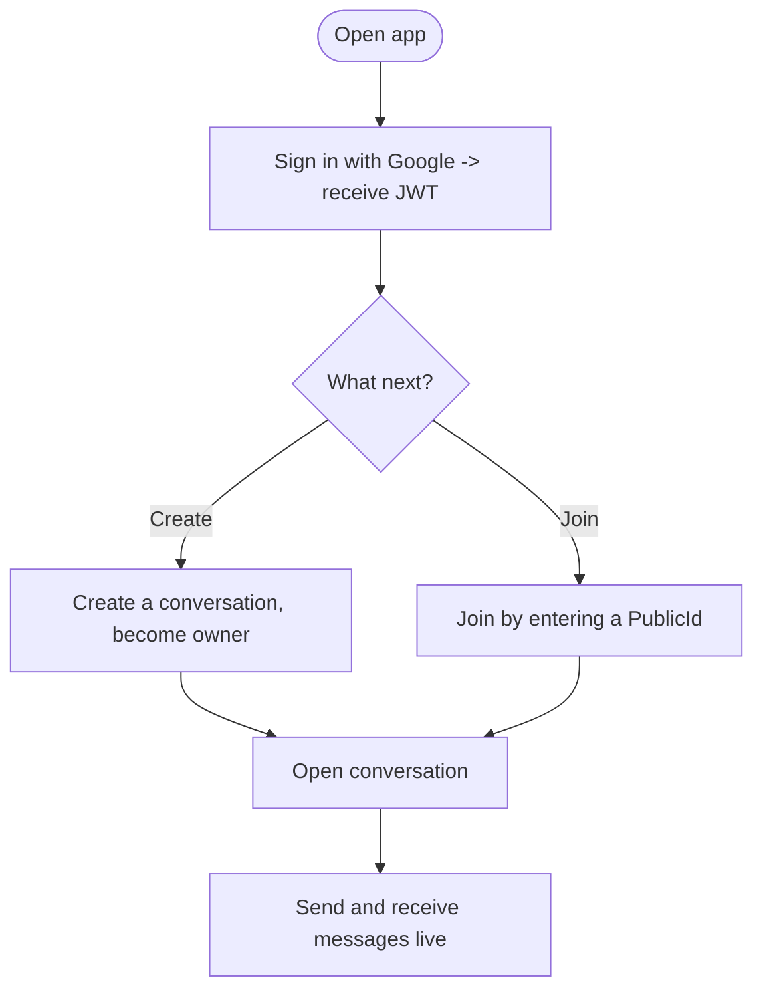
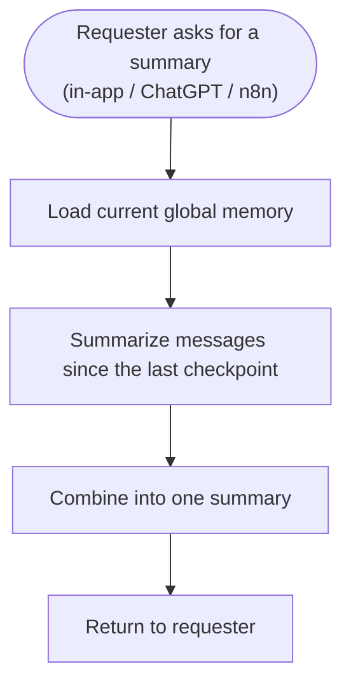

# Software Requirements Specification — Realtime Chat App

The authoritative requirements: what the product must do, and how each requirement is verified. Technical design is in [backend-system-design-and-architecture.md](../backend/docs/backend-system-design-and-architecture.md); the data model is in [database-design.md](../backend/docs/database-design.md).

---

## 1. Introduction

### 1.1 Scope

A **realtime chat application**: users message each other one-to-one or in groups, send images, and can request an AI-generated summary of a conversation. It also exposes an MCP server so ChatGPT can operate on conversations, and ships an n8n workflow that produces a scheduled daily digest.

### 1.2 Definitions

| Term | Meaning |
|---|---|
| PWA | Progressive Web App — one web build, installable on desktop and mobile |
| JWT | Signed token issued by Supabase Auth after Google sign-in, sent on every request |
| Username | Public handle, letters + digits only, ≤ 30 chars, unique. Auto-derived from the Google account's email local-part at sign-up — never user-chosen |
| UserRole | System-wide permission tier: `Administrator` \| `Moderator` \| `User` (default). Distinct from Owner/Member below, which are per-conversation |
| Owner | The creator of a conversation; transferable to another participant; no owner ⟺ **frozen** |
| PublicId | 6-character case-sensitive code used to join a conversation |
| MCP | Model Context Protocol — lets ChatGPT call the app's tools |
| RLS | Row-Level Security — per-row authorization enforced inside Postgres |

### 1.3 Constraints / explicitly out of scope

Push notifications, end-to-end encryption, in-app message search, voice/video, multi-owner conversations, horizontal scale-out.

---

## 2. Overall description

### 2.1 Product perspective

One responsive PWA, not three native apps — a single codebase that runs in a desktop browser and installs to a mobile home screen. The backend is a thin logic plane; Supabase owns identity, files, and the database (see [architecture §1](../backend/docs/backend-system-design-and-architecture.md#1-guiding-principles)).

### 2.2 Actors

| Actor | Description |
|---|---|
| **User** | A registered person: chats 1:1 or in groups, sends images, requests summaries |
| **Group Owner** | A User who created a group; additionally manages membership and decides delete-vs-freeze on leaving |
| **ChatGPT** | External actor, via MCP: lists conversations, summarizes a thread, joins a group |
| **n8n** | External actor: runs the daily summary job |

### 2.3 Assumptions

| # | Assumption | Rationale |
|---|---|---|
| A1 | One PWA covers desktop + mobile, not native apps | Full coverage with one codebase |
| A2 | General-purpose chat, no domain-specific context | Keeps the feature set broadly applicable |
| A3 | Image AI is a one-line on-send caption only, not text extraction | Cheaper and simpler than a full extraction feature |
| A4 | One owner per conversation, transferable; owner leaving picks delete or freeze | Explicit ownership without multi-owner conflicts |
| A5 | Rolling conversation memory backs every summary | Keeps summaries cheap regardless of history length |
| A6 | n8n runs on a daily schedule | "Last 24 hours" implies a periodic job |
| A7 | Joining a conversation means entering its `PublicId` | User-initiated join, no owner approval step |

---

## 3. Use cases

---

## 4. Functional requirements

### F-1 · Sign-in

**Behavior.** Sign-in is exclusively "Sign in with Google" via Supabase Auth — no password or other provider. On first sign-in, a profile is created automatically: the username is derived from the Google email's local-part (sanitized to letters + digits, with a numeric suffix if that username is already taken), and the account is assigned the `User` role by default. Every subsequent request carries the resulting JWT.

**Acceptance.** A new Google account signing in for the first time gets a unique, valid username and a `User` role, with no separate sign-up step; a returning user reaches the same profile; unauthenticated requests are rejected.

**Edge cases.** An email whose local-part sanitizes to nothing falls back to a generated placeholder username; a colliding username gets a numeric suffix.

### F-2 · Roles & authorization

**Behavior.** Every user has exactly one `UserRole`. It — not which client made the call — decides what a request may do; see [architecture §6](../backend/docs/backend-system-design-and-architecture.md#6-authentication--authorization) for the full matrix. MCP and n8n calls always act on behalf of a specific real user, never anonymously.

**Acceptance.** A `User`-role account can use every ordinary chat feature; only `Administrator`/`Moderator` can reach the system-wide operations that power the n8n digest; only `Administrator` can change a user's role.

**Edge cases.** Promoting an account to `Moderator`/`Administrator` is a manual database operation — bootstrapping the very first Administrator requires direct database access, since the role-change endpoint itself requires an existing Administrator caller.

### F-3 · Real-time messaging

**Behavior.** Users chat 1:1 or in groups over a persistent WebSocket connection. The server persists each message, then broadcasts it to every online member. History is paginated over REST; the database is the source of truth, so a reconnecting client always recovers correct state.

**Acceptance.** A sent message appears for all online members without a refresh; history loads and paginates correctly; a reconnect never loses or duplicates messages.

### F-4 · Create & join conversations

**Behavior.** A user creates a conversation by adding one or more other participants by `username` (2 people = direct chat, more = group) and becomes its owner. The backend generates a unique 6-character `PublicId` and an initial display name from the participants' usernames. A user joins an existing conversation by entering its exact `PublicId`.

**Acceptance.** Creating yields a conversation with a unique `PublicId` the creator can chat in immediately; a valid `PublicId` adds the joiner and shows history plus live messages.

**Edge cases.** Creating with no other participant, or an unknown username, is rejected (the whole request fails together, nothing partially happens). Joining a frozen or deleted conversation is rejected; joining one already joined is a no-op.

### F-5 · Ownership & lifecycle

| Action | Who |
|---|---|
| Send / read messages | any participant (blocked when readonly, except the owner) |
| Join by `PublicId` | anyone, if not frozen or deleted |
| Add / remove participant, rename, set readonly, transfer ownership | owner only |
| Leave | any participant; the owner additionally chooses delete or freeze |

**Readonly** turns on automatically at 1 remaining participant and clears automatically once a join brings it back to 2; the owner can also set it manually.

**Acceptance.** Only the owner can add/remove participants, rename, set readonly, transfer ownership, or delete — enforced server-side, not just hidden in the UI. On delete, every participant is notified in real time.

**Edge cases.** A frozen conversation stays that way until ownership is transferred back — this is intentional, since the owner chose freeze over transfer. A manually-set readonly is cleared if membership crosses back through the 1↔2 boundary via a join.

### F-6 · Image messaging

**Behavior.** A participant sends one image per message. The client uploads it directly to Supabase Storage and sends a message carrying the resulting URL — the backend never streams image bytes. On send, the backend makes one AI call that generates a caption, which also feeds conversation memory. There is no text-extraction feature; captioning is the only AI step an image goes through.

**Acceptance.** A sent image appears inline for all participants in real time, persists across reloads, and has a caption.

**Edge cases.** A failed captioning call never blocks the image from sending — the caption is simply left empty.

### F-7 · Conversation summarization

**Behavior.** The system maintains a rolling background summary per conversation (see [architecture §8](../backend/docs/backend-system-design-and-architecture.md#8-conversation-memory-pipeline)), so a summary is cheap to produce on demand. One endpoint serves three callers: the in-app "Summarize" action, the MCP `get_conversation_summarization` tool, and the n8n daily digest.

**Acceptance.** Summarization never blocks message sending; an on-demand summary reflects everything up to the request moment; ChatGPT obtains the same summary via MCP as the in-app action does.

---

## 5. User flows

### 5.1 Onboarding

### 5.2 Request a summary

---

## 6. Integration requirements

### 6.1 ChatGPT via MCP

A remote MCP server (`/mcp`, HTTPS, OAuth-protected) is added to ChatGPT via Developer Mode:

| ChatGPT capability | MCP tool |
|---|---|
| List conversations | `list_joined_conversations` |
| Read a conversation's messages | `fetch_conversation_messages` |
| Summarize a selected thread | `get_conversation_summarization` |
| Join a group chat | `join_conversation` |

**Acceptance.** The `/mcp` URL can be added as a connector; ChatGPT can list conversations, read/summarize a thread, and join a group. Full design: [mcp/README.md](../mcp/README.md).

### 6.2 n8n daily digest

A daily workflow retrieves all conversations, summarizes each, produces one overall 24-hour summary, publishes it to a web page, and appends rows to a Google Sheet.

**Acceptance.** On schedule, per-conversation and one overall summary are produced and published to both the web page and the sheet. Full design: [n8n/README.md](../n8n/README.md).

---

## 7. Non-functional requirements

| Rule | Effect |
|---|---|
| AI is on-demand and cached, never fan-out | Predictable, low AI cost regardless of group size |
| AI failure never blocks core chat | Chat stays reliable even if the AI provider is down |
| The database is the source of truth | A reconnecting client always recovers correct state |
| Authorization is enforced server-side, not just in the UI | Cannot be bypassed by a modified client |

---

## 8. Traceability

| Requirement | Fulfilled by | Verified by |
|---|---|---|
| F-1 Sign-in | Supabase Auth (Google OAuth) + `handle_new_user` trigger | New account gets a valid profile with no sign-up step |
| F-2 Roles | `UserRole` + `[AllowedRoles]` | Access matrix in [architecture §6](../backend/docs/backend-system-design-and-architecture.md#6-authentication--authorization) |
| F-3 Messaging | SignalR `ChatHub` | Realtime delivery + REST history pagination |
| F-4 Create/join | `POST /api/conversations`, `POST /api/conversations/join` | Create-then-chat, join-then-see-history |
| F-5 Ownership | Owner-only handler checks | Non-owner actions rejected server-side |
| F-6 Images | Direct-to-Storage upload + on-send caption | Image renders with caption, feeds memory |
| F-7 Summarization | `ConversationMemoryService` | Same summary via in-app action and MCP |
| §6.1 MCP | MCP server + tools | ChatGPT lists / summarizes / joins |
| §6.2 n8n | `workflow.json` | Web page + Google Sheet updated on schedule |
