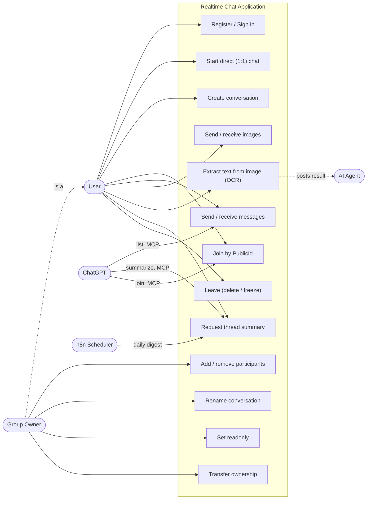
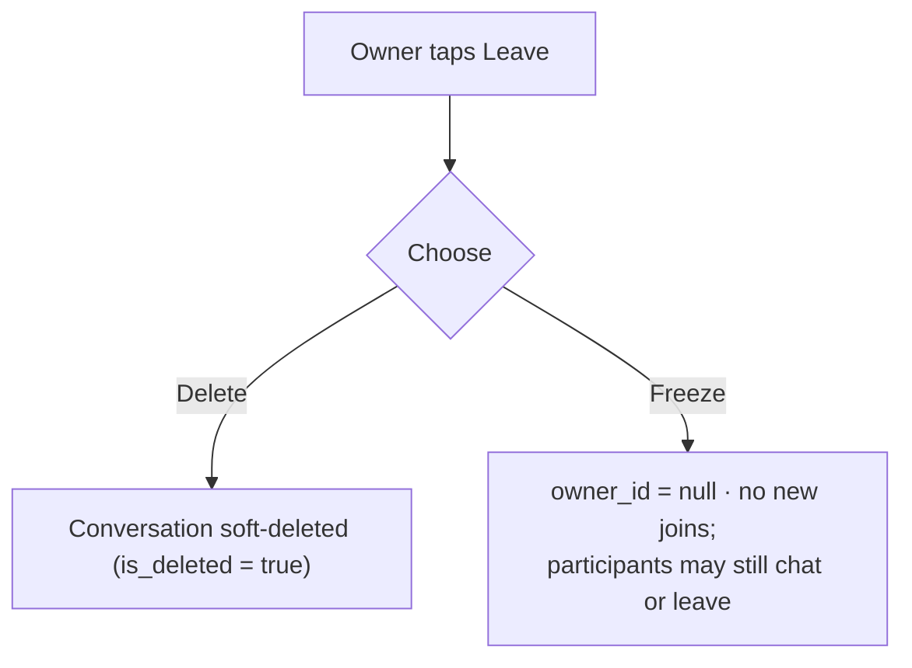
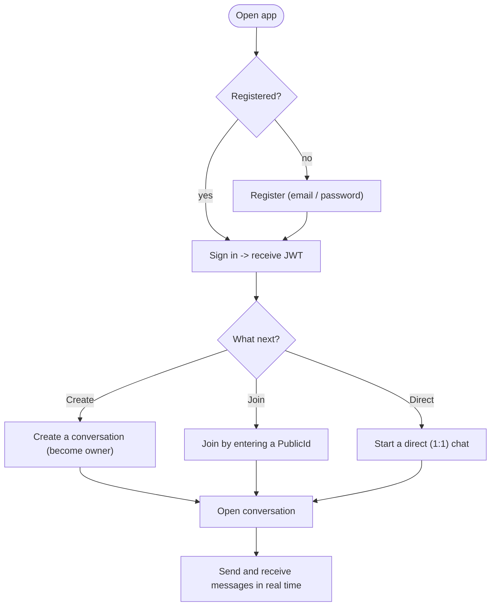
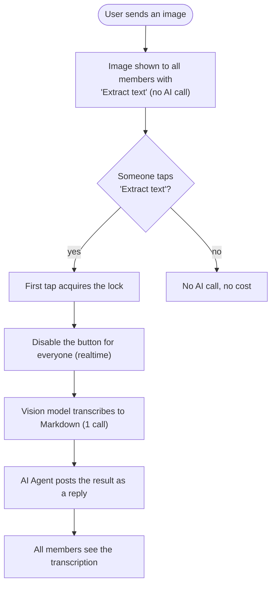
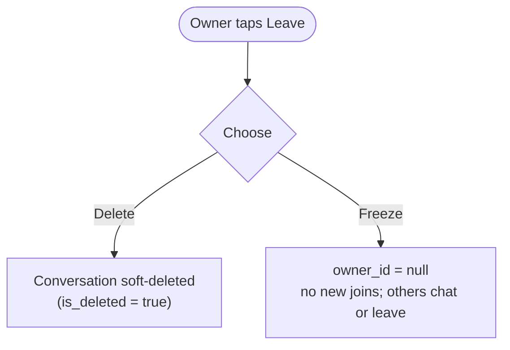
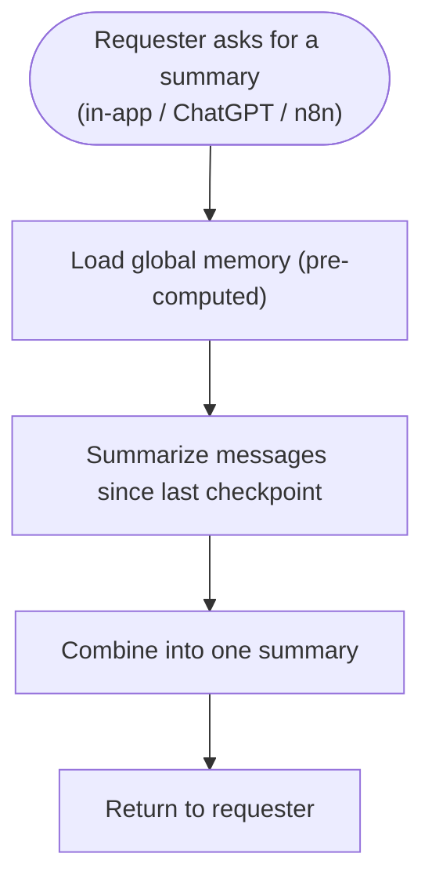

# Software Requirements Specification — Realtime Chat App

Merged, authoritative requirements document. It combines the business requirements and the feature specification into one source of truth. Technical design is in `backend-system-design-and-architecture.md`; the data model is in `database-design.md`.

---

## 1. Introduction

### 1.1 Purpose
Define what the product must do and how each requirement is verified, so design and implementation can be traced back to a clear source.

### 1.2 Scope
A **realtime chat application** where users message each other one-to-one, create group chats, and join group chats. It supports images and an AI-assisted image feature, exposes an MCP server so ChatGPT can operate on conversations, and ships an n8n workflow that produces scheduled summaries.

### 1.3 Definitions

| Term | Meaning |
|---|---|
| PWA | Progressive Web App — one web build installable on PC, iOS, Android |
| JWT | Signed token issued by Supabase Auth, carried on every request |
| Username | Login handle; letters + digits only, ≤30 chars, unique |
| Owner | The creator of a conversation; **transferable**; `null` owner ⟺ **frozen** |
| PublicId | 6-char case-sensitive alphanumeric code used to join a conversation |
| Member | A participant of a conversation |
| AI Agent | Hidden system user that posts AI (OCR) results as messages |
| OCR | Optical Character Recognition — transcribing image text to Markdown |
| MCP | Model Context Protocol — lets ChatGPT call the app's tools |
| RLS | Row-Level Security — per-row authorization enforced in Postgres |

---

## 2. Overall description

### 2.1 Product perspective
Delivered as a single **responsive PWA** rather than three native apps: one codebase runs in desktop browsers and installs to the home screen on mobile. The backend is a thin logic plane; identity, storage, and the database are provided by Supabase.

### 2.2 Actors & roles

| Actor | Description |
|---|---|
| **User** | A registered person; can chat 1:1, create/join groups, send images, trigger OCR, request summaries |
| **Group Owner** | A User who created a group; additionally manages members and can delete the group |
| **AI Agent** | System actor; posts OCR results into conversations |
| **ChatGPT** | External actor; via MCP, lists conversations, summarizes a thread, joins a group |
| **n8n Scheduler** | External actor; runs the daily summary workflow |

### 2.3 Assumptions & dependencies

| # | Assumption | Rationale |
|---|---|---|
| A1 | Cross-platform = one PWA, not native apps | Coverage with minimal effort |
| A2 | General-purpose chat (no domain context) | Feature set stays broadly applicable |
| A3 | "AI-assisted image messaging" = collaborative OCR to Markdown | Cheaper, faster, safer, more demoable than image generation |
| A4 | Single owner per conversation, **transferable**; owner leaving chooses delete or freeze | Simple, explicit ownership without multi-owner conflicts |
| A5 | Rolling conversation memory backs all summaries | Makes per-thread and 24h summaries O(1) to produce |
| A6 | n8n runs on a daily schedule | "Last 24 hours" implies a periodic job |
| A7 | Users join a conversation by entering its `PublicId` | User-initiated join without owner-add |
| A8 | Usernames are unique; a conversation is created with ≥1 other participant | Needed for identity and display-name generation |

### 2.4 Constraints / out of scope
Push notifications; end-to-end encryption; in-app message search; voice/video; multi-owner or co-admin roles; horizontal scale-out. Acknowledged and deferred.

---

## 3. Use case diagram

*User and Group Owner are both actors; a Group Owner is a User who additionally has owner-only actions (add/remove participants, rename, set readonly, transfer ownership, delete/freeze on leave).*

---

## 4. Functional requirements

Each feature: description, behavior, acceptance criteria, edge cases.

### F-1 · Registration & authentication
**Behavior.** Sign-up and sign-in via Supabase Auth, which issues a JWT; a profile is created on first sign-up. Each user is identified by a unique **Username** (letters + digits only, ≤30 chars); there is no separate display name. Every request carries the JWT.
**Acceptance.** A new user can register with a valid, unique username and sign in; a profile exists; invalid or duplicate usernames are rejected; unauthenticated requests are rejected.
**Edge cases.** Username with non-alphanumeric characters or >30 chars rejected; duplicate username rejected.

### F-2 · Direct & real-time messaging
**Behavior.** Users chat 1:1 or in groups over a persistent WebSocket (SignalR). The server persists each message, then broadcasts it to all members. History is paginated via REST; the database is the source of truth, so reconnecting clients recover correct state.
**Acceptance.** A sent message appears for all online members without refresh; history loads and paginates; reconnect loses/duplicates nothing.
**Edge cases.** Messages from a member who later leaves remain in history.

### F-3 · Create & join conversations
**Behavior.** A user **creates** a conversation by adding **1 or more** other participants (2 people = direct chat, more = group), becoming its owner. The backend auto-generates a unique 6-char `PublicId` and an initial `DisplayName` from the owner's and up to two other participants' usernames (e.g. `alice, bob`). A `DisplayName` may contain letters, digits, commas, and spaces. A user **joins** an existing conversation by entering its exact `PublicId`.
**Acceptance.** Creating yields a conversation with a unique PublicId and generated name, and the creator can chat immediately; entering a valid PublicId of a joinable conversation adds the user and shows history + live messages.
**Edge cases.** Creating with no other participant is rejected; joining with a wrong/nonexistent PublicId fails cleanly; joining a **frozen** or deleted conversation is rejected; joining one already joined is a no-op.

### F-4 · Ownership & lifecycle
**Ownership.** Each conversation has **one owner = its creator**, but ownership is **transferable** to another participant. A conversation with **no owner** (`owner_id = null`) is **frozen**.

| Action | Who |
|---|---|
| Send / read messages | any participant (send blocked when readonly, except owner) |
| Join (by PublicId) | any user, if not frozen/deleted |
| Add / remove participant | **owner only** |
| Rename `DisplayName` | **owner only** |
| Set `IsReadonly` | **owner only** |
| Transfer ownership | **owner only** (to a participant) |
| Leave (self) | any participant |
| Delete (soft) or Freeze | **owner**, via leaving |

**Readonly.** A conversation auto-becomes readonly when it has **1 participant**, and auto-clears when a join brings it back to **≥2**. The owner may also set readonly manually. When readonly, **only the owner may send**.

**Owner leaving** chooses between soft-**delete** and **freeze**:

**Acceptance.** Only the owner can add/remove participants, rename, set readonly, transfer ownership, or delete — enforced server-side (not just hidden in the UI); a non-owner leaves freely; a frozen conversation blocks new joins but allows chatting and leaving.
**Edge cases.** A frozen conversation stays unmanaged (no owner) until... it remains frozen (owner chose freeze over transfer); a manual readonly can be cleared by a subsequent join crossing the 1↔2 boundary (accepted simplification).

### F-5 · Image messaging
**Behavior.** A participant sends **one image per message**. The client uploads it **directly** to Supabase Storage, then sends a message carrying the URL; the backend never streams bytes. On send, the backend makes one vision pass that (a) generates a **caption** (feeds memory) and (b) **detects whether the image contains text**, setting `OcrStatus` to `TEXT_NOT_FOUND` (no text) or `NOT_REQUESTED` (text present).
**Acceptance.** A member sends an image and all participants see it inline in realtime; images persist and reload with history; each image has a caption and an initial OcrStatus.
**Edge cases.** Oversized/non-image uploads rejected client-side; a failed caption/detection never blocks the image from sending (status falls back safely).

### F-6 · AI-assisted image messaging (collaborative OCR)
**Behavior.** For an image with `OcrStatus = NOT_REQUESTED` (text detected on send, per F-5), every participant sees an **"Extract text"** button. The **first** to tap it acquires a lock (`NOT_REQUESTED → PROCESSING`) and the button is **permanently disabled for everyone** via realtime. One vision call transcribes the image to **Markdown**, stored in `OcrContent`; status becomes `FINISHED`; and the hidden **AI Agent** posts a text reply to the image so all participants see it.

**Why these choices.** On-demand (cost scales with usage, not participant count); first-tap-wins lock (one call per image regardless of taps); Markdown not HTML (output is data → no XSS surface); the result is both stored (`OcrContent`) and shown as an Agent reply (latecomers see it).

**Acceptance.** The button appears only when text was detected; concurrent taps yield a single shared transcription; the transcription is saved to `OcrContent` and posted as an Agent reply rendered as Markdown; images with no text show no button (`TEXT_NOT_FOUND`).
**Edge cases.** OCR failure/slowness never blocks normal chatting.

### F-7 · Conversation memory & summarization
**Behavior.** The system maintains a background rolling summary per conversation (per-chunk summaries plus one evolving overall summary) so summaries are cheap and current. On request, a summary combines the overall memory with a fresh summary of messages since the last checkpoint. One endpoint serves three callers: the in-app "Summarize" action, the MCP `summarize_thread` tool, and the n8n daily digest.
**Acceptance.** Summarization runs in the background and never blocks sending; an on-demand summary reflects messages up to the request moment; ChatGPT obtains the same summary via MCP.

---

## 5. User flows

### 5.1 Onboarding to first conversation

### 5.2 Collaborative OCR

### 5.3 Owner leaves a group

### 5.4 Request a thread summary

---

## 6. Integration requirements

### 6.1 MCP integration (ChatGPT)
A remote MCP server (HTTPS, `/mcp`) is added to ChatGPT via **Developer Mode** (Plus/Pro/Team/Enterprise). Because ChatGPT's default connector mode only calls `search`/`fetch`, the server exposes **both** that standard pair **and** the custom tools.

| ChatGPT capability | MCP tool |
|---|---|
| Display all conversations | `list_conversations` |
| Summarize a selected thread | `summarize_thread` |
| Join a group chat | `join_group` |
| (standard) discovery + retrieval | `search`, `fetch` |

**Acceptance.** The `/mcp` URL can be added as a connector; ChatGPT can list conversations, summarize a named thread, and join a group; setup steps (incl. Developer Mode) are in the README.

### 6.2 n8n workflow
A daily workflow retrieves all threads, summarizes each (reusing the summarization endpoint, which reads the pre-computed memory), produces one 24-hour overall summary, publishes to a web page, and appends to a Google Sheet.
**Acceptance.** On schedule, per-thread and one overall 24h summary are produced and published to both the web page and the Google Sheet; the workflow is importable (`workflow.json`).

---

## 7. Submission requirements
A GitHub repo with the app, MCP server, and n8n workflow; a README enabling a fresh clone to run; and a commit history showing phased, incremental development (a graded artifact — commit per feature/phase, meaningful messages, not one squashed commit).

---

## 8. Non-functional / cross-cutting rules

| Rule | Effect |
|---|---|
| AI is on-demand + cached, never fan-out | Predictable, low AI cost |
| AI failure never blocks core chat | Chat stays reliable |
| Database is the source of truth | Reconnects recover correct state |
| Authorization enforced server-side (API + RLS), not just UI | Security cannot be bypassed by the client |
| One responsive PWA | Consistent experience on PC / iOS / Android |

---

## 9. Traceability

| Requirement | Fulfilled by | Verified by |
|---|---|---|
| Cross-platform (§2.1) | React + TS PWA | Installable on desktop + mobile |
| F-1…F-7 | Backend + client features | Acceptance criteria above |
| Create / join (F-3) | `POST /conversations`, `POST /conversations/join` (by PublicId) | Create-then-chat, join-then-see-history |
| MCP (§6.1) | MCP server + tools | ChatGPT lists / summarizes / joins |
| n8n (§6.2) | `workflow.json` | Web page + Google Sheet updated |
| Submission (§7) | Repo + README + phased commits | Fresh clone runs |
