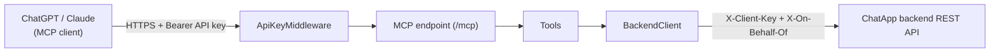

# ChatApp MCP Server

A thin [Model Context Protocol](https://modelcontextprotocol.io/) server that lets ChatGPT, Claude, or any other MCP client operate on ChatApp conversations. It holds no business logic of its own — every tool call translates directly into a call to the ChatApp REST API. Full design context: [../docs/mcp-integration.md](../docs/mcp-integration.md).

## How it works



- **One fixed backend account.** This server always calls the backend as one configured user (`Backend:OnBehalfOfUsername`) using the backend's existing `Mcp` service key. There is no per-caller identity mapping — every ChatGPT/Claude session that can reach this server acts as that same account.
- **One access gate.** `ApiKeyMiddleware` checks every request's `Authorization: Bearer <key>` against a configured API key before it reaches the MCP endpoint. Both ChatGPT (Developer Mode connectors) and Claude (custom connectors) support this natively — no OAuth server needed here.
- **Stateless.** No tool needs multi-turn session state or server-to-client sampling, so the server runs in stateless HTTP mode — simpler than the alternative, one less thing to scale or persist.

## Codebase

```
mcp/
├── ChatApp.Mcp.csproj
├── Program.cs           composition root: options, HttpClient, MCP server, middleware
├── appsettings.json      non-secret config only
├── Auth/
│   ├── McpAccessOptions.cs      the API key this server itself requires
│   └── ApiKeyMiddleware.cs      checks it on every request
├── Backend/
│   ├── BackendOptions.cs        backend URL + service key + on-behalf-of username
│   ├── Dtos.cs                  minimal mirrors of the backend's JSON shapes
│   └── BackendClient.cs         typed HttpClient wrapper over the REST API
└── Tools/
    ├── SearchAndFetchTools.cs   the standard "search"/"fetch" pair ChatGPT's default mode calls
    └── ConversationTools.cs     list_conversations, summarize_thread, join_group
```

No Domain/Application/Infrastructure split like the main backend — this project is a protocol adapter, not a business system, so one flat project is the right amount of structure. If it ever grows real logic of its own, that's the signal to split it up; until then, more layers would just be ceremony.

## Tools

| Tool | Backend call | Read-only |
|---|---|---|
| `search` | `GET /api/conversations?q=` | yes |
| `fetch` | `GET /api/conversations/{id}/messages` | yes |
| `list_conversations` | `GET /api/conversations` | yes |
| `summarize_thread` | `POST /api/conversations/{id}/summary` | yes |
| `join_group` | `POST /api/conversations/join` | no |

`search`/`fetch` exist because ChatGPT's default (non-Developer-Mode) connector mode only ever calls those two — shipping both means this server works whether or not Developer Mode is on. `search` returns each matching conversation's id/title/url; `fetch` returns one conversation's full transcript as plain text (image messages show as `[image] <caption>`).

## Build & run locally

```bash
cd mcp
dotnet restore
dotnet build
```

Configure secrets with [user-secrets](https://learn.microsoft.com/aspnet/core/security/app-secrets) — never commit real keys:

```bash
dotnet user-secrets init
dotnet user-secrets set "Backend:BaseUrl"             "https://your-chatapp-backend"
dotnet user-secrets set "Backend:ClientKey"           "<the backend's Clients:McpKey value>"
dotnet user-secrets set "Backend:OnBehalfOfUsername"  "<an existing backend username>"
dotnet user-secrets set "Mcp:ApiKey"                  "<a long random string you generate>"
```

Run:

```bash
dotnet run
```

The MCP endpoint is `POST/GET /mcp` on whatever port the console prints. Every request needs `Authorization: Bearer <Mcp:ApiKey>` or it gets `401`.

## Deploying it

This server needs a public HTTPS URL — ChatGPT and Claude both connect to it remotely, not as a local subprocess. Any host that can run a .NET 10 ASP.NET Core app works (same options as the [backend](../backend/README.md)); for local testing without deploying anywhere, a tunnel like [ngrok](https://ngrok.com/) pointed at your local port is enough to get an HTTPS URL ChatGPT/Claude can reach.

## Connecting it to ChatGPT

1. In ChatGPT: **Settings → Apps → Advanced settings → Developer mode** → on (Plus/Pro/Business/Enterprise).
2. **Settings → Connectors → Create** (only visible with Developer mode on).
3. **URL**: `https://<your-host>/mcp`
4. **Authentication**: API key → paste your `Mcp:ApiKey` value.
5. Save. The five tools above become available in conversations, subject to ChatGPT's own per-call confirmation settings.

## Connecting it to Claude

1. **Settings → Connectors → Add custom connector**.
2. **URL**: `https://<your-host>/mcp`
3. Under **Request headers** (currently a beta feature — request access from Anthropic if you don't see it), add: `Authorization` = `Bearer <your Mcp:ApiKey value>` (include the word "Bearer" and the space).
4. Save and enable the connector.

## Maintaining & upgrading

- **Add a tool**: add a method with `[McpServerTool]` to a class marked `[McpServerToolType]` under `Tools/` (new file or existing one). `WithToolsFromAssembly()` in `Program.cs` discovers it automatically — no registration step to remember.
- **Upgrade the SDK**: bump the `ModelContextProtocol.AspNetCore` version in `ChatApp.Mcp.csproj` and rebuild. Check the [SDK's release notes](https://github.com/modelcontextprotocol/csharp-sdk/releases) for breaking changes first.
- **Revoke access**: rotate `Mcp:ApiKey` (this server) and/or the backend's `Clients:McpKey` (backend) — either one invalidates every existing connector immediately.
- **Backend contract drift**: `Backend/Dtos.cs` is a hand-maintained mirror of the backend's JSON shapes, not a shared library — if the backend's `ConversationDto`/`MessageDto` change, update these records to match. See [../docs/backend-system-design-and-architecture.md §10](../docs/backend-system-design-and-architecture.md#10-api-reference) for the source of truth.

## Reference

- [Model Context Protocol](https://modelcontextprotocol.io/) · [MCP C# SDK](https://github.com/modelcontextprotocol/csharp-sdk)
- [ChatGPT: Developer mode and MCP apps](https://help.openai.com/en/articles/12584461-developer-mode-and-mcp-apps-in-chatgpt)
- [Claude: Custom connectors (remote MCP)](https://claude.com/docs/connectors/custom/remote-mcp)
