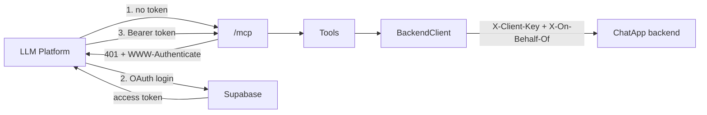

Thin [MCP](https://modelcontextprotocol.io/) server for ChatGPT/Claude to operate on ChatApp conversations. It's a **separate deployable** — no business logic, no direct database access; every tool call maps 1:1 to a ChatApp REST call, so all business rules stay in the backend and this server is just a protocol adapter.

## How it works



- **One fixed backend account.** Every call acts as `Backend:OnBehalfOfUsername` — no per-caller mapping.
- **OAuth, not a static key** — required by both ChatGPT/Claude connectors. [Supabase Auth's OAuth 2.1 Server](https://supabase.com/docs/guides/auth/oauth-server) (beta) issues tokens; this server only validates them (`AddJwtBearer`), same Supabase project the [backend](../backend/README.md) already uses for its own user JWTs. RFC 9728 discovery is built into the SDK's `AddMcp(...)`.
- A valid token only proves "completed Supabase's OAuth consent flow" — it never changes which backend account is used.
- **SDK pinned to `1.4.1`** (not `2.0.0`) — see [Troubleshooting](#troubleshooting).

## Codebase

```
mcp/
├── ChatApp.Mcp.csproj
├── Program.cs           composition root: options, auth, HttpClient, MCP server
├── appsettings.json      non-secret config only
├── Options/              BackendOptions, SupabaseOptions
├── Auth/                 SupabaseJwksProvider
├── Backend/              BackendClient (typed HttpClient over the REST API)
├── DTOs/                 minimal mirrors of the backend's JSON shapes
└── Tools/                ConversationTools.cs, WhoamiTools.cs
```

## Tools

| Tool | Input | Backend call | Read-only |
|---|---|---|---|
| `whoami` | — | `GET /api/users/me` | yes |
| `list_joined_conversations` | `query?` | `GET /api/conversations?q=<query>` | yes |
| `create_conversation` | `participantUsernames` | `POST /api/conversations` | no |
| `join_conversation` | `publicId` | `POST /api/conversations/join` | no |
| `leave_conversation` | `conversationId`, `mode?` (owner only) | `POST /api/conversations/{id}/leave` | no |
| `send_text_message` | `conversationId`, `content` | `POST /api/conversations/{id}/messages` | no |
| `fetch_messages_from_a_conversation` | `conversationId`, `beforeMessageId?`, `limit?` | `GET /api/conversations/{id}/messages` | yes |
| `search_messages_in_a_conversation` | `conversationId`, `keyword`, `limit?` (1-10) | `GET /api/conversations/{id}/messages/search` | yes |

No `search`/`fetch` pair — ChatGPT's non-Developer-Mode default connector needs those two names specifically; without them this only works via Developer Mode's custom tools (see [Connecting a client](#connecting-a-client)).

## Auth model

Two separate authentication concerns, not one:

1. **MCP server → backend**: always as **one fixed, configured account** — there is no per-caller mapping. Every tool call sends:
   ```
   X-Client-Key: <Clients:McpKey value>
   X-On-Behalf-Of: <the one configured backend username>
   ```
   The backend resolves that user and applies the exact same membership, ownership, and role-based rules ([backend architecture §6](../backend/docs/backend-system-design-and-architecture.md#6-authentication--authorization)) it would for that user calling directly.

2. **ChatGPT/Claude → MCP server**: real OAuth, since both platforms require it for remote MCP connectors. The MCP server doesn't issue tokens itself — it validates access tokens issued by [Supabase Auth's OAuth 2.1 Server](https://supabase.com/docs/guides/auth/oauth-server) (the same Supabase project the backend already uses, running as a hosted authorization server) against a fixed `"authenticated"` audience, publishing the standard [RFC 9728](https://datatracker.ietf.org/doc/html/rfc9728) discovery document so ChatGPT/Claude can find it automatically. A valid token only proves "this client completed Supabase's OAuth consent flow" — it does not change which backend account gets used, since that's still the one fixed account from step 1.

## Setup

**1. Enable Supabase's OAuth Server** (same project the backend uses — see [backend/README.md](../backend/README.md))

| Step | Where |
|---|---|
| Enable the OAuth Server | Authentication → **OAuth Server** (beta) → toggle on |
| Allow dynamic client registration | Same page → **Allow Dynamic OAuth Apps** → on (required — ChatGPT/Claude self-register via DCR, no manual client id/secret) |
| Implement the consent screen | Same page → **Authorization Path** (default `/oauth/consent`) → build this route in your app; it's the login/consent UI Supabase redirects to mid-flow |
| Save changes | — |

**2. Secrets:**

**Shortcut:** `Copy-Item .env.local.example .env.local`, fill in the real values, then `./start-dev.ps1` — it applies them via `dotnet user-secrets` and runs the server.

Or manually:

```bash
cd mcp
dotnet user-secrets init
dotnet user-secrets set "Backend:BaseUrl"            "http://localhost:5000"
dotnet user-secrets set "Backend:ClientKey"           "<backend's Clients:McpKey>"
dotnet user-secrets set "Backend:OnBehalfOfUsername"  "<a registered username>"
dotnet user-secrets set "Supabase:Url"                "https://<project-ref>.supabase.co"
dotnet user-secrets set "Supabase:ResourceUri"        "<any fixed string, e.g. this server's public URL>"
dotnet restore && dotnet build && dotnet run
```

## Test locally before deploying

1. `dotnet run` (above).
2. `ngrok http <port>` → copy the `https://...ngrok-free.app` URL.
3. Add it as a connector (below) using that URL.
4. Ask ChatGPT/Claude to do something that calls a tool; watch this console for logs.

ngrok's free URL changes every restart — update the connector URL each time, or use a reserved domain. Deploying for real only changes this URL; nothing in `mcp/` changes.

## Connecting a client

| | ChatGPT | Claude |
|---|---|---|
| Enable | Settings → Apps → Advanced → **Developer mode** (Plus/Pro/Team/Enterprise) | — |
| Add | Settings → Connectors → Create | Settings → Connectors → Add custom connector |
| URL | `https://<host>/mcp` | `https://<host>/mcp` |
| Auth | OAuth → redirects to Supabase consent screen → log in → Allow | OAuth → same flow |

ChatGPT's connector is added at the `https://…/mcp` route via **Developer Mode** specifically — there's no standard `search`/`fetch` tool pair (see [Tools](#tools)), so this only works via Developer Mode's custom tool calling, not ChatGPT's default (non-Developer-Mode) connector mode.

Reference: [Building MCP servers for ChatGPT](https://platform.openai.com/docs/mcp) · [Claude custom connectors](https://claude.com/docs/connectors/custom/remote-mcp)

## Maintaining

- **New tool**: add a `[McpServerTool]` method under `Tools/` — auto-discovered, nothing to register.
- **Upgrade SDK**: check `ChatApp.Mcp.csproj`'s comment before bumping past `2.0.0`.
- **Revoke access**: rotate backend's `Clients:McpKey` (kills every connector), or disable/delete one client in Supabase → Authentication → OAuth Apps.
- **Backend contract drift**: `DTOs/` is hand-maintained, not shared — update if backend DTOs change ([source of truth](../backend/docs/backend-system-design-and-architecture.md#10-api-reference)).

## Troubleshooting

| Symptom | Cause | Fix |
|---|---|---|
| `JSON-RPC -32600`, "clientCapabilities... not valid with protocol version" | ChatGPT's connector sends a request `ModelContextProtocol.AspNetCore 2.0.0` rejects (protocol version mismatch bug) | Pin the package to `1.4.1` |
| Consent screen 404s / redirect fails | `/oauth/consent` route not implemented in your app, or **Site URL** doesn't match where it's hosted | See Setup step 1 |
| Supabase: "client is not authorized" / registration fails | **Allow Dynamic OAuth Apps** not enabled | See Setup step 1 |
| `401` on every call even with a fresh token | Token's `aud` claim isn't `"authenticated"` (e.g. a Custom Access Token Hook overrides it) | Decode the token and check `aud`/`iss` against `Program.cs`'s `TokenValidationParameters` |
| Tool call fails, backend logs "Mcp callers may only act on behalf of a User-role account" | `Backend:OnBehalfOfUsername` is Moderator/Administrator | Use a `User`-role username |
| `WWW-Authenticate`/metadata URLs show `http://` behind ngrok | Missing forwarded-headers handling | Already handled in `Program.cs` (`UseForwardedHeaders`) |

## References

- [MCP](https://modelcontextprotocol.io/) · [MCP C# SDK](https://github.com/modelcontextprotocol/csharp-sdk)
- [Building MCP servers for ChatGPT](https://platform.openai.com/docs/mcp) · [ChatGPT Developer mode](https://help.openai.com/en/articles/12584461-developer-mode-and-mcp-apps-in-chatgpt) · [Claude custom connectors](https://claude.com/docs/connectors/custom/remote-mcp)
- [Supabase OAuth 2.1 Server docs](https://supabase.com/docs/guides/auth/oauth-server) · [Supabase MCP authentication guide](https://supabase.com/docs/guides/auth/oauth-server/mcp-authentication) · [RFC 9728](https://datatracker.ietf.org/doc/html/rfc9728)

**Related documents:** [backend/README.md](../backend/README.md) · [backend architecture](../backend/docs/backend-system-design-and-architecture.md) · [n8n/README.md](../n8n/README.md) — n8n shares the same service-key + on-behalf-of auth model as this server.
