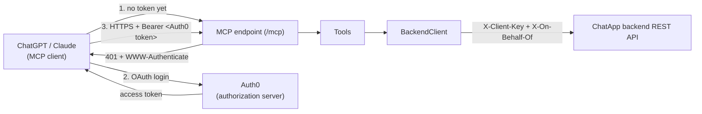

# ChatApp MCP Server

A thin [Model Context Protocol](https://modelcontextprotocol.io/) server that lets ChatGPT, Claude, or any other MCP client operate on ChatApp conversations. It holds no business logic of its own — every tool call translates directly into a call to the ChatApp REST API. Full design context: [../docs/mcp-integration.md](../docs/mcp-integration.md).

## How it works



- **One fixed backend account.** This server always calls the backend as one configured user (`Backend:OnBehalfOfUsername`) using the backend's existing `Mcp` service key. There is no per-caller identity mapping — every ChatGPT/Claude session that can reach this server acts as that same account.
- **OAuth gate, not a static key.** Both ChatGPT (Developer Mode connectors) and Claude (custom connectors) require the client to complete an OAuth flow against a real authorization server before calling a remote MCP server. Rather than building a token-issuing server ourselves, [Auth0](https://auth0.com/)'s free tier plays that role — this server only *validates* the access tokens Auth0 issues (`AddJwtBearer`), the same shape of work the [backend](../backend/README.md) already does for Supabase JWTs. It also publishes the [RFC 9728](https://datatracker.ietf.org/doc/html/rfc9728) Protected Resource Metadata document (`.well-known/oauth-protected-resource`) so a client can discover Auth0 automatically — this is built into the SDK's `AddMcp(...)` call, not hand-written.
- **The token only proves "a client completed Auth0 login" — it doesn't change which backend account is used.** Whoever holds a valid Auth0 access token for this server's audience gets the same fixed `Backend:OnBehalfOfUsername` account; there's no per-user permission mapping, since one shared account is this project's whole scope (see [mcp-integration.md](../docs/mcp-integration.md) for why).
- **SDK pinned to `1.4.1`, not the latest `2.0.0`.** See the comment in `ChatApp.Mcp.csproj` — as of writing, ChatGPT's connector sends a request that `2.0.0`'s stricter per-request `_meta` validation rejects outright, before any tool call is attempted. Confirmed by testing against a real ChatGPT connector, in both stateless and stateful mode. Revisit once that's fixed upstream.

## Codebase

```
mcp/
├── ChatApp.Mcp.csproj
├── Program.cs           composition root: options, auth, HttpClient, MCP server
├── appsettings.json      non-secret config only
├── Options/
│   ├── BackendOptions.cs        backend URL + service key + on-behalf-of username
│   └── Auth0Options.cs          Auth0 tenant domain + this server's audience
├── Backend/
│   └── BackendClient.cs         typed HttpClient wrapper over the REST API
├── DTOs/                        minimal mirrors of the backend's JSON shapes
└── Tools/
    └── ConversationTools.cs     list_joined_conversations, get_conversation_summarization,
                                 fetch_conversation_messages, join_conversation
```

No Domain/Application/Infrastructure split like the main backend — this project is a protocol adapter, not a business system, so one flat project is the right amount of structure. If it ever grows real logic of its own, that's the signal to split it up; until then, more layers would just be ceremony.

## Tools

| Tool | Backend call | Read-only |
|---|---|---|
| `list_joined_conversations` | `GET /api/conversations?q=` | yes |
| `fetch_conversation_messages` | `GET /api/conversations/{id}/messages?before=&limit=` | yes |
| `get_conversation_summarization` | `POST /api/conversations/{id}/summary` | yes |
| `join_conversation` | `POST /api/conversations/join` | no |

**Note:** there is no `search`/`fetch` pair. ChatGPT's *default* (non-Developer-Mode) connector calling convention only ever invokes those two standard tool names — without them, this server only works with Developer Mode's custom tool calling, not the default mode. That's fine for this project's scope; if default-mode compatibility is ever needed, add a `search`/`fetch` pair back that delegates to the tools above.

## Setting up Auth0

Do this once before running the server (free tier is enough — [sign up here](https://auth0.com/signup)):

1. **Enable Dynamic Client Registration.** Dashboard → **Settings → Advanced** → turn on **OIDC Dynamic Application Registration**. This lets ChatGPT/Claude register themselves as OAuth clients on first connect — you never manually create an "Application" per client.
2. **Create an API** (Dashboard → **Applications → APIs → Create API**):
   - **Identifier**: a fixed string you choose (this is the OAuth *audience*). It does **not** need to be a real, reachable URL, and it does **not** need to change when your ngrok URL changes during local testing — e.g. `https://chatapp-mcp` is fine. Whatever you pick, it must match `Auth0:Audience` below exactly.
   - Leave signing algorithm as the default (RS256) — the server validates signatures against Auth0's JWKS, the same pattern the [backend](../backend/README.md) already uses for Supabase.
3. **Create at least one login method** for the consent screen users complete (Auth0's default `Username-Password-Authentication` connection works — create one user for yourself; nobody else needs an account here since every token maps to the same fixed backend account regardless of who logs in).
   - **Promote that connection to the domain level.** Dashboard → **Authentication → Database → Username-Password-Authentication → Applications** tab — there's a banner saying third-party apps (like ChatGPT's dynamically-registered client) need the connection promoted to domain level. Follow that link and confirm. Skipping this gets you a generic "Oops!, something went wrong" on the Universal Login page with no useful error shown to the user — check **Monitoring → Logs** in the dashboard for the real reason if this happens (that's how this exact issue was diagnosed).
4. **Grant the API default permissions for third-party apps.** Dashboard → **Applications → APIs → your API → Settings** → scroll to **Default Permissions for Third Party Apps** → set **User-Delegated Access** to **Authorized** → Save. Without this, Auth0 rejects the dynamically-registered client with "Client ... is not authorized to access resource server ..." — visible in the same Logs page as a `Failed Login` entry.

Official reference, since Auth0's dashboard UI changes over time: [Auth0 API docs](https://auth0.com/docs/get-started/apis) · [Dynamic Client Registration](https://auth0.com/docs/get-started/applications/dynamic-client-registration).

## Local Installation

Replace the [user-secrets](https://learn.microsoft.com/aspnet/core/security/app-secrets) values in the following script with the actual values before executing:

```bash
cd mcp

dotnet user-secrets init
dotnet user-secrets set "Backend:BaseUrl"             "http://localhost:5000"
dotnet user-secrets set "Backend:ClientKey"           "<the backend server's Clients:McpKey value>"
dotnet user-secrets set "Backend:OnBehalfOfUsername"  "<a User-role backend username - NOT Moderator/Administrator>"
dotnet user-secrets set "Auth0:Domain"                "<your-tenant>.us.auth0.com"
dotnet user-secrets set "Auth0:Audience"               "<the API Identifier you chose above>"

dotnet restore
dotnet build

dotnet run
```

The MCP endpoint is `POST/GET /mcp` on whatever port the console prints. Every request needs a valid Auth0 access token for the configured audience, or it gets `401` with a `WWW-Authenticate` header pointing the client at `/.well-known/oauth-protected-resource` — that's how ChatGPT/Claude discover Auth0 automatically and complete the OAuth flow before retrying.

> **Why `Backend:OnBehalfOfUsername` must be a `User`-role account:** the backend's `ClientKeyAuthenticationHandler` deliberately caps the `Mcp` service key to only impersonate a `User`-role account, so a leaked Mcp key can't be used to act as a Moderator/Administrator. Pointing this at a Moderator/Administrator username fails every tool call with a backend `401` ("Mcp callers may only act on behalf of a User-role account") — check the backend's own console log for that exact message if tool calls fail with no other explanation.

## Deployment

This server needs a public HTTPS URL — ChatGPT and Claude both connect to it remotely, not as a local subprocess. Any host that can run a .NET 10 ASP.NET Core app works (same options as the [backend](../backend/README.md)); for local testing without deploying anywhere, a tunnel like [ngrok](https://ngrok.com/) pointed at your local port is enough to get an HTTPS URL ChatGPT/Claude can reach.

## Test with ChatGPT

Before deploying anywhere, verify the whole flow (ChatGPT → your MCP server → your backend) locally. ChatGPT requires HTTPS, so a tunnel stands in for a real deployment:

1. Run the server locally as guided in the [Build & run locally](#build--run-locally) section.

2. Get a public HTTPS URL pointing at that port with [ngrok](https://ngrok.com):
   ```bash
   ngrok http 5001
   ```
   Copy the `https://xxxx.ngrok-free.app` forwarding URL it prints.

3. Follow [Connecting it to ChatGPT](#connecting-it-to-chatgpt) below, but use `https://xxxx.ngrok-free.app/mcp` as the connector URL instead of a real host.

4. In a ChatGPT conversation with this connector enabled, ask it something that requires a tool call (e.g. `list my ChatApp conversations`). Check the running server's logs, you should see the tool's log lines and the matching `BackendClient` HTTP call.

**Notes:**
- The free ngrok URL changes every time you restart it — update the connector's URL in ChatGPT each time, or use a [reserved domain](https://ngrok.com/docs/universal-gateway/domains/) if you're testing repeatedly.
- Once you deploy for real, the only change is the URL in ChatGPT/Claude's connector settings — nothing in `mcp/` itself needs to change.

## Connecting it to ChatGPT

1. In ChatGPT: **Settings → Apps → Advanced settings → Developer mode** → on (Plus/Pro/Business/Enterprise).
2. **Settings → Connectors → Create** (only visible with Developer mode on).
3. **URL**: `https://<your-host>/mcp`
4. **Authentication**: OAuth. ChatGPT fetches `/.well-known/oauth-protected-resource` from that URL automatically, discovers your Auth0 tenant, and redirects you to Auth0's Universal Login.
5. Log in with the Auth0 user you created, click **Allow**. Save — the tools above become available in conversations, subject to ChatGPT's own per-call confirmation settings.

## Connecting it to Claude

1. **Settings → Connectors → Add custom connector**.
2. **URL**: `https://<your-host>/mcp`
3. **Authentication**: OAuth — same discovery flow as ChatGPT above; Claude redirects to Auth0's Universal Login, you log in and allow access.
4. Save and enable the connector.

## Maintaining & upgrading

- **Add a tool**: add a method with `[McpServerTool]` to a class marked `[McpServerToolType]` under `Tools/` (new file or existing one). `WithToolsFromAssembly()` in `Program.cs` discovers it automatically — no registration step to remember.
- **Upgrade the SDK**: bump the `ModelContextProtocol.AspNetCore` version in `ChatApp.Mcp.csproj` and rebuild. Check the [SDK's release notes](https://github.com/modelcontextprotocol/csharp-sdk/releases) for breaking changes first — and re-read the comment above the package reference before jumping to `2.0.0`+, since that's what's currently pinned back and why.
- **Revoke access**: in Auth0, revoke the client's grant (Dashboard → **Applications** → the dynamically-registered client → Delete/Revoke) to cut off one connector, or rotate the backend's `Clients:McpKey` to cut off every connector at once regardless of their Auth0 tokens.
- **Backend contract drift**: `DTOs/` is a hand-maintained mirror of the backend's JSON shapes, not a shared library — if the backend's `ConversationDto`/`MessageDto` change, update these records to match. See [backend-system-design-and-architecture](../docs/backend-system-design-and-architecture.md#10-api-reference) for the source of truth.

## References

- [Model Context Protocol](https://modelcontextprotocol.io/)
- [MCP C# SDK](https://github.com/modelcontextprotocol/csharp-sdk)
- [ChatGPT: Developer mode and MCP apps](https://help.openai.com/en/articles/12584461-developer-mode-and-mcp-apps-in-chatgpt)
- [Claude: Custom connectors (remote MCP)](https://claude.com/docs/connectors/custom/remote-mcp)
- [Auth0](https://auth0.com/docs) · [RFC 9728 — OAuth Protected Resource Metadata](https://datatracker.ietf.org/doc/html/rfc9728)