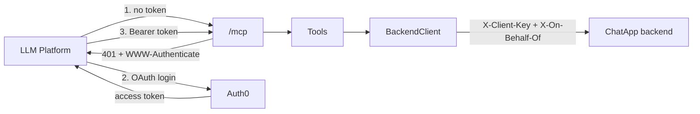

Thin [MCP](https://modelcontextprotocol.io/) server for ChatGPT/Claude to operate on ChatApp conversations. No business logic — every tool call maps 1:1 to a ChatApp REST call. Design doc: [../docs/mcp-integration.md](../docs/mcp-integration.md).

## How it works



- **One fixed backend account.** Every call acts as `Backend:OnBehalfOfUsername` — no per-caller mapping.
- **OAuth, not a static key** — required by both ChatGPT/Claude connectors. [Auth0](https://auth0.com/) free tier issues tokens; this server only validates them (`AddJwtBearer`), same pattern the [backend](../backend/README.md) uses for Supabase JWTs. RFC 9728 discovery is built into the SDK's `AddMcp(...)`.
- A valid token only proves "logged into Auth0" — it never changes which backend account is used.
- **SDK pinned to `1.4.1`** (not `2.0.0`) — see [Troubleshooting](#troubleshooting).

## Codebase

```
mcp/
├── ChatApp.Mcp.csproj
├── Program.cs           composition root: options, auth, HttpClient, MCP server
├── appsettings.json      non-secret config only
├── Options/              BackendOptions, Auth0Options
├── Backend/              BackendClient (typed HttpClient over the REST API)
├── DTOs/                 minimal mirrors of the backend's JSON shapes
└── Tools/                ConversationTools.cs
```

## Tools

| Tool | Backend call | Read-only |
|---|---|---|
| `list_joined_conversations` | `GET /api/conversations?q=` | yes |
| `fetch_conversation_messages` | `GET /api/conversations/{id}/messages` | yes |
| `get_conversation_summarization` | `POST /api/conversations/{id}/summary` | yes |
| `join_conversation` | `POST /api/conversations/join` | no |

No `search`/`fetch` pair — ChatGPT's non-Developer-Mode default connector needs those two names specifically; without them this only works via Developer Mode's custom tools.

## Setup

**1. Sign up for [Auth0](https://auth0.com/signup)**

| Step | Where |
|---|---|
| Enable Dynamic Client Registration | Settings → Advanced → **OIDC Dynamic Application Registration** |
| Create an API | Applications → APIs → Create API. **Identifier** = any fixed string (this is `Auth0:Audience`), doesn't need to be reachable or change with your ngrok URL |
| Grant third-party access | That API → Settings → **Default Permissions for Third Party Apps** → User-Delegated Access = **Authorized** |
| Create a login | Authentication → Database → default connection → create one user |
| Promote that connection | Same connection → **Applications** tab → banner link → **promote to domain level** |

**2. Secrets:**

```bash
cd mcp
dotnet user-secrets init
dotnet user-secrets set "Backend:BaseUrl"            "http://localhost:5000"
dotnet user-secrets set "Backend:ClientKey"           "<backend's Clients:McpKey>"
dotnet user-secrets set "Backend:OnBehalfOfUsername"  "<a User-role username, not Moderator/Administrator>"
dotnet user-secrets set "Auth0:Domain"                "<tenant>.us.auth0.com"
dotnet user-secrets set "Auth0:Audience"              "<API Identifier from step 1>"
dotnet restore && dotnet build && dotnet run
```

## Test locally before deploying

1. `dotnet run` (above).
2. `ngrok http <port>` → copy the `https://...ngrok-free.app` URL.
3. Add it as a connector (below) using that URL.
4. Ask ChatGPT/Claude to do something that calls a tool; watch this console for logs.

ngrok's free URL changes every restart — update the connector URL each time, or use a reserved domain. Deploying for real only changes this URL; nothing in `mcp/` changes.

## Connecting a client

| | ChatGPT | Claude |
|---|---|---|
| Enable | Settings → Apps → Advanced → **Developer mode** | — |
| Add | Settings → Connectors → Create | Settings → Connectors → Add custom connector |
| URL | `https://<host>/mcp` | `https://<host>/mcp` |
| Auth | OAuth → redirects to Auth0 → log in → Allow | OAuth → same flow |

## Maintaining

- **New tool**: add a `[McpServerTool]` method under `Tools/` — auto-discovered, nothing to register.
- **Upgrade SDK**: check `ChatApp.Mcp.csproj`'s comment before bumping past `2.0.0`.
- **Revoke access**: rotate backend's `Clients:McpKey` (kills every connector), or revoke one client in Auth0 → Applications.
- **Backend contract drift**: `DTOs/` is hand-maintained, not shared — update if backend DTOs change ([source of truth](../docs/backend-system-design-and-architecture.md#10-api-reference)).

## Troubleshooting

| Symptom | Cause | Fix |
|---|---|---|
| `JSON-RPC -32600`, "clientCapabilities... not valid with protocol version" | ChatGPT's connector sends a request `ModelContextProtocol.AspNetCore 2.0.0` rejects (protocol version mismatch bug) | Pin the package to `1.4.1` |
| Universal Login: generic "Oops! something went wrong" | Login connection not promoted to domain level | See Setup step 1; check Auth0 **Monitoring → Logs** for the real reason |
| Auth0 log: "Client ... is not authorized to access resource server" | API missing default third-party permissions | See Setup step 1 |
| Tool call fails, backend logs "Mcp callers may only act on behalf of a User-role account" | `Backend:OnBehalfOfUsername` is Moderator/Administrator | Use a `User`-role username |
| `WWW-Authenticate`/metadata URLs show `http://` behind ngrok | Missing forwarded-headers handling | Already handled in `Program.cs` (`UseForwardedHeaders`) |

## References

- [MCP](https://modelcontextprotocol.io/) · [MCP C# SDK](https://github.com/modelcontextprotocol/csharp-sdk)
- [ChatGPT Developer mode](https://help.openai.com/en/articles/12584461-developer-mode-and-mcp-apps-in-chatgpt) · [Claude custom connectors](https://claude.com/docs/connectors/custom/remote-mcp)
- [Auth0 docs](https://auth0.com/docs) · [RFC 9728](https://datatracker.ietf.org/doc/html/rfc9728)
