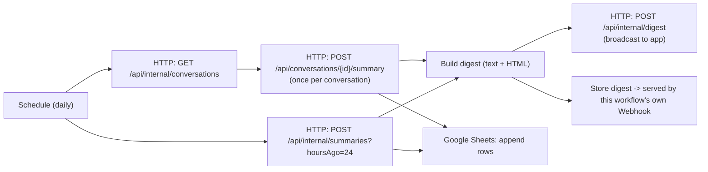

# Overview

n8n is an external client of the ChatApp backend API — a scheduled automation that calls backend endpoints with the `N8n` service key, on behalf of a real Administrator account. The backend exposes the data; n8n owns scheduling, publishing, and the spreadsheet. You do not need to know how the backend works. You only need three things from the backend owner:
- the backend's URL
- an `N8n` service key (a secret string)
- the username of an existing **Administrator** account on the backend

Hosting: self-hosted n8n via Docker, or n8n Cloud — see [n8n docs](https://docs.n8n.io/). The steps below are for running it locally.

---

# Workflow



Every day at 00:00 (configurable), the workflow:

1. Fetches every conversation (`GET /api/internal/conversations`).
2. Requests an on-demand summary for each one individually.
3. Separately requests one overall summary of everything active in the last 24 hours.
4. Combines both into a single digest (plain text and HTML).
5. Sends the digest to the backend, which broadcasts `DigestPublished` to connected clients — the backend does not store it.
6. Serves the same digest as a web page via this workflow's own **Webhook** node, so it's viewable any time, not only right after a run — open its URL any time to see the latest digest, even outside the daily schedule.
7. Appends one row per conversation, plus one "overall" row, to a Google Sheet.

## Auth

Every backend call carries two headers — the service key plus the real user it acts as:

```
X-Client-Key: <Clients:N8nKey value>
X-On-Behalf-Of: <username of an Administrator account>
```

An Administrator-role account must already exist before this workflow can authenticate — see [backend/docs/database-design.md](../backend/docs/database-design.md#user_roles) for how roles are assigned. This is the same service-key + on-behalf-of auth model the [MCP server](../mcp/README.md) uses.

## A membership caveat worth knowing

`GET /api/internal/conversations` lists every conversation regardless of membership, but `POST /api/conversations/{id}/summary` only allows a caller who is a **participant** of that conversation. If the on-behalf-of Administrator isn't a participant of some conversation, that conversation's summary call gets `403` — the workflow has "continue on fail" enabled for exactly this reason, so one failed thread doesn't break the whole run; it just falls back to a placeholder line in the digest.

## Resilience

Both AI-backed calls (per-thread summary, 24-hour roll-up) have **continue on fail** enabled — if Gemini times out or rate-limits for one conversation, the digest still completes with a placeholder for that entry instead of the whole run aborting.

---

# Local Installation

## Prerequisites

- [Node.js](https://nodejs.org) 20 or newer, and npm (comes with Node.js).
- The backend already running and reachable from your machine (ask the backend owner for its URL).
- From the backend owner: the `N8n` service key, and the username of an Administrator-role account.
- A Google account, if you want the Google Sheet step to work (optional — you can delete that node otherwise).

## Installation

**Shortcut:** `Copy-Item .env.example .env.local`, then `./start-dev.ps1` — it installs n8n and starts it in one step. Steps below are what that script does, spelled out manually.

1. Open a terminal in this folder (`n8n/`).
2. Install n8n:
   ```
   npm install
   ```
3. Start n8n:
   ```
   npm run dev
   ```
   Wait for it to print a URL (usually `http://localhost:5678`), then open that URL in your browser. First time only: n8n asks you to create a local account — any email/password works, it's just for your own login.
4. Import the workflow: top-left menu → **Import from File** → select `workflow.json` in this folder.
5. After import, open the workflow and read the yellow "Setup" note in the top-left corner — it lists the same steps below, directly on the canvas.
6. Create the credential the workflow needs:
   - Go to **Credentials** (left sidebar) → **Add credential** → **Header Auth**.
   - Name it exactly: `ChatApp N8n Key`
   - Header name: `X-Client-Key`
   - Header value: the `N8n` service key from the backend owner
   - Save.
   - Back in the workflow, open each HTTP Request node once (there are 4: "Get All Conversations", "Summarize Thread", "Get 24h Rollup", "Publish Digest To Backend") and confirm the credential dropdown shows `ChatApp N8n Key`. If it shows "credential not found", just pick it from the dropdown.
7. Open the **Config** node and fill in:
   - `baseUrl` — the backend's URL, no trailing slash (e.g. `https://your-backend.example.com`).
   - `onBehalfOfUsername` — the Administrator username the backend owner gave you.
8. Open the **Append To Google Sheet** node, connect your own Google account, and pick (or create) a spreadsheet with a sheet whose first row is: `Type | ConversationId | DisplayName | Summary | GeneratedAt`. Skip this step (and delete the node) if you don't need the spreadsheet.
9. Before relying on the daily schedule: click **Execute Workflow** once to run it manually and confirm every node turns green.
10. Turn on the **Active** toggle (top-right) so it runs automatically every day.

**To see the published digest page:** open the "Webhook: Digest Page" node, copy its **Production URL**, and open that URL in a browser. It shows "no digest yet" until the workflow runs once.

---

# References

- [n8n documentation](https://docs.n8n.io/)
- [Schedule Trigger](https://docs.n8n.io/integrations/builtin/core-nodes/n8n-nodes-base.scheduletrigger/) · [HTTP Request node](https://docs.n8n.io/integrations/builtin/core-nodes/n8n-nodes-base.httprequest/) · [Google Sheets node](https://docs.n8n.io/integrations/builtin/app-nodes/n8n-nodes-base.googlesheets/)

**Related documents:** [backend/README.md](../backend/README.md) · [backend/docs/database-design.md](../backend/docs/database-design.md) · [mcp/README.md](../mcp/README.md) — the auth model shared with the MCP client (service key + on-behalf-of user).
